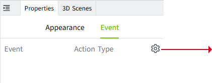
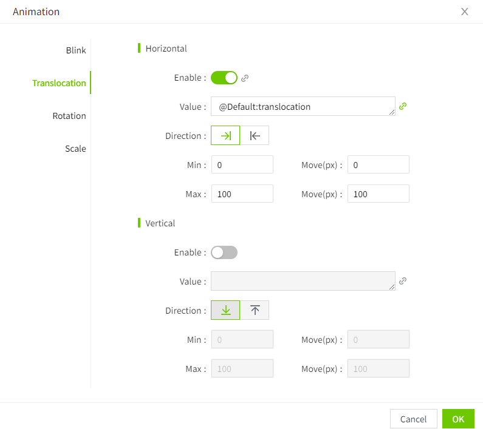
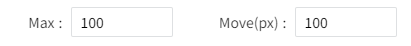
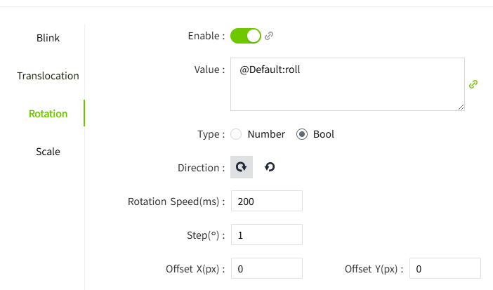
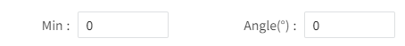
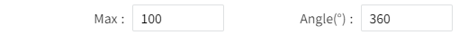
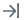
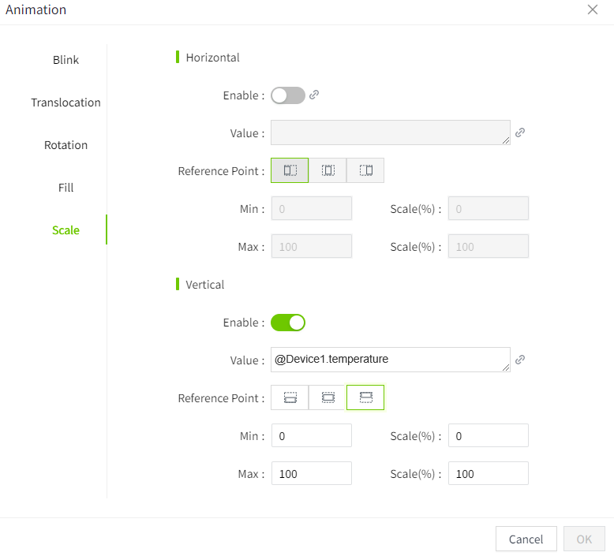
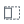
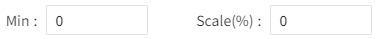

# Animation

By applying animation effects sensibly, users can enjoy a more efficient, intuitive, and pleasant interface interaction experience.

In VC Hub, when the control has animation properties, the "Animation" column will be displayed in the property bar on the right. Click the setting button to set the animation.

In addition to "Value" supporting binding, the "Enable" state also supports binding. Through binding, the enabled state of the animation can dynamically change along with the value of a certain tag or expression. It is no longer manually fixed as "on/off", but rather determined dynamically by the bound value whether the animation is enabled or not.

## Animation Types

VC Hub supports the following animation types:

#### Blink

The blinking effect is easy to attract attention and is often used to alarm when abnormal conditions occur.

**Example**

Create a circular control that represents an alarm indicator light that blinks when the value of "temperature" is greater than 40.

| **Properties** | **Value**    |
|----------------|-----------|
| Fill Color     | ff0000    |
| Border Color   | ff0000    |
| Enabled Blink  | Enable   |
| Interval       | 500 ms    |
| Value          | Expression: tag('Default:Temper')>40;    **Note:** This animation only takes effect when the value is a Bool value. |

#### Translocation

Create dynamic effects by changing the position of the control, which can be moved horizontally and vertically.

**Example**

See where objects are traveling on the conveyor belt.

| **Properties**    | **Value**     |
|-------------------|------------------|
| Horizontal Enable | Enable  |
| Value             | Tag: Default.translocation   |
| Direction         | From left to right    | 
| Min               |Used in combination with  "move" . Set the minimum value at which the animation takes effect, and the moving distance of the object at the minimum value.    |
| Max               | Used in combination with  "move" . Set the maximum value at which the animation takes effect, and the moving distance of the object at the maximum value.    |

#### Rotation

The object rotates as the value changes.

**Example**

| **Properties**  | **Value**   |
|-----------------|---------------|
| Enable          | Enable  |
| Value           | Tags: Default.roll  |
| Type            | The result type of the value. Divided into number and bool.   Number：     Bool:   |
| Min             | When the type is number, this parameter is displayed. Used in combination with the "Angle" . Set the minimum value at which the animation takes effect, and the rotation angle of the object at the minimum value.    |
| Max             | When the type is number, this parameter is displayed. Used in combination with the "Angle" . Set the minimum value at which the animation takes effect, and the rotation angle of the object at the minimum value.   |
| Offset X        | When the type is number, this parameter is displayed. Used to set the distance by which the rotation center point is offset to the right.  |
| Offset Y        | When the type is number, this parameter is displayed. Used to set the distance by which the rotation center point is offset downwards.   |
| Direction       | When the type is Bool, this parameter is displayed. Indicates the direction of rotation.   |
| Rotatiion Speed | When the type is Bool, this parameter is displayed. Indicates how often to transfer.   |
| Step            | When the type is Bool, this parameter is displayed. Represents the angle of each rotation.   |

#### Fill

By changing the value, the filling effect of the object is changed.

**Example**

The liquid level in the tank is constantly changing. Represent the jar as a rectangle.

| **Properties** | **Value**    |
|----------------|----------|
| Enable         | Enable   |
| Value          | Tags: Equipment1. Liquid_Level  |
| Direction      | The direction of the fill.    Fill from top to bottom.   Fill from bottom to top.   Fill from left to right.   Fill from right to left. | 
| Fill           | The fill color.  |
| Min            | Used in combination with the "fill(%)" . Set the minimum value at which the animation takes effect, and the filling ratio of the object at the minimum value.    |
| Max            | Used in combination with the "filll(%)" . Set the minimum value at which the animation takes effect, and the filling ratio of the object at the minimum value.   |

#### Scale

Through changes in value, the overall shape of the object is changed. Scale is possible in both horizontal and vertical directions.

**Example**

The mercury column of a thermometer changes as the value changes.

| **Properties**  | **Value**   |
|-----------------|----------|
| Vertical Enable | Enable   |
| Value           | Tags: Device 1. Temperature |
| Reference Point | The direction of the scale.   Used for horizontal scaling, indicating scaling left and right with the object's left side as the reference point.    Used for horizontal scaling, indicating scaling left and right with the object's center as the reference point.       Used for horizontal scaling, indicating scaling left and right with the object's right side as the reference point.  Used for vertical scaling, indicating scaling up and down with the object's top side as the reference point.       Used for vertical scaling, indicating scaling up and down with the object's center as the reference point.     Used for vertical scaling, indicating scaling up and down with the object's bottom side as the reference point.     | 
| Min             | Used in combination with the "Scale(%)" . Set the minimum value at which the animation takes effect, and the scaling ratio of the object at the minimum value.     |
| Max             | Used in combination with the "Scale(%)" . Set the minimum value at which the animation takes effect, and the scaling ratio of the object at the minimum value.   |
