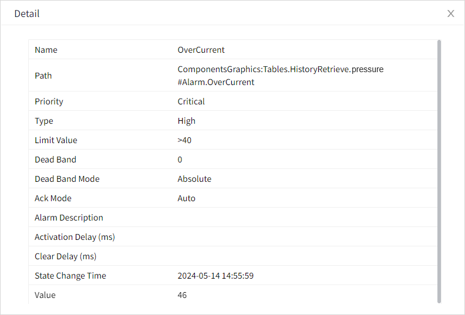

# Alarm Details

On the running page, you can click the view button in the list to view the detailed alarm configuration.

**Premise:** In the column settings, "Detail" is selected. 

On the running page, click the view button of details to view.

