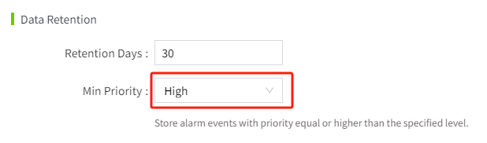
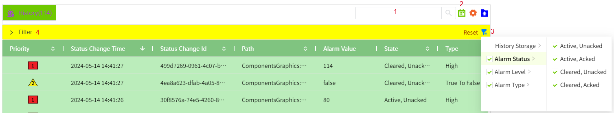
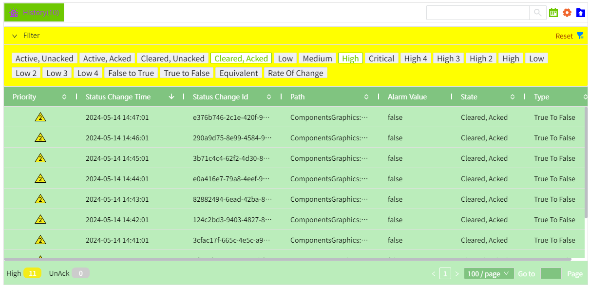

# Alarm Filter

You can filter the data according to the conditions on the control. The historical alarm will only display the alarm information in the alarm history library under the current node, and the historical alarm data at the remote node will not be displayed.

Both editor and running pages support data filtering.

## Filter Data On Editor 

Data filtering can be performed in the "Properties" -> "Filter" of the control. After the filter are set here, the data is filtered and displayed according to the set conditions on the running page.

#### Filter by history storage

It can be filtered according to the selected alarm history storage，only one history storage that created in the "Alarming"->"History Storage" page can be selected. When you select a history storage, all historical alarms in the database where the history storage is located will be displayed on the control.

 For example, you can choose a historical storage that only stores Critical and High alarms. The min priority configuration of the historical library is high.

#### Filter by status

It can be filtered according to the status of the alarm. For example, you can enable the "Active, Acked" and "Cleared, Acked" properties to display only the acknowledged alarm on the control.

#### Filter by Priority

It can be filtered according to the priority of the alarm. For example, only these two levels of alarms can be displayed on the control by enabling the "Critical" and "High" .

#### Filter by type

It can be filtered according to the type of alarm. For example, you can enable the "off-> on" and "on-> off" properties to display only the alarm of bool jump on the control.

## Filter Data On Running Page

On the running page, there are 4 places where you can set filter.

1. Enter the query content in the search box, fuzzy search for the input content in all columns of the control.
2. Click the calendar control to set the time period for the query. You can query the data of the last 24 hours by default, and you can also set the query range by yourself.

3. Click the filter button to filter the data. The filter conditions are the same as the design page, including: history storage, alarm status, alarm level, and alarm type. Click the reset button to restore the filter to the filter set on the design page.
4. Filter the data in the panel. The options that have been enabled in the filter are displayed by default. You can quickly disable filters by clicking the option. For example, the following figure only shows an alarm whose status is "Cleared, Acked" and the alarm level is "Critical" .

**Note:** The enable/disable of options in the filter panel only indicates whether data is displayed in the control, but does not mean that the data is not queried. It will not affect the enable/disable status of options in the filtering criteria.   For example, in the filtering criteria, only 'Active, Unacked' is enabled, but in the filtering panel, all options are enabled.  

