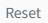

# Historical Alarm

The historical alarm control is used to display the history of alarms, including the historical alarms of the current node and those of remote nodes in a networked environment.

**Interface Elements**

Before using the historical alarm control to view the data, you need to configure the history storage on the "Alarm" -> "History Storage" page.

By default, the control will display the alarm data of the last 12 hours. You can also filter the data according to the filter criteria.

You can click the  setting button of column on the preview and running page to set the columns to be displayed. Click and drag the margin of the column to adjust its width. You can also sort the columns in ascending or descending order, just click the up or down arrow next to the title of each column is enough.

Through the export button, the query data can be exported to a excel file, which is convenient for data organization and analysis. Up to 50,000 pieces of data can be exported.

Historical alarm, no flashing, no alarm sound, no line color.

**Properties**

| **Name**         | **Description** |
|------------------|-------------------|
| Name             | The name of this control.  |
| X                | The distance between the left side of the control and the left side of the canvas.  |
| Y                | The distance between the top of the control and the top of the canvas.  |
| W                | The width of the control.  |
| H                | Height of the control.   |
| Show             | Set which buttons are displayed on the control.  |
| Priority Color   | Set the corresponding color for each alarm level. Only the color of the symbol corresponding to the level will be modified, and the color will not be displayed in the whole line.   |
| Border Color     | Set the outer border of the control and the table line color of the table body.   |
| Border Thickness | Set the thickness of the outer border of the control and the table line of the table body.   |
| Header           | Set the background color, font type, font size, bold, italic, and font color of the header.  |
| Body             | Set the background color, font type, font size, bold, italic, and font color of the body.  |
| Tab              | Set the style of the history tab.    - **Background**: The filling color of the tab.       - **Border**: The border color of the tab.         - **Font**: Set the font type, font size, bold, italic, and font color of the tab content. | 
| Filter Panel     | Set the style of the filter panel.    - **Background**: Background color of the filter panel.   - **Title Font**: Set the font type, font size, bold, italic, and font color of the panel name.    - **Tag**: After the filter panel is expanded, the style of the tab displayed.     Including the background color, border color, font type, font size, bold, italic, font color displayed when the tab is selected and not selected. | 
| Button Style     | Set the style of the buttons used on the control. Click the button-style setting button to set it up.    Calendar.Set the color of the calendar button.      Setting Button.Set the color of the setting button.      Download Button.Set the color of the download button.     Reset Button.Set the color of the reset button.     Filter Button.Set the color of the filter button.      Search box.The background color, border color of the search box, and the font type, font size, bold, italic, and font color of the search box. | 
| Filter           | Check the required filter criteria.  |
| Column           | Set the columns displayed in the list.   |
| Action           | Set the operation button and set the trigger operation to be executed when the alarm is triggered.   |
| Items Per Page   | Set the number of alarms displayed on each page. |

**Event**

Allow you to perform specific events based on certain conditions. See the full description of each event on the **2D Visualization-> Event** page.

**Example 1**

In the editor, you can set the appearance style of the control. For example，set the background to green.

**Example 2**

On the running page, enter the search criteria in the search box and filter the data according to the search content.

**Example 3**

No buttons are displayed, only the alarm information is displayed. In the "Show" of the property, all options are not selected.

The display effect is as below:

