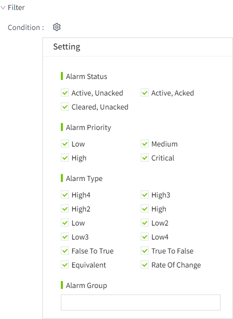
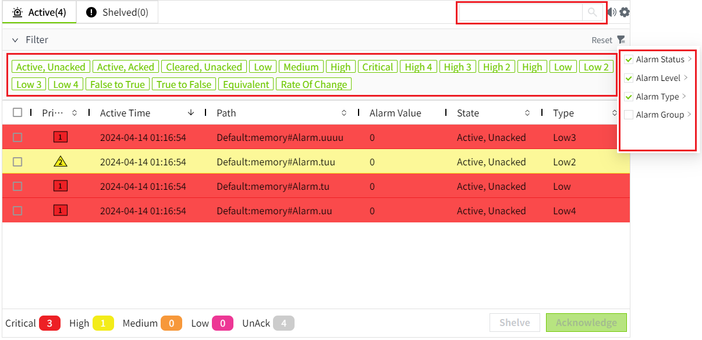

# Alarm Filter

By default, all alarms in the system are displayed on the control, including the remote alarm data of the network. You can filter the data according to the conditions on the control.

Both editor and running pages support data filtering.

## Filter Data On Editor 

Data filtering can be performed in the "Properties" -> "Filter" of the control. After the filter set here, the data is filtered and displayed according to the set conditions on the running page.

#### **Filter by status**

It can be filtered according to the status of the alarm. For example, only unacked alarms can be displayed on the control by enabling the "Active, Unacked " and "Cleared, Unacked " properties.

#### **Filter by priority**

It can be filtered according to the priority of the alarm. For example, only these two levels of alarms can be displayed on the control by enabling the "Critical" and "High" .

#### **Filter by type**

It can be filtered according to the type of alarm. For example, you can enable the "off-> on" and "on-> off" properties to display only the alarm of bool jump on the control.

#### **Filter by alarm group**

You can filter based on the alarm group. For example, if you select the alarm group "Line1," the control will display the alarm information for the tags within that group.

## **Filter Data On Running Page**

On the running page, there are three places for data filtering.

1. Enter the query content in the search box, fuzzy search for the input content in all columns of the control.
2. Click the filter button to filter the data. The filter conditions are the same as the design page, including: alarm status, alarm priority, and alarm type. Click the reset button to restore the filter to the filter set on the design page.
3. Filter the data in the panel. The options that have been enabled in the filter criteria are displayed by default. You can quickly disable filters by clicking the option. For example, the following figure only shows the alarm of "Active, Unacked".

**Note:** Enabling or disabling options in the filter panel only controls whether the data is displayed in the control; it does not prevent the data from being queried or affect the enabled/disabled status of options in the filter criteria.   For example, in the filter panel, only "Active, Unacked" enabled, but all options remain enabled in the filter criteria. 

