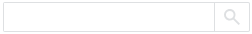
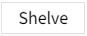

# Real Time Alarm

The real time alarm control shows the on going alarms, including alarms for the current node and alarms for remote nodes in a networked environment. By default, all alarm information is displayed, and the control only supports displaying the latest 2,000 alarm data. You can also set filters.

Support operations such as acknowledging, shelving, and filtering for all alarms displayed in the list.

**Interface Elements**

You can set the columns to be displayed by clicking the "Column Setting" button on the preview and running page. Click and drag the margin of the column to adjust its width. You can also sort columns in ascending or descending order by clicking the up or down arrow next to each column header.

**Properties**

| **Name**                 | **Description**   |
|--------------------------|--------------------|
| Name                     | The name of this control.  |
| X                        | The distance from the left side of the control from the left side of the canvas.  |
| Y                        | The distance from the top of the control from the top of the canvas.  |
| W                        | The width of the control.  |
| H                        | The height of the control.  |
| Show                     | Set which buttons are displayed on the control. |
| Priority Color           | Set the color and flashing effect for each alarm level.  |
| Border Color             | Set the table line color of the outer border and table body of the control.  |
| Border Thickness         | Set the thickness of the table line of the outer border of the control and the table body.    |
| Header                   | Set the background color, font type, font size, bold, italic, and font color of the header.  |
| Body                     | Set the background color, font type, font size, bold, italic, and font color of the body.   |
| Tab                      | Set the style of active and shelved tabs.    - **Indicator bar**: After selecting the tab, the color of the indicator bar displayed below the tab.    - **Active**: Set the background color, border color, font type, font size, bold, italic, font color for active tab.   - **Shelved**: Set the background color, border color, font type, font size, bold, italic, font color for shelved tab. | |
| Alarm Sound              | Set the alarm sound.   - **Enable**: Used to turn the alarm sound on or off.   - **Sound**: With a built-in beep, users can also manually upload alarm sounds, and up to 5 can be uploaded.  - **Critical**: Set the alarm sound of the alarm priority of "Critical".                                 - **High**: Set the alarm sound of the alarm priority of "High".                                 - **Medium**: Set the alarm sound of the alarm priority of "Medium".                                         - **Low**: Set the alarm sound of the alarm priority of "Low".  |
| Filter Panel             | Set the style of the filter panel.  - **Background**: Background color of the filter panel.  - **Title Font**: Set the font type, font size, bold, italic, and font color of the panel name.   - **Tag**: After the filter panel is expanded, the style of the tab displayed.     Including the background color, border color, font type, font size, bold, italic, font color displayed when the tab is selected and not selected. | 
| Button Style             | Set the style of the buttons used on the control. Click the button style settings button to set it up.    Sound Button.Set the color of the sound button.      Setting Button.Set the color of the setting button.          Reset Button.Set the color of the reset button.      Filter Button.Set the color of the filter button.       Search box.Set the background color, border color of the search box, and the font type, font size, bold, italic, and font color of the search box.    Acknowledge Button.Set the background color, border color, font type, font size, bold, italic, font color of the acknowledge button.       Shelve Button.Set the background color, border color, font type, font size, bold, italic, font color of the shelve button.          Unshelve Button.Set the background color, border color, font type, font size, bold, italic, font color of the unshelve button. |
| Filter                   | Check the required filter criteria.  |
| Column                   | Set the column  that need to be displayed in the active tab and shelved tab.  |
| Action                   | Set the operation button and set the trigger operation to be executed when the alarm is triggered.  |
| Maximum Number of Alarms | Set the maximum number of alarms allowed by the control to display.|

**Event**

Allows you to perform a specific event based on certain conditions. See the full description of each event on the **2D Visualization-> Event** page.

**Example 1**

In the designer, you can configure the background color to other colors. In this example, set the color of the Medium alarm to green.

**Example 2**

On the running page, set the filter criteria in the filter button to filter only the alarm data with high alarm type.

**Example 3**

No buttons are displayed, only alarm information is displayed. In the "Appearance Display" of the property, all options are not selected.

The display effect is as follows:

