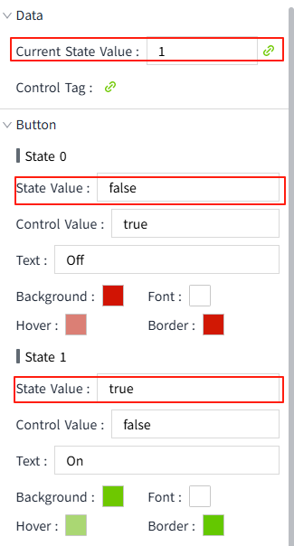

# 2-State Button

The 2-State Button is a type of button control with two distinct states. Common states include on/off, start/stop, etc. Each state can be configured with its own appearance style (color, text, etc.). Users can clearly understand the current state by the appearance of the button.

**Properties**

| **Name**  | **Description**  |
|---------|-----------|
| Name  | The name of this control.  |
| X  | The distance between the left side of the control and the left side of the canvas. |
| Y   | The distance between the top of the control and the top of the canvas. |
| W  | The width of the control.  |
| H  | The height of the control.  |
|  | The rounded corner curvature of the control.  |
| Current State Value  | Match this value with the two status values under the "Button" category. Based on the matching result, display the appearance of the corresponding button.   |
| Control Value   | Bind to a property to control the state of the control. When the button is pressed, the control value corresponding to the current state will be written into the bound property. Usually, the current state value and the control value will be bound to the same property.    |
| Button | Set the appearance style of the control when it is in different state values. It includes two states: State 0 and State 1.   - **State Value**: Used in conjunction with "Data" -> "Current State Value". The current state value corresponds to which state value of the button, and then the appearance of that state is displayed.  - **Control value**: Used in conjunction with "Data" -> "Control Value". When the button is pressed in the current state, the corresponding control value will be written into the property bound to "Data" -> "Control Value".  - **Text**: The text content displayed by the control in the corresponding state.  - **Background**: The backhground color of the control in the corresponding state.  - **Font**: The font color of the control in the corresponding state.  - **Hover**: The hover color of the control in the corresponding state.  - **Border**: The border color of the control in the corresponding state. |
| Border | Set the border width.  |
|  | Set the font for text content. Including font type, font size, font color, bold, italic, underline, horizontal alignment, and vertical alignment.   |

**Event**

Allows you to perform specific events based on certain conditions. See the full description of each event on the **2D Visualization-> Event** page.

**Example**

The fan can be turned on or off by using the 2-State button control.

1. Add a 2-State button control to the page.
2. The current state value is bound to a boolean tag: @Demo:status
3. The control value is also bound to the tag: @Demo:status
4. The button properties are as follows:

| **State**       | **Property** |
|-----------------|------------------|
| **State** **0** |   - **State Value**: false  - **Control Value**: true  - **Text**: Off  - **Background**: d11404  -**Font**: ffffff   - **Hover**: db7f75   - **Border**: d11804 |
| **State** **1** |   - **State Value**: true   - **Control Value**: false   - **Text**: On  - **Background**: 6ec800  - **Font**:  ffffff   - **Hover**: aad773  - **Border**: 64c800 |

5. On the running page, click the button to start and stop the fan, and view the button style.

