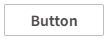
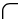

# Button

Buttons are used to initiate an event when pressed and can also be used to display status.

**Properties**

| **Name**   | **Description**      |
|-----------|-----------------------|
| Name  | The name of this control.   |
| X  | The distance between the left side of the control and the left side of the canvas.  |
| Y   | The distance between the top of the control and the top of the canvas.   |
| W | The width of the control.  |
| H   | The height of the control.  |
|  | The rounded curvature of the four corners of the button. |
| Fill   | The content displayed by the control.        The button's background image. Only JPG, GIF, PNG, SVG, and JPEG formats are supported.  |
| Border  | The color and  thickness of the border.   |
| Shadow    | Sets the shadow effect of the control. You can set the outer shadow and inner shadow.    **Outer**    **- Enable**: Whether to enable the shadow effect   **- Color**: Used to set the shadow color   **- X**: Controls how far the shadow is shifted horizontally.   `X = 10` → shadow moves 10px to the right   `X = -5` → shadow moves 5px to the left  **- Y**: Controls how far the shadow is shifted vertically.   `Y = 8` → shadow moves 8px downward   `Y = -3` → shadow moves 3px upward   **- Blur**: Controls how soft or sharp the edges of the shadow appear. Higher values make the shadow more blurry and spread out.   **Inner**   **- Enable**: Whether to enable the shadow effect   **- Color**: Used to set the shadow color  **- X**: Controls how far the shadow is shifted horizontally.   `X = 10` → shadow moves 10px to the right   `X = -5` → shadow moves 5px to the left  **- Y**: Controls how far the shadow is shifted vertically.   `Y = 8` → shadow moves 8px downward   `Y = -3` → shadow moves 3px upward  **- Blur**: Controls how soft or sharp the edges of the shadow appear. Higher values make the shadow more blurry and spread out.    **- Spread**: Controls how much the shadow **expands or contracts** from the shape. |
| Color   | Set the color effects for different operational states of a control. The states include: default, hover, and pressed.   You can set the background color, border color, and font color for each state.     |
| Font     | Set the font for text content. Including font style, font size, font color, bold, italic, horizontal alignment, and vertical alignment.  |

**Event**

Allows you to perform specific events based on certain conditions. See the full description of each event on the **2D Visualization-> Event** page.

**Example**

Click the button to navigate to other page.

| **Property**  | **Value**     |
|---------------|---------------|
| W   | 80                                                    |
| H   | 32                                                    |
|  | 4       |
| Background    | 1c1c88                              |
| Text     | < Back          |
| Font    | Calibri, 22, horizontal centering, vertical centering |

On the button, add a press event, select 'Navigation' as the operation type, choose 'Page1' as the page, and select 'Replace ' as the open position. On the runtime page, clicking this button will navigate to Page1.

