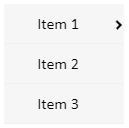
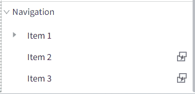
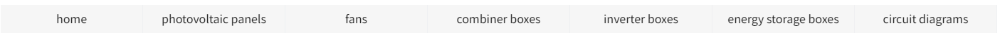
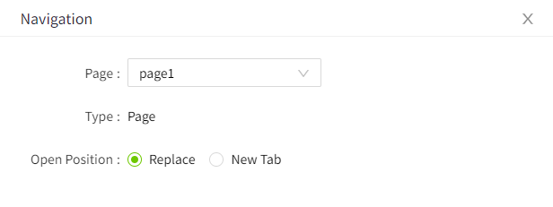
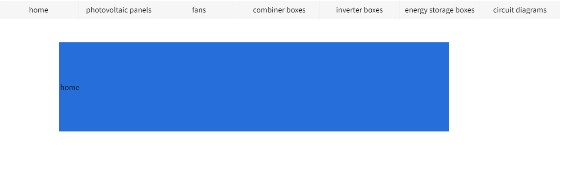

# Menu

The  menu control is used to facilitate quick navigation for users. Supports up to secondary menus.

**Properties**

| **Name**   | **Description**  |
|------------|--------|
| Name       | The name of this control.  |
| X          | The distance between the left side of the control and the left side of the canvas. |
| Y          | The distance between the top of the control and the top of the canvas.  |
| W          | The width of the control.  |
| H          | The height of the control.  |
| Layout     | Sets the overall layout of the menu. Including horizontal, vertical and inline. |
| Primary    | Set the display style of the primary menu.   - **W**: The width of the primary menu.  - **H**: The height of the primary menu.  - **Font**: Set the font of the primary menu. Including font type, font size, bold, italic, horizontal alignment, and vertical alignment.  You can set color effects for menus in different operating states. Status includes: default, hover, selected.  The background color and font color can be set for each status.   |
| Secondary  | Set the display style of the secondary menu.   - **W**: The width of the secondary menu.  - **H**: The height of the secondary menu.  - **Font**: Set the font of the secondary menu. Including font type, font size, bold, italic, horizontal alignment, and vertical alignment.  You can set color effects for menus in different operating states. Status includes: default, hover, selected.     The background color and font color can be set for each status. |
| Navigation | Set the names of menus at each level and the navigation page.     |

## **setting menu**

In the navigation content, you can set the number, name and page navigation function of the menus.

**Set menu name**

Move the mouse over the menu, and the menu will display an editing box. Click the mouse in the editing box to enter the editing state, and you can set the menu name.

**New menu**

Right-click on the menu to display the operation options. Click the option to perform the corresponding operation. 

**Note:** Only primary menus support the addition operation.

**Setup navigation**

Click the settings button on the right side of the menu item to pop up the navigation settings window.

**Event**

Allows you to perform specific events based on certain conditions. See the full description of each event on the **2D Visualization-> Event** page.

**Example**

Use the navigation menu to display information about individual components of the photovoltaic power system.

1. Add a menu control to a page.
2. The content of the menu in the setting control is: (only set as a primary menu) home page, photovoltaic panels, fans, combiner boxes, inverter boxes, energy storage boxes, and circuit diagrams.

3. Set the navigation screen for each menu. Take the "Home" menu setting as an example to perform navigation settings.
4. In the navigation window, select the page to be navigated and set the opening position to the replace.

5. By analogy, set the navigation page of other menus.
6. In the running page, click the home page menu in the menu control to jump to the content of "Home Page"; click the photovoltaic panel menu again to display the content of the "photovoltaic panel" screen.

