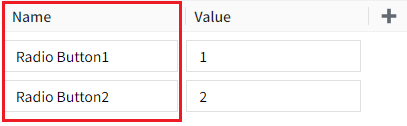
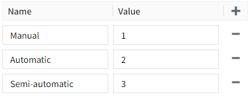

# Radio Button

The radio button control is used to select one of multiple mutually exclusive options. When the user selects a radio button, the other options will automatically be deselected, ensuring that only one option is selected.

**Properties**

| **Name**       | **Description**  |
|----------------|-------------|
| Name           | The name of this control.|
| X              | The distance between the left side of the control and the left side of the canvas. |
| Y              | The distance between the top of the control and the top of the canvas.|
| W              | The width of the contro.  |
| H              | The height of the control. |
| Option Name    | The name of the radio button's option. The "name" here corresponds to the "selected text".   |
| Option Value   | The value of the radio button's option. The "name" here corresponds to the "selected value".     |
| Selected Text  | The corresponding text content of the current option. |
| Selected Value | The value of the current option.    **Note:** You can only choose between selected text and selected value. After setting one option, the other option will be disabled. Only after the currently set option value is cleared or unbound, another option becomes editable. |
| Style          | The layout style for radio buttons. Includes horizontal and vertical.  |
| Fill           | The fill color of the radio button.     |
| Border         | The border color of the radio button.    |
| Shadow         | Sets the shadow effect of the control. You can set the outer shadow and inner shadow.    **Outer**    **- Enable**: Whether to enable the shadow effect   **- Color**: Used to set the shadow color   **- X**: Controls how far the shadow is shifted horizontally.   `X = 10` → shadow moves 10px to the right   `X = -5` → shadow moves 5px to the left  **- Y**: Controls how far the shadow is shifted vertically.   `Y = 8` → shadow moves 8px downward   `Y = -3` → shadow moves 3px upward   **- Blur**: Controls how soft or sharp the edges of the shadow appear. Higher values make the shadow more blurry and spread out.   **Inner**   **- Enable**: Whether to enable the shadow effect   **- Color**: Used to set the shadow color  **- X**: Controls how far the shadow is shifted horizontally.   `X = 10` → shadow moves 10px to the right   `X = -5` → shadow moves 5px to the left  **- Y**: Controls how far the shadow is shifted vertically.   `Y = 8` → shadow moves 8px downward   `Y = -3` → shadow moves 3px upward  **- Blur**: Controls how soft or sharp the edges of the shadow appear. Higher values make the shadow more blurry and spread out.    **- Spread**: Controls how much the shadow **expands or contracts** from the shape.
|
| Font           | Set the font for text content. Including font type, font size, font color, bold, italic, and underline.   |

**Event**

Allows you to perform specific events based on certain conditions. See the full description of each event on the **2D Visualization-> Event** page.

**Example**

Change the device's operating mode via radio buttons.

| **Property** | **Value**      |
|--------------|----------|
| Options      | Set the option name and option value.    |

1. Add a radio button control to the page.
2. Set the value change event of the action attribute and enable tag assignment. Assign the value of the selected radio button to the tag and control the working mode of the device through the tag. 

