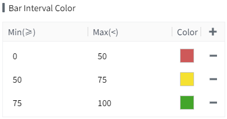
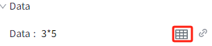
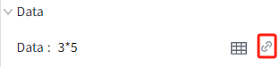

# Bar Chart

A bar chart is used to compare the numerical differences between different categories or components. It consists of a series of rectangular bars, where the height of each bar represents the value associated with each category or component.

**Properties**

| **Name**          | **Description**  |
|-------------------|--------------|
| Name              | The name of this control.  |
| X                 | The distance between the left side of the control and the left side of the canvas, in pixels. |
| Y                 | The distance between the top of the control and the top of the canvas, in pixels.    |
| W                 | The width of the control, in pixels.  |
| H                 | The height of the control, in pixels.  |
| Data              | Click the Bind button to bind data to the bar chart. Double-click the tag in the Select Tag window to bind it.    Click the dataset button to set default data for the bar chart.           Click the binding button to bind variables, properties, or write expressions for the cells in the dataset. |   |
| Refresh Frequency | - Frequency(s): Refresh the data on the bar chart at this frequency. | 
| Style             | Set the display style of the bar chart: vertical or horizontal. Displayed vertically by default.  |
| Color             | - **Background**: The overall background color of the control.   - **Grid**: The line color of the grid.    - **Border**: The border color of the bar.    - **X Axis**: The axis color of the X-axis. - **Y Axis**: The axis color of the Y-axis.   - **Series Colors**: Set the colors for different series in a bar chart, with the default being the colors displayed on the color palette.    - **Bar Interval Color**: You can set value ranges. When the corresponding value of the bar is in different value ranges, the bar will display different colors.   **Note:** Once the bar interval colors are set, the interval colors take precedence over the series colors. |
| Margin            | Set the spacing between the control and its selection box. Ensure that the chart is displayed clearly and sufficient space is reserved for chart elements, such as legend.    |
| Series            | - **Bar Width(px)**: The width of the bars.                      - **Bar Gap(%)**: The space between bars of different series. |  
| X Axis            | Set the style of the text displayed on the X-axis, including font, font size, bold, italic, and font color.     |
| Y Axis            | Set the style of the Y-axis.   - **Show Y Axis**: Control the display and hiding of the Y axis. Default Display.   - **Show Grid**: Control the display and hiding of the grid.    - **Grid(s)**: Set the number of dividing lines inserted on the Y-axis.  - **Range**: Set the display and hiding of Y-axis range. Selected by default.  When this item is selected, the upper and lower limits of the Y-axis need to be set.     - **Auto Range**: The range of the Y-axis changes dynamically according to the range of bar values. If checked, the value range of the Y-axis will be automatically determined. If unchecked, the specified upper and lower bounds will be used.  - **Decimals**: Set the number of decimal places displayed on the Y-axis tick values.  - **Font**: Set the font, font size, bold, italics, and font color of the text displayed on the Y axis.    |
| Legend            | Set the style of the pie chart's legend.  - **Show**: Controls the display and hiding of the legend. Default display.  - **Position**: Set the display position of the legend.                         - **Font**: Set the legend font, font size, bold, italic, and font color.    |
| Label             | Sets the style for the numerical value displayed on each bar.   - **Show**: Control the display and hiding of label values. Hidden by default.   - **Position**: Set the display position of the label value.                           - **Decimals**: The number of decimal places displayed for bar values.                - **Font**: Set the font, font size, bold, italics, and font color of the legend.  |

**Event**

Allows you to perform specific events based on certain conditions. See the full description of each event on the **2D Visualization-> Event** page.

**Example**

Use a bar chart to display the daily production capacity of the production line.

1. Insert a bar chart on the page.
2. Set the properties of the bar chart.

| **Property**       | **Value** |
|--------------------|---------------|
| Bar Interval Color | Set to the following:   |
| Label              | Turn on and position: is Top.     |
| Y Axis Range       | 0~100   |
| Data               | Click the **Dataset** button to configure the dataset.        After completing the setup, click the **Bind** button to perform dynamic cell binding.      |

3.Click the Preview button to preview.
    

