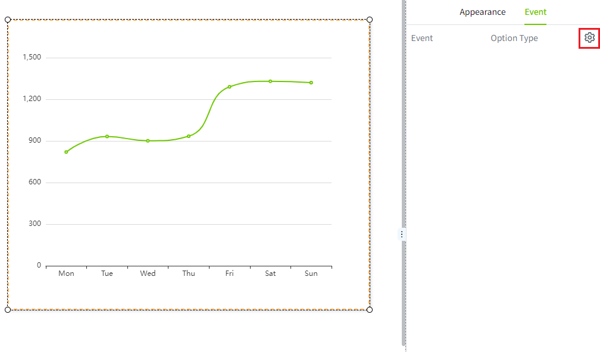
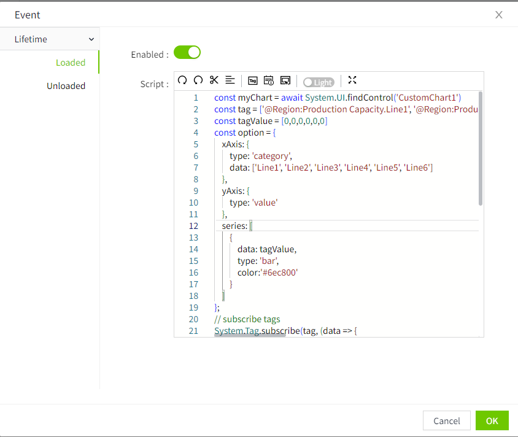

# Custom Chart

Custom charts can display data according to your specific requirements. Through this control, you can realize various charts in **echarts** , and personalize the style, appearance, etc. of the control.

This control can only set properties by writing scripts, so to use this control easily, you need to have certain coding skills.

**Note**: echarts is an open source visualization chart library based on JavaScript. For specific charts, please see:  [https://echarts.apache.org/examples/zh/index.html](https://echarts.apache.org/examples/zh/index.html) 


**Properties**

| **Name** | **Description**    |
|----------|-------|
| Name     | The name of this control.                                                          |
| X        | The distance between the left side of the control and the left side of the canvas. |
| Y        | The distance between the top of the control and the top of the canvas.             |
| W        | The width of the control.                                                          |
| H        | The height of the control.                                                         |


**Event**

Allows you to perform specific events based on certain conditions. See the full description of each event on the **2D Visualization-> Event** page.

**Example**

Use a custom chart to display a bar chart that displays the production line's capacity on the bar chart.

1. Under the chart category of echarts, click on the bar chart,  [https://echarts.apache.org/examples/en/index.html#chart-type-bar](https://echarts.apache.org/examples/en/index.html) 


2. Under the histogram category, click Basic Histogram to enter the histogram editing page. Copy the code on the left. If necessary, you can also edit the code here directly.


3. Insert a "custom chart" control on the WAGO SCADA screen.
4. Set the action properties for the control and add a "load" action.



5. Enter the following script in the script editor. 

```typescript
const myChart = await System.UI.findControl('CustomChart1')
const tag = ['@Region:Production Capacity.Line1', '@Region:Production Capacity.Line2', '@Region:Production Capacity.Line3', '@Region:Production Capacity.Line4', '@Region:Production Capacity.Line5', '@Region:Production Capacity.Line6'];
const tagValue = [0,0,0,0,0,0]
const option = {
    xAxis: {
        type: 'category',
        data: ['Line1', 'Line2', 'Line3', 'Line4', 'Line5', 'Line6']
    },
    yAxis: {
        type: 'value'
    },
    series: [
        {
            data: tagValue,
            type: 'bar',
            color:'#6ec800'
        }
    ]
};
// subscribe tags
System.Tag.subscribe(tag, (data => { 
    const index = tag.findIndex(res => res === data.Path)
    tagValue[index] = data.Value;
    myChart.setOptions(option)
}))
```
 


6. Click the "Preview" button on the page to view it.


Note:  
1. The actual display effect of custom charts can only be seen on the preview or run page. 
2. Custom charts only support the following three methods in echarts:  
- setOption(option); 
- clear() 
- dispose()  

Not all 3D class charts in echarts are supported.  

