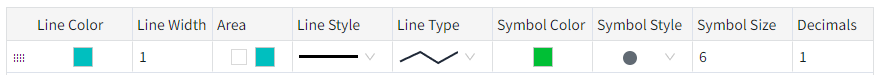
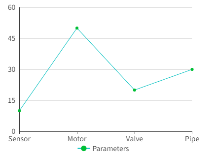

# Custom Curve

A custom curve refers to a curve form created or defined based on actual conditions or specific needs. Custom curves do not have fixed mathematical expressions or forms, but are customized based on the characteristics and relationships of the data.

**Properties**

| **Name** | **Description** |
|----------|---------------------|
| Name     | The name of this control.  |
| X        | The distance between the left side of the control and the left side of the canvas, in pixels.  |
| Y        | The distance between the top of the control and the top of the canvas, in pixels.   |
| W        | The width of the control, in pixels.   |
| H        | The height of the control, in pixels.  |
| Data     | Set the dataset and cell binding for the custom curve.    Click the  button to set the dataset for the curve.      The default setting is for 2 rows and 8 columns of data, with the row data labeled as "Series1" and "Series2", and the column data being Name and the names of the seven days of the week. Each row of data corresponds to a day of the week, showing the values for both series.   Click the  button to set the cell binding for the dataset.    | Delete Binding    | Delete the selected cell binding.    Set the style of the custom curve.   - **Line Color**: The color of the curve. - **Line Width**: The width of the curve. - **Area**: Set the background color of the area between the curve and the axis.                         - **Line Style**: Set the number of decimal places displayed for dimension values.                         - **Line Type**: Set the font, font size, bold, italics, and font color of the legend.                         - **Symbol Color**: Set the style of the symbol, including round dots, triangles, squares, and the default circle.     - **Symbol Style**: Set the style of the symbol.  - **Symbol Size**: Set the size of the symbol. - ** Decimals**: Set the number of decimal places displayed for the value corresponding to each point on the curve. |
| Color    | Set the color effect of the control.  | Background | The overall background color of the control. | |------------|----------------------------------------------| | Grid       | The line color of the grid.                  | | X Axis     | The axis color of the X-axis.                | | Y Axis     | The axis color of the Y-axis.                |   |
| Margin   | Set the spacing between the control and its selection box. Ensure that the chart is displayed clearly and sufficient space is reserved for chart elements, such as legend.  |
| X Axis   | Set the style of the text displayed on the X-axis, including font, font size, bold, italic, and font color.  |
| Y Axis   | Set the style of the Y-axis.  - **Show Grid**: Control the display and hiding of the grid. Default Display.  - **Grid(s)**: Set the number of dividing lines inserted on the Y-axis.    - **Range**: Set the display and hiding of Y-axis range. Selected by default.  When this item is selected, the upper and lower limits of the YY-axis need to be set.   - **Auto Range**: Automatically display scale values  The range of the Y-axis changes dynamically according to the range of bound values. If checked, the value range for the Y-axis will be automatically determined. If unchecked, the specified upper and lower bounds will be used.  **Note:** You can only choose 1 from 2 for display range and automatic display scale value.  - **Decimals**: Set the number of decimal places displayed on the Y-axis tick values.     - **Font**: Set the font, font size, bold, italics, and font color of the text displayed on the Y-axis.  |
| Legend   | Set the style of the control's legend.   - **Show**: Control the display and hiding of the legend. Default is to display.   - **Position**: Set the display position of the legend. The default is at the bottom.  - **Font**: Set the legend's font, font size, bold, italic, and font color.       | 

**Event**

Allows you to perform specific events based on certain conditions. See the full description of each event on the **2D Visualization-> Event** page.

**Example**

Use custom curves to display equipment failure rates.

1. Insert a custom curve on the page.
2. Set the properties of the custom curve.

| **Property** | **Value**   |
|--------------|---------------------|
| Y Axis       | The display range is set to 1~60.    |
| Line Style   | Set the dataset and cell binding for the curve.      Set the style of the curve.      - **Line Color**: #00bfbf    - **Line Width**: 1    - **Area**: False      - **Line Style**: Solid Line  - **Line Type**:Line        - **Symbol Color**: #00bf35     - **Symbol Style**: Dot         - **Symbol Size**: 6           - **Decimals**:1    |

3.Click the Preview button to preview.
    

