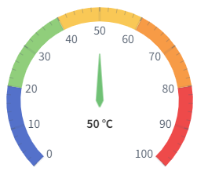
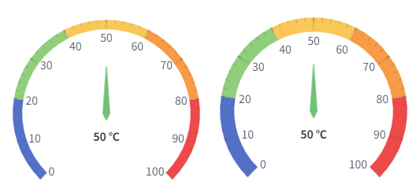
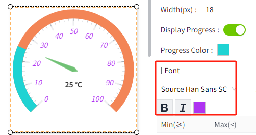
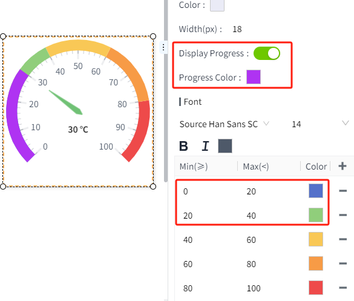

# Gauge

A gauge contains pointer and dials that allow the user to set multiple value intervals and a corresponding color for each interval.

**Properties**

| **Name**          | **Description**        |
|-------------------|------------------------|
| Name              | The name of this control.  |
| X                 | The distance between the left side of the control and the left side of the canvas.     |
| Y                 | The distance between the top of the control and the top of the canvas.   |
| W                 | The width of the control.    |
| H                 | The height of the control.     |
| Start Angle       | The starting angle of the dial.   |
| End Angle         | The ending angle of the dial.    |
| Pointer           | - **Display Pointer**: Control whether the  pointer is displayed.    - **Value**: The value displayed on the control. - **Unit**: The unit of the current value. - **Pointer Length(%)**: The length of the pointer   - **Background**: The color of the pointer   - **Border**: The border color of the pointer  - **Border Width**: The border width of the pointer  - **Font**: The font of the value and the unit. Includes font type, font size ,font color, bold and italic settings.  |
| Measurement Range | The measuring range of the gauge. Default is 0~100.     |
| Tick              | - **Major Tick**: The number of major ticks.       - **Major Color**: The color of the major ticks.          - **Minor Tick**: The number of minor ticks.        - **Minor Color**: The color of the minor ticks.                                     - **Decimals**: The number of decimals displayed on the dial and the pointer value. |  
| Dial              | - **Color**: Background color of the dial scale     - **Width**: Width of the scale        - **Display Progress**: Whether a progress bar should appear in the scale      - **Progress Color**: Tick progress bar color     - **Font**: The font for the scale values on the dial. Includes font type, font size, font color, bold and italic settings.      - **Dial Interval Color**: Colors corresponding to different numerical ranges on the dial.    |

**Note:** If both interval colors and "Diaplay Progress" are enabled, the progress bar color will override the interval colors corresponding to the values. 

For example, in the image below, the interval color for 0-30 is covered by the progress color.

**Event**

Allows you to perform specific events based on certain conditions. See the full description of each event on the **2D Visualization-> Event** page.

**Example 1  Progress gauge**

Display the current device temperature through the gauge.

| **Property** | **Value**  |
|--------------|---------|
| Start Angle  | 180°   |
| End Angle    | 0°    |
| Pointer      | - **Value**: Tag(@Device:Temperature)                   - **Unit**: ℃                 - **Pointer Length(%)**: 50                        - **Background**: rgba(112,193,117,100)                - **Border**: rgba(112,193,117,60)                    - **Border Width**: 2   | Font              | Calibri, 18 , Bold，Italic，rgba(51,51,51,100) | |
| Dial         | - **Color**: rgba(234,235,246,100)     - **Width**: 18        - **Display Progress**: Turn on           - **Progress Color**: rgba(110,200,0,80)          - **Font**: Calibri, 14, rgba(78,89,105,100)  - **Dial Interval Color**: None  |

**Example 2 Range gauge**

| **Property** | **Value**  |
|--------------|-----|
| Start Angle  | 225° |
| End Angle    | 315° |
| Pointer      | - **Value**:Tag(@Device:Temperature)            - **Unit**: ℃              - **Pointer Length(%)**: 50                              - **Background**: rgba(112,193,117,100)                 - **Border**: rgba(112,193,117,60)                     - **Border Width**: 2               - **Font**: Calibri, 18 , Bold，Italic，rgba(51,51,51,100) |
| Tick         | - **Major Color**: The color of the major ticks.  - **Minor Color**: The color of the minor ticks. |  
| Dial         | - **Color**: rgba(234,235,246,100)     - **Width**: 25   - **Font**: Calibri, 14, rgba(78,89,105,100)   - **Dial Interval Color**:  0-30 rgba(128,128,128,100)；   30-40 rgba(110,200,0,100)；   40-100 rgba(255,0,0,100)；    |

