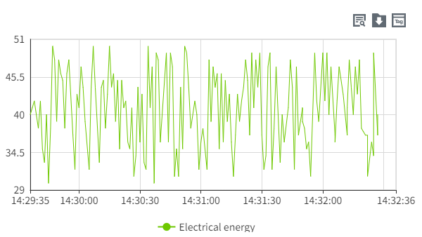
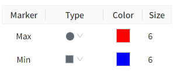

# Historical Chart

A historical chart is a chart that shows trends in data over a past period of time. The X-axis is the time axis and the Y-axis is the data axis.

**Properties**

| **Name**     | **Description**   |
|--------------|---------|
| Name         | The name of this control. |
| X            | The distance from the left side of the control to the left side of the canvas, in pixels.  |
| Y            | The distance from the top of the control to the top of the canvas, in pixels.  |
| W            | The width of the control, in pixels.  |
| H            | The height of the control, in pixels.  |
| Time Range   | Query based on the specified time period.      - **Last**: Set the time range for data display.     - **Custom**: Set the start time and end time to customize the time range for data display.   |
| Query Mode   | Query according to the selected query mode, which includes: Raw, Fixed Points, and Periodic.   - **Raw**: Retrieves all raw historical data within the selected time range. When selecting Raw, the aggregation mode of the tag is disabled.  - **Fixed Points**: Requires setting the number of points. The selected time range is divided into corresponding time intervals based on the set number of points, and one data point is selected from each interval according to the specified aggregation mode.  - **Periodic**: Requires setting a period. The selected time range is divided into corresponding time intervals based on the set period, and one data point is selected from each interval according to the specified aggregation mode.  |
| Data         | Click the dataset button to set the data source and style for the historical trend chart.    Clicking this button allows you to set the data source and style for the curve.      - **Tag**: Set the data source for the curve.  You can copy the path of a tag directly to the "Name” column by clicking on the following symbol on the far right of the "Tag" column.    - **Name**: Set the name of the curve.  - **Y Axis**: Select a Y-axis as the Y-axis of the current tag. - **Line Color**: Set the color of the curve.  - **Line Type**: The type of the curve.  - **Line Style**: The style of the curve.   - **Line Width**: The width of the curve.  - **Area**: Set the background color of the area between the curve and the axis.  - **Alarm Line**: Set whether the alarm value of the tag is displayed as a line on the current control.  Click the Set button of the alarm line to select the alarm line to be displayed and set the style for it.  Check the checkbox of t - **Average Line**: Sets whether the average value of the tag over the query time period is displayed as a straight line on the current control. When enabled, you can set the line shape of the average.      - **Average Line Width**: Sets the line width of the average line.   - **Symbol Style**: Set the style of markers on the curve.  - **Symbol Size**: The size of the mark.  - **Decimals**: Move the mouse to the number of decimal places displayed on the curve.   - **Aggregation Mode**: Set the data aggregation method. This field takes effect when the query type is Fixed Points or Periodic. | |
| Show         | Set the display and hiding of the button.   - **Select Tag Button**: Set the display and hiding of the tag selection button.When visible, this button on the running page allows users to reconfigure the tags and their corresponding curve display styles.  - **Export Button**: Set the display and hiding of the export button.When visible, this button on the running page allows users to export the queried data.   - **Search Button**: Control the visibility of the query button. When visible, users can reset the query time range and mode on the runtime page.     |    |
| Button Style |  - **Select Tag Button**: Set the color of the tag selection button.  - **Search Button**: Set the color of the search button.         - **Export Button**: Set the color of the export button.        |  
| Color        | Set the color effect of the control.   - **Background**: The overall background color of the control.  - **Grid**: The line color of the grid.                  - **X Axis**: The axis color of the X Axis.   |    
| Margin       | Set the spacing between the control and its selection box. Ensure that the chart is displayed clearly and sufficient space is reserved for chart elements, such as time or legend. |
| X Axis       | Set the style of the X Axis.   - **Show Grid**: Control the display and hiding of the grid.  - **Time Format**: Set the format of the time displayed on the X-axis, you can choose the time format preset by the system or input it manually, the time format set must meet the time format requirements of Echarts.  For details, see  [https://echarts.apache.org/zh/option.html#xAxis.axisLabel.formatter](https://echarts.apache.org/zh/option.html#xAxis.axisLabel.formatter)  - **Font**: Set the font, font size, bold, italics, and font color of the text displayed on the X-axis.    |   
| Y Axis       | Set the style of the Y-axis.   - **Show Grid**: Control the display and hiding of the grid.  - **Enable Subplot**: Control whether embedding another chart is allowed in the main chart.  - **Grid(s)**: Set the number of dividing lines inserted on the Y-axis.               - **Axes**: Display the number of rows and columns of the axis.                     Clicking this button allows you to set the style of the axis.    - **Name**: The name of the Y axis.  - **Auto Range**: The range of the Y-axis changes dynamically according to the range of values. If checked, the value range of the Y-axis will be automatically determined. If unchecked, the min and max values will be used.  When Auto is selected, the min and max values become invalid.  - **Min**: Minimum value of Y axis.    - **Max**: The maximum value of the Y-axis.   - **Decimals**: Set the number of decimal places displayed on the Y-axis tick values.   - **Show**: Control the display and hiding of the Y-axis.  - **Position**: Set the display position of the Y-axis.   - **Offset(px)**: Set the offset of the Y-axis relative to its default position.  - **Axis Color**: Set the color of the Y-axis.     - **Font**: Set the font for the Y-axis labels.    - **Font Size**: Set the font size for the Y-axis coordinates.   - **Font Color**: Set the font color for the Y-axis coordinates.   - **Bold**: Set the font weight for the Y-axis coordinates.   - **Italic**: Set the font style to italic for the Y-axis coordinates.    - **Subplot Weight**: Set the size of the space that the subplot occupies in the main chart.      - **Subplot Background Color**: Set the background color of the subplot.       |
| Legend       | Set the style of the legend.   - **Show**: Control the display and hiding of the legend. Default Display.        - **Position**: Set the display position of the legend.                                - **Font**: Set the font, font size, bold, italics, and font color of the legend. |  
| Markers      | Sets whether the markers for maximum and minimum points are displayed on the control. You can set the style, color and size of the markers.    |

**Note:** The historical chart is developed based on Echarts 5.x version. There is a flaw in the graduation number in this version, and it does not take effect according to the set value, causing the historical chart to also have this problem. Please wait for Echarts to fix this defect.

**Event**

Allows you to perform specific events based on certain conditions. See the full description of each event on the **2D Visualization-> Event** page.

**Example 1**

Use historical chart to show electricity usage.

1. Insert a historical chart on the page.
2. Set the properties of the historical chart.

| **Property** | **Value**   |
|--------------|------|
| Time Range   | Select last 10 minutes.  |
| Query Mode   | Select Raw.    |
| Data         | Bind the tag and select raw value as the sampling type. Set the style of the curve.    Click to set the style. The set attribute values are as follows:    - **Tag**: @Factory:Area     - **Name**: Electrical energy  - **Y Axis**: Y-Axis1            - **Line Color**: #6ec800            -**Line Type**: Line               - **Line Style**: Solid Line         - **Line Width**: 1                 - **Area**: heck            - **Alarm Line**: Uncheck            - **Average Line**: Uncheck            - **Symbol Style**: None               - **Symbol Size**: 6                  - **Decimals**: 2     |

3.Click the Preview button to preview.
    

**Example 2**

Use historical trends to show electricity usage, identifying the maximum and minimum values of electricity on a graph.

1. Insert a historical chart on the page.
2. Set the properties of the historical chart.

| **Property** | **Value**  |
|--------------|---------|
| Time Range   | Select last 10 minutes.   |
| Query Mode   | Select Raw.  |
| Data         | Bind the tag and select raw value as the sampling type. Set the style of the curve.    Click to set the style. The configurations are as follows:   - **Tag**: @Demo:Totalpower  - **Name**: Totalpower        - **Y Axis**: Y-Axis1           - **Line Color**: #6ec800           - **Line Type**: Line              - **Line Style**: Solid Line        - **Line Width**: 1                 - **Area**: Uncheck           - **Alarm Line**: Uncheck           - **Average Line**: Uncheck           - **Symbol Style**: None              - **Symbol Size**: 6                 - **Decimals**: 2                |
| Markers      |  |

3.Click the Preview button to preview.
    