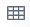
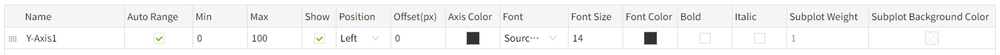
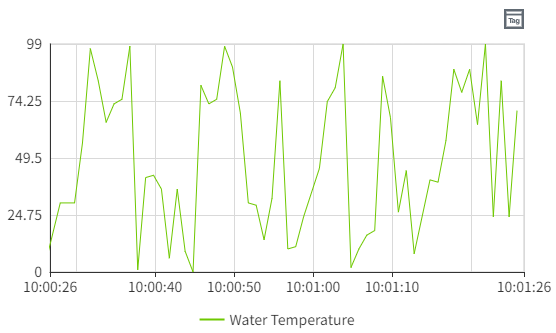

# Real Time Chart

A real time chart is a chart used to display real time changes in data over time. The X-axis is the time axis and the Y-axis is the data axis.

**Properties**

| **Name**          | **Description**   |
|-------------------|-------------------|
| Name              | The name of this control.  |
| X                 | The distance between the left side of the control and the left side of the canvas, in pixels.      |
| Y                 | The distance between the top of the control and the top of the canvas, in pixels.  |
| W                 | The width of the control, in pixels.   |
| H                 | The height of the control, in pixels.    |
| Data              | Click the Bind button to bind data to the control. Double-click the tag in the Select Tag window to bind it. After binding the tag, click the Set button to set the curve style.     Clicking this button allows you to set the data source and style of the curve.    - **Tag**: Set the data source for the curve.  You can copy the path of a tag directly to the "Name” column by clicking on the following symbol on the far right of the "Tag" column.      - **Name**: Set the name of the curve.   - **Y Axis**：Select a Y-axis as the Y-axis of the current tag.  - **Line Color**: Set the color of the curve. - **Line Type**：The type of the curve.    - **Line Style**: The style of the curve.    - **Line Width**: The width of the curve.   - **Area**: Set the background color of the area between the curve and the axis.   - **Alarm Line**: Set whether the alarm value of the tag is displayed as a line on the current control.  Click the Set button of the alarm line to select the alarm line to be displayed and set the style for it.   Check the checkbox of the alarm line to enable the display of the alarm line on the control.  - **Symbol Style**: Set the style of markers on the curve.  - **Symbol Size**: The size of the mark.    - **Decimals**: Move the mouse to the number of decimal places displayed on the curve.  | |
| Refresh Frequency | Data on the control is refreshed at this frequency.  |
| Show              | Select Tag Button: Set the display and hiding of the tag selection button.When visible, this button on the running page allows users to reconfigure the tags and their corresponding curve display styles. |
| Button Style      |  Select Tag Button: Set the color of the tag selection button.  |
| Color             | Set the color effect of the control.   - **Background**: The overall background color of the control.  - **Grid**: The line color of the grid.  - **X Axis**: The axis color of the X Axis.                |    |
| Margin            | Set the spacing between the control and its selection box. Ensure that the chart is displayed clearly and sufficient space is reserved for chart elements, such as time or legend.    |
| X Axis            | Set the style of the X Axis.   - **Show Grid**: ontrol the display and hiding of the grid.   - **Time Format**: Set the format of the time displayed on the X-axis, you can choose the time format preset by the system or input it manually, the time format set must meet the time format requirements of Echarts.  For details, see  [https://echarts.apache.org/zh/option.html#xAxis.axisLabel.formatter](https://echarts.apache.org/zh/option.html#xAxis.axisLabel.formatter)  - **Time Range(s)**: The time range shown on the x-axis.   - **Font**: Set the font, font size, bold, italics, and font color of the text displayed on the X-axis.   |
| Y Axis            | Set the style of the Y-axis.   - **Show Grid**: Control the display and hiding of the grid.  - ** Enable Subplot**: Control whether embedding another chart is allowed in the main chart.  - **Grid(s)**: Set the number of dividing lines inserted on the Y-axis.  - **Axes**: Display the number of rows and columns of the axis.       Clicking this button allows you to set the style of the axis.      - **Name**: The name of the Y axis.  - **Auto Range**: The range of the Y-axis changes dynamically according to the range of values. If checked, the value range of the Y-axis will be automatically determined. If unchecked, the min and max values will be used.  When Auto is selected, the min and max values become invalid.  - **Min**: Minimum value of Y axis.   - **Max**: The maximum value of the Y-axis.   - **Decimals**: Set the number of decimal places displayed on the Y-axis tick values.  - **Show**: Control the display and hiding of the Y-axis.   - **Position**: Set the display position of the Y-axis.   - **Offset(px)**: Set the offset of the Y-axis relative to its default position. - **Axis Color**: Set the color of the Y-axis.  - **Font**: Set the font for the Y-axis labels. - **Font Size**: Set the font size for the Y-axis coordinates.  - **Font Color**: Set the font color for the Y-axis coordinates. - **Bold**: Set the font weight for the Y-axis coordinates.  - **Italic**: Set the font style to italic for the Y-axis coordinates.  - **Subplot Weight**: Set the size of the space that the subplot occupies in the main chart.   - **Subplot Background Color**: Set the background color of the subplot. | 
| Legend            | Set the style of the legend.  - **Show**: Control the display and hiding of the legend. Default Display.   - **Position**: Set the display position of the legend.      - **Font**: Set the font, font size, bold, italics, and font color of the legend. |

**Note:** The real time chart is developed based on Echarts 5.x version. There is a flaw in the graduation number in this version, and it does not take effect according to the set value, causing the real time chart to also have this problem. Please wait for Echarts to fix this defect.

**Event**

Allows you to perform specific events based on certain conditions. See the full description of each event on the **2D Visualization-> Event** page.

**Example 1**

Use real time chart to display water temperature.

1. Insert a real time chart on the page.
2. Set the properties of the real time chart.

| **Property** | **Value**  |
|--------------|---------------------|
| X Axis       | Turn off the display of the grid. |
| Y Axis       | Turn off the display of the grid.  |
| Data         | Bind tags and set the style of the curve.    - **Tag**: @Demo:temperature  - **Name**: Water Temperature  - **Y Axis**: Y-Axis1      - **Line Color**: #6ec800            - **Line Type**: Line               - **Line Style**: Solid line         - **Line Width**: 1                  - **Area**: Uncheck            - **Alarm Line**: Uncheck            - **Symbol Style**: None               - **Symbol Size**: 6               - **Decimals**: 2           |

3. Click the Preview button to preview.

**Example 2**

Use real time chart to display water temperature, and display the water temperature alarm line.

1. Insert a real time chart on the page.
2. Set the properties of the real time chart.

| **Property** | **Value**   |
|--------------|-------------|
| X Axis       | Turn off the display of the grid.  |
| Y Axis       | Turn off the display of the grid. |
| Data         | Bind tags and set the style of the curve.   - **Tag**: @Demo:temperature   - **Name**: temperature    - **Y Axis**: Y-Axis1   - **Line Color**: #6ec800   - **Line Type**: Line   - **Line Style**: Solid line   - **Line Width**: 1     - **Area**: False   - **Alarm Line**: Checked. Select High Temperature Alarm, set Line Color to Red and Style to Dashed.       - **Symbol Style**: None     - **Symbol Size**: 6     - **Decimals**:2  |

3. Click on the preview button to preview. The red dotted line is the alarm line for the water temperature. The alarm line allows you to determine only at which moment the tag generates an alarm.

