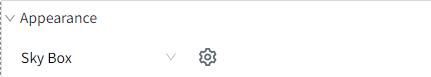
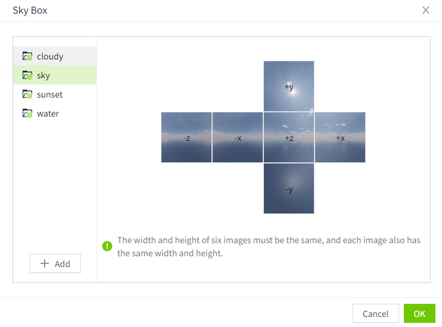

# 3D Viewer

3D Viewer is used to view and explore 3D models and scenes.

**Properties**

| **Name**   | **Description**  |
|------------|---------------|
| Name       | The name of this control.  |
| X          | The distance between the left side of the control and the left side of the canvas.|
| Y          | The distance between the top of the control and the top of the canvas.  |
| W          | The width of the control.  |
| H          | The height of the control. |
| Scene      | Bind the scene to the control.        Drop down to select the created scene   Refresh button, click to refresh the contents of the drop-down list    Edit button, click to open the editing page of the currently selected scene in a new browser window    Bind button. After clicking, the property binding window will pop up to bind the scene to the control.|
| Appearance | Set the appearance of the 3D viewer, supporting background color, background image and skybox settings.|

## **Background color setting**

Select "BackgroundColor" in the drop-down option of Appearance, click the color selector behind the drop-down box, and set the color.

**Preview:**

## **Background image settings**

1. Select "Background Image" in the drop-down option of appearance, click the settings button behind the drop-down box, and the file selection window will pop up. The file selection window displays the entire contents of the library.

    

2. selecting a picture in png or jpg format , click the confirmation button in the pop-up window to complete the settings.

**Note:** The background image only supports png and jpg formats. 

**Preview:**

## **Skybox settings**

1. Select "Skybox" in the drop-down option of appearance, click the settings button behind the drop-down box, and the skybox settings window will pop up. The system has 4 built-in skybox materials for you to use. You can also upload the skybox materials yourself.

    

2. In the skybox name list on the left, click a name, and the material picture of the skybox will be automatically displayed on the right.
3. Click the OK button to complete the settings.

**Preview :**

## **Create a skybox**

1. In the skybox pop-up window, click the "Add" button, and a skybox will be automatically added. You can set the name of the skybox.

    

2. Click on the name of the newly added sky box. On the right side of the pop-up window, the six components of the sky box (+x, -x, +y, -y, +z, -z) are displayed.
3. Move the mouse to a certain area to display the upload prompt. After clicking, a file selection window will pop up and you can select the file to upload.
4. After all 6 pictures have been uploaded, click the OK button to save.

**Notes:** 

1. The six pictures in the sky box must have the same width and height, and the width and height of each picture must also be the same. 
2. Skybox pictures only support png and jpg formats. 

## **Rename skybox**

The system's built-in skybox does not support renaming. Right-click the mouse on the skybox created by the user, and click Rename in the pop-up menu to modify the name of the current skybox.

## **Remove skybox**

The skybox built into the system does not support deletion. Right-click the skybox created by the user and click Delete in the pop-up menu to delete the current skybox.

After the sky box is deleted, all 3D viewers that apply the sky box will no longer display the sky box effect.

**Event**

Allows you to perform specific events based on certain conditions. See the full description of each event on the **2D Visualization-> Event** page.

**Example**

View the 3D scene.

1. Insert a 3D viewer control on the screen.
2. Select scene: Park.
3. Click the preview button on the screen to view the running effect.

    

