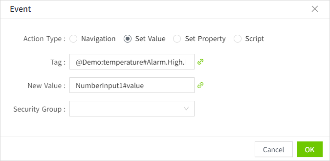

# Label

The Label control is used to display text, either static text or, through property binding, dynamic content.

**Properties**

| **Name** | **Description**  |
|-----------------|----|
| Name | The name of this control.| X | Distance of the left side of the control from the left side of the canvas. |
| Y  | The distance from the top of the control to the top of the canvas. |
| W | Width of the control.  |
| H   | The height of the control. |
|  |The angle of the control.|
| Text  | The content displayed by the control.  |
| Background | The background color of the control.    |
| Border | The border color of the control.    |
| Border Thickness  | The border thickness of the control.  |
| Shadow | Sets the shadow effect of the control. You can set the outer shadow and inner shadow.   **Outer**    **- Enable**: Whether to enable the shadow effect   **- Color**: Used to set the shadow color   **- X**: Controls how far the shadow is shifted horizontally.   `X = 10` → shadow moves 10px to the right   `X = -5` → shadow moves 5px to the left  **- Y**: Controls how far the shadow is shifted vertically.   `Y = 8` → shadow moves 8px downward   `Y = -3` → shadow moves 3px upward   **- Blur**: Controls how soft or sharp the edges of the shadow appear. Higher values make the shadow more blurry and spread out.   **Inner**   **- Enable**: Whether to enable the shadow effect   **- Color**: Used to set the shadow color  **- X**: Controls how far the shadow is shifted horizontally.   `X = 10` → shadow moves 10px to the right   `X = -5` → shadow moves 5px to the left  **- Y**: Controls how far the shadow is shifted vertically.   `Y = 8` → shadow moves 8px downward   `Y = -3` → shadow moves 3px upward  **- Blur**: Controls how soft or sharp the edges of the shadow appear. Higher values make the shadow more blurry and spread out.    **- Spread**: Controls how much the shadow **expands or contracts** from the shape. |
| Font | Sets the font of the text content. This includes font, font size, font color, bold, italic, underline, horizontal alignment, and vertical alignment. |
| Right Click Menu  | Setting the context menu on the control allows you to set the background color, border color, font type, font size, font color, bold, and skew of the menu. You can configure actions for the context menu, including navigation, set value, set property, and script.  On the running page, right-click on the control to display the context menu. |

**Animation**

Allows you to perform specific animations based on certain conditions. See the  **2D Visualization-> Animation** page for a complete description of the various animations.

**Event**

Allows you to perform a specific event based on certain conditions. See the **2D Visualization-> Event** page for a complete description of the various events.

**Example 1**

Displays a static text. 

| **Name**   | **Description**                                |
|------------|------------------------------------------------|
| Background | ace9ac                                         |
| Text       | Demo Screen                                    |
| Font       | Calibri,16, Horizontal center, Vertical center |

**Example 2**

Use text to display the operating status of the device.

| **Name** | **Description**                                                              |
|----------|------------------------------------------------------------------------------|
| Text     | Binding expression: "Device operational status: "+tag('@area:device1status') |
| Font     | Calibri, 16, font color f0672e, horizontal left, vertical center             |

**Example 3**

When the user right clicks on the label , the following context menu pops up

**Properties：**

| **Name**         | **Description**  |
|------------------|--------------|
| Text             | Pump temperature |
| Font             | Calibri, 16, #000000, Horizontal center, Vertical center|
| Right Click Menu | Add the following 2 right-click menus:       - View Historical Chart: Click on the Action button, select “Navigation” in the Action Settings window, and select a pop-up window that displays the historical chart of the pump.           Note: The pop-up window needs to be pre-configured.      - Set Alarm Limits: Click the Action button and select “Set Value” in the Action Setting window. Select “Demo:temperature#Alarm. Limit”. Select ‘NumberInput1#value’ for the new value.   When you click on this context menu, it takes the value entered in the numberinput,set it as the limit value of Demo:temperature#Alarm.High.    |

Click the preview button on the page, click the label control on the preview page, and then click “View Historical Chart” in the right-click menu to display the following effect:

