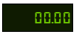

# LED Display

In industrial automation equipment, used to monitor and display various parameters, status and fault information.

**Properties**

| **Name** | **Description** |
|--------|--------------|
| Name | The name of this control.  |
| X | The distance between the left side of the control and the left side of the canvas.|
| Y | The distance between the top of the control and the top of the canvasx.  |
| W  | The width of the control. |
| H | The height of the control. |
|  | The angle of the control. |
| Data  | Data received by the control.   - Text: The content that needs to be displayed. You can enter it manually or click the bind button to bind.    -  Format: The format of content expected to be displayed. You can enter it manually, or you can click the settings button and double-click to select the required format.  |
| Fill | The fill color of the control. |
| Border| Set the border color and border thickness. |
| Font   | Sets the font for the control's content. Including font type, font size, font color, bold, italic, underline, horizontal alignment, and vertical alignment. |
| Right Click Menu    | Setting the context menu on the control allows you to set the background color, border color, font type, font size, font color, bold, and skew of the menu. You can configure actions for the context menu, including navigation, set value, set property, and script.  On the running page, right-click on the control to display the context menu. |

**Animation**

Allows you to perform specific animations based on certain conditions. See full descriptions of various animations on the **2D Visualization-> Animation** page.

**Event**

Allows you to perform specific event based on certain conditions. See the full description of each event on the **2D Visualization-> Event** page.

**Example 1**

Displays the  status of the device.

| **Property**     | **Value**                                                |
|------------------|----------------------------------------------------------|
| Fill             | 2a2a2a                                                   |
| Border color     | 808080                                                   |
| Border thickness | 4                                                        |
| Text             | Area.Status                                             |
| Font             | e9bf2b, bold, horizontally centered, vertically centered |

**Example 2**

Displays the temperature of the workshop.

| **Property**     | **Value**  |
|------------------|----------------|
| Fill             | c0c0c0 |
| Border color     | f06868 |
| Border thickness | 2 |
| Text             | Bind Expression：tag('Area:temperature')+"℃"    |
| Font             | 18, bold, ff0000, horizontally centered, vertically centered|

**Example 3**

The start/stop status of the device is controlled and displayed via the right-click menu.

| **Property**     | **Value**  |
|------------------|-------------|
| Fill             | c0c0c0|
| Border color     | f06868  |
| Border thickness | 2  |
| Text             | Expression:   let a =tag('Demo:status');   if (a)   {    return "Running"; //When the value of the tag is true, the content of the control displays Running.   }   else   {       return "Stopped";//When the value of the tag is false, the content of the control displays Stopped.   }  |
| Font             | 18, bold, ff0000, horizontally centered, vertically centered |
| Right Click Menu | Create 2 right-click menus: Start, Stop.  Setting the Start action: when this menu is clicked, set the value of the tag "Demo:status" to 1      Setting the Stop action: when this menu is clicked, set the value of the tag "Demo:status" to 0    |

Click the Preview button on the page, and then click the right-click menu of the control on the Preview page to see what the control displays. When you click the Start menu, the device is turned on and the control displays Running, when you click the Stop menu, the device is turned off and the control displays Stopped.

