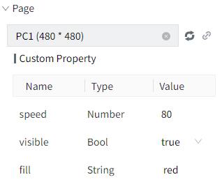
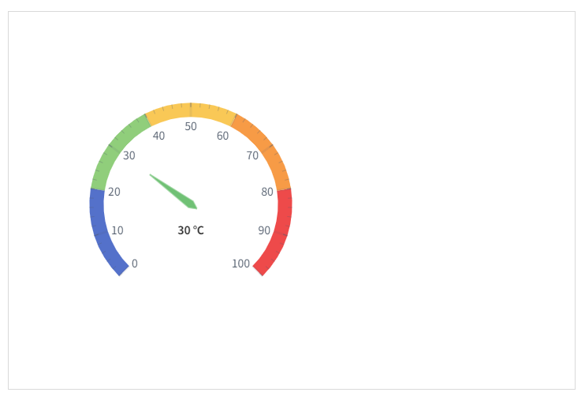
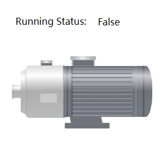

# Page Container

Page Container is used to display the pages within this project.

**Properties**

| **Name**            | **Description**  |
|---------------------|----------|
| Name                | The name of this control.  |
| X                   | The distance between the left side of the control and the left side of the canvas. |
| Y                   | The distance between the top of the control and the top of the canvas.|
| W                   | The width of the control.|
| H                   | The height of the control.  |
| Border              | Set the border of the page container, supporting border color and border thickness.   |
| Resolution Adaption | Set the resolution adaptation of the page container, supporting options like none, scaled, full. Additionally, the resolution adaptation of the page itself will no longer be effective. |
| Page                | Bind the page to the control.     |

**Event**

Allows you to perform specific events based on certain conditions. See the full description of each event on the **2D Visualization-> Event**  page.

**Example 1**

Use a **Page Container** to embed other pages into the current page.

1. Create a new page and name it Page01.
2. Add a gauge to Page01.
3. Create another new page and name it Page02.
4. Add a Page Container to Page02. Click the page container, and set the "Page" property to "Page01", indicating that Page01will be displayed inside the page container.

    

5. The display effect is as follows:

    

**Example 2**

Use a **page container** to monitor multiple devices' statuses simultaneously.

1. Create a new page named **"Motor1"**. Place a motor image and two labels on the page. Set the content of one tlabel to **"Running Status"**, and bind the other label to the tag **Motor1.RunningStatus** to display the current operating status of Motor1.

    

2. Create a new page named **"Motor2"**. Place a motor image and two labels on the page. Set the content of one tlabel to **"Running Status"**, and bind the other label to the tag **Motor2.RunningStatus** to display the current operating status of Motor2.

    

3. Create a new page named **"Home"**. Place a page container and a dropdown on the page. When switching the dropdown selection, the displayed page inside the page container updates accordingly.Set the dropdown options to **"Motor1"** and **"Motor2"**, with the default selection text as **"Motor1"**. Bind the page property of the page container to the **selectedText** property of the dropdown.

    

    

4. In the running page, when switching the dropdown selection, the page inside the page container automatically updates.

    

