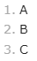
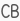
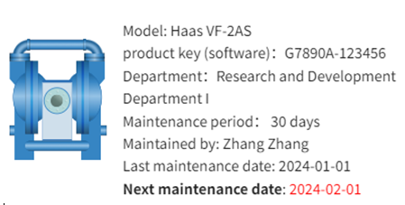

# Rich Text

Rich Text controls allow you to apply rich styles, formatting and multimedia elements to text. Compared to plain text, rich text can include font styles, colors, bold, italic, underline and other text styles, as well as insert tables, links and more.

VC Hub's built-in rich text editor supports two editing modes: Markdown and WYSIWYG(what you see is what you get).

**Markdown Mode**

- Markdown is a lightweight markup language for formatting plain text and adding structure and style.
- In Markdown mode, you can use simple symbols and tags to represent different text styles, such as headings, bold, italics, links, and so on.
- The editor converts the Markdown syntax into rich text format to display the desired styles when previewing or publishing.
- Markdown mode is suitable for users who are familiar with Markdown syntax and provides more control and flexibility.

**WYSIWYG Mode**

- WYSIWYG mode allows you to see the final formatting directly in the editor, just as you would in a regular text processing program.
- In WYSIWYG mode, you can apply different styles, such as fonts, sizes, colors, alignments, etc. via toolbars, shortcuts or right-click menus.
- WYSIWYG mode is more intuitive and easier to use, and there's no need to memorize or understand specific markup syntax.

Whether you choose Markdown or WYSIWYG mode depends on your personal preferences and usage scenarios. If you are used to Markdown syntax, or need more control and flexibility, then Markdown mode may be better for you. If you prefer to edit text intuitively and see results instantly, then WYSIWYG mode may be more suitable for you.                           

**Properties**

| **Name**         | **Description**   |
|------------------|---------------------|
| Name             | The name of this control. |
| X                | Distance of the left side of the control from the left side of the canvas.  |
| Y                | The distance from the top of the control to the top of the canvas.  |
| W                | Width of the control.    |
| H                | The height of the control.   |
| Background       | The background color of the rich text control. |
| Text             | Set the content and format of the text. Click the Edit button to bring up the Rich Text Editor, which allows you to edit the text within the editor.  The editing window is as follows:        Title     Bold    Italic   Set the color of the text   Show strikethrough on selected text   Insert a dividing line between two lines of text   Highlighting quoted content   Unordered list. Each piece of content is identified by a symbol or specific tag, rather than being numbered sequentially.   Unordered lists serve to highlight the equality between items and provide an easy way to list related content.    Example:      Ordered list. Used to present a sequential content format where each item is labeled with a number and numbered in the order in which it appears in the list. The purpose of an ordered list is to make the relationships between items clearer and to provide structured and organized information.    Example:     To-Do List. A format used to record and organize pending tasks.  Example:     Indent. Select the text you want to indent, then use the Tab key or the Indent button to move it to the right. Indentation works when Unorganized, Ordered, or To-Do Lists are enabled.    Reduce Indent. Select the text you want to reduce the indentation, then use the Shift+Tab keys or the Reduce Indent button to move it back to its original position. Reduce Indentation works when Unordered, Ordered, or To-Do List is enabled.     Insert URL    Insert code for short code snippets.    Insert code, suitable for inserting longer code snippets.|
| Border Color     | The border color of the rich text.   |
| Border Thickness | The border thickness of the rich text.   |

**Note:** How to exit the code mode: in Markdown mode, press enter outside the formatting; in WYSIWYG mode, press ctrl + enter.

**Event**

Allows you to perform a specific event based on certain conditions. See the**2D Visualization-> Event** page for a complete description of the various events.

Example

Displaying information about a device via rich text.

