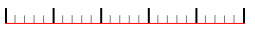
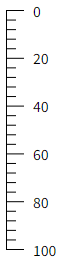
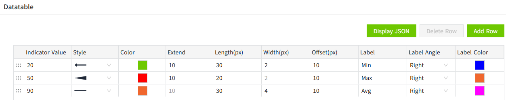
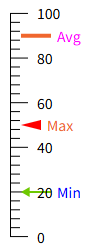

# Ruler

Ruler is used to measure and mark lengths, often used with text label controls.

**Properties**

| **Name**   | **Description**  |
|--|-------------------|
| Name| The name of this control. |
| X   | The distance between the left side of the control and the left side of the canvas.  |
| Y | The distance between the top of the control and the top of the canvas.   |
| W | The width of the control.   |
| H | The height of the control.   |
|  | The angle of the control.  |
| Fill  | The background color of the control.  |
| Tick  | Sets the appearance style of the tick.    - **Axis**: Set the axis color. The red area in the figure below is the main axis.     - **Major Tick**: Set the major tick color, quantity and length. The red area in the figure below is the major tick.     - **Minor Tick**: Set the minor tick color, quantity and length. The red area in the figure below is the minor tick.    |
| Tick Value    | Set the measuring range of the ruler.    - **Show**:  Whether or not to display the value.    - **Reverse**: Displays the maximum and minimum values of the ruler values in reverse.   Before reverse:     After reverse:       - **Min**: Minimum value of the ruler   - **Max**: Maximum value of the ruler   - **Type**: Contains value and percentage to set the numeric type    - **Decimals**: Sets the number of decimal places for the ruler value.       - **Font**: Sets the font type, font size, bold, italic, and font color for the ruler value.  |
| Indicator    | Set the style for each indicator on the ruler. Available styles include Arrow, Line, and Wedge.   Click the Settings button to open a dialog where you can configure the indicators and their styles.    - **Indicator Value**: Value corresponding to the indicator     - **Style**: Select the style for the indicator , choosing from arrow,  line, or wedge   - **Color**: Set the color of the indicator   - **Extend**: When "Line" is selected, the Extend field is disabled.      - **Length**: The overall length of the indicator   - **Width**:   When **Wedge** is selected, the Width field is disabled.   When **Line** or **Arrow** is selected, the Width value represents the width of the line segment.   - **Offset**: Setting the distance between the indicator and the axis   - **Label**:  Set a text label for the indicator   - **Label Angle**: Set the text’s display orientation   - **Label Color**: Set the font color of the text  |

**Event**

Allows you to perform specific events based on certain conditions. See the full description of each event on the **2D Visualization-> Event** page.

**Example**

Add 3 indicators to the ruler to indicate the max, min and avg values.

1. Insert a ruler control on the page
2. Click on the control and in the Appearance property of the control click on the setting button of the indicator 

    

3. Make the following settings in the datatable popup window

    

4. After saving the popup, the ruler is displayed as follow：

    

