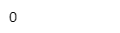
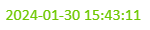

# Value Display

Value display control is used to display data, which can display numerical, boolean, string and datatime data.

**Properties**

| **Name**   | **Describe**     |
|-------|---------|
| Name | The name of this control.  |
| X  | The distance between the left side of the control and the left side of the canvas.  |
| Y | The distance between the top of the control and the top of the canvas.  |
| W | The width of the controlx. |
| H  | Height of the control.  |
|  | The angle of the control. |
| Data   | The data received by the control.    -Text: What needs to be displayed. You can enter it manually or click the binding button to bind.     -Units: Sets the unit of the displayed data. You can enter it manually or click the Bind button to bind it.   - Format: The content format is expected to be displayed. You can enter it manually or click the settings button and double-click to select the desired format. |
| Fill  | The fill color of the control.    |
| Font  | Set the font of the control content. Including font , font size, font color, bold, italic, underline, horizontal alignment, vertical alignment.|
| Right Click Menu | Setting the context menu on the control allows you to set the background color, border color, font type, font size, font color, bold, and skew of the menu. You can configure actions for the context menu, including navigation, set value, set property, and script.  On the running page, right-click on the control to display the context menu.  |

**Animation**

Allow you to execute specific animations based on certain conditions. Please refer to the complete description of various animations on the **2D Visualization-> Animation** page.

**Event**

Allow you to perform specific event based on certain conditions. Please refer to the complete description of various events on the **2D Visualization-> Event** page.

**Example 1**

Display the temperature of the current working environment.

| **Property** | **Value**     |
|--------------|--------------|
| Fill         | 2c2c2c |
| Text         | Binding tag: Demo:temperature    |
| Units        | ℃    |
| Font         | Calibri, 16, ffffff, horizontal right, vertical center |

**Example 2**

Display the system time.

| **Property** | **Value**                                               |
|--------------|---------------------------------------------------------|
| Text         | Binding tag: System:Server.CurrentDateTime              |
| Format       | yyyy-MM-dd HH:mm:ss                                     |
| Font         | Calibri, 16, 6ec800, horizontal center, vertical center |

**Example 3**

View Celsius and Fahrenheit temperatures via the right-click menu.

| **Property**     | **Value**         |
|------------------|------------|
| Text             | expression：   const value = tag('@Demo:temperature');   if(property('ValueDisplay1#units') === '℃'){       return value;   }   return (value * 9 / 5) + 32; |
| Format           | #,##0.# |
| Font             | Calibri,16, 6ec800，horizontal center, vertical center |
| Right Click Menu | Add two right-click menus: Celsius, Fahrenheit.  In the Fahrenheit action, set the property binding, which displays the value of the control's UNITS property, to set its value to ℉     In the Celsius action, set the property binding, which displays the value of the control's units property, to set its value to °C    |

Click the Preview button on the page, and on the preview page, right-click the control to toggle the context menu and view the display.

