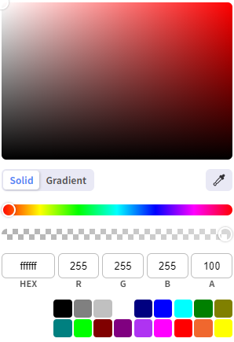
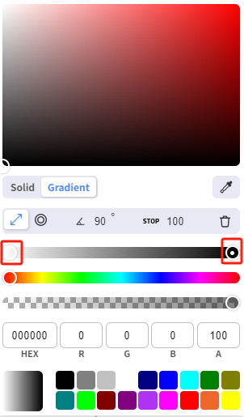

# Fill, Stroke, Shadow and Pick Color

You can change the appearance style of a control by setting its fill color, border color, border type, and border thickness.

## **Fill**

Includes 2 fill styles: solid and gradient. In the “Appearance“ property of the control, click the color selector of the fill to set the fill.

#### **Solid**

Examples:

## **Gradient**

1. Select "Gradient" in the Color Editor.
2. Select Linear or Radial.
3. You will see two stops: white and black. Click on each stop and select a different color.
4. If you want to add additional stops, left-click on the color bar and select a stop color. You can also delete added stops. 

Examples:

## **Stroke**

Borders are also commonly used to set the shape of the control. This includes the border color, border type, and border thickness. The border color is set similarly to the fill. In the Appearance property of the control, click the color selector of the border to set the color.

Type primarily controls the style of the line drawn, for example, with a dotted line. The Thickness setting is in pixels. On thick lines, you can more easily observe their effect.

Examples:

## **Shadow**

By applying shadow effects to components, you can enhance the sense of depth and layering in the user interface.

This makes the UI look less flat and improves its overall visual appeal and professionalism.

Examples:

## **Pick color**

Click the Color Pickup button on the Color Picker to pick up the color.

1. Draw two rectangles on the page: Rectangle 1 and Rectangle 2. The fill color of Rectangle 1 is set to red and the fill color of Rectangle 2 is white.
2. Set the fill color for Rectangle 2 and click the color picker button on the open color picker.
3. Move the color picker cursor and place it in the fill area of Rectangle 1 to pick up the fill color (red) of Rectangle 1.
4. Click the left mouse button to complete the color picking operation. At this point, Rectangle 2 is automatically filled with the fill color of Rectangle 1.

