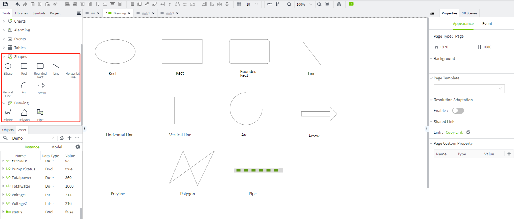
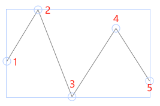
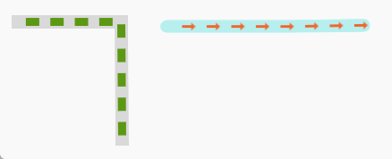
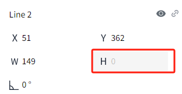
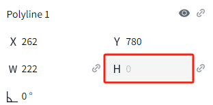
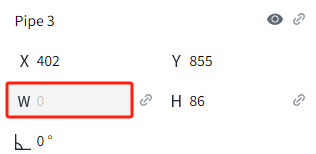

# Shape

Shapes can be changed and edited after they have been drawn using the drawing tools, and contain a variety of shapes, each with a different purpose. 

## **Ellipse**

Used to create and edit ellipse shapes. To create an ellipse, place the mouse over the control, then hold down the left mouse button, move the mouse to the page, release the mouse and an ellipse will be created on the page. Once created, clicking on the ellipse allows you to adjust the angle and size of the ellipse using the action buttons of the selection box. The size and angle can also be adjusted in the properties window.

Positions 1 to 8, corresponding to the following figure, are used to adjust the size of the ellipse. Position 9, press and hold and move the mouse, you can rotate the ellipse.

## **Rectangle**

Used to create and edit rectangles. It is used in much the same way as an ellipse. To create a rectangle, place the mouse over the control, then hold down the left mouse button, move the mouse to the page, release the mouse and a rectangle will be created on the page. Once created, clicking on the rectangle,  you can adjust the angle and size of the selection box using the operation buttons. The size and angle can also be adjusted in the properties window.

## **Rounded Rectangle**

Used to create and edit rounded rectangles. It is used in much the same way as an ellipse. To create a rounded rectangle, place the mouse over the control, then hold down the left mouse button, move the mouse to the page, release the mouse and a rounded rectangle will be created on the page.Once created, clicking on the rounded rectangle, you can adjust the angle and size of the selection box using the operation buttons.The size and angle can also be adjusted in the properties window.

## **Line**

Used to create and edit lines. To create a line, select the control, place the mouse over the control, then hold down the left mouse button, move the mouse to the page, release the mouse and a line will be created on the page. Once created, clicking on the line，you can adjust the angle and size of the selection box using the operation buttons. The length and angle can also be adjusted in the properties window.

If you want to draw a horizontal or vertical line, select the control, hold down the Shift key, and then drag the mouse across the canvas to automatically draw a horizontal or vertical line.

## **Horizontal Line**

Used for creating and editing horizontal lines. To create a horizontal line, place the mouse over the control, press and hold the left mouse button, move the mouse to the page, and release the button. A horizontal line will be created on the page. After creation, click the line to adjust its angle and length using the selection box's action buttons. You can also modify the length and angle in the properties window.

## **Vertical Line**

Used for creating and editing vertical lines. To create a vertical line, place the mouse over the control, press and hold the left mouse button, move the mouse to the page, and release the button. A vertical line will be created on the page. After creation, click the line to adjust its angle and height using the selection box's action buttons. You can also modify the length and angle in the properties window.

## **Arc**

Used to create and edit arcs. To create an arc, place the mouse over the control, then hold down the left mouse button, move the mouse to the page, release the mouse and an arc will be created on the page . Once created, clicking on the arc ，you can adjust the angle and size of the selection box using the operation buttons.  The size and angle can also be adjusted in the properties window.

Double-click the arc, the arc is in the editing state, you can use the mouse to move the position of the start point and end point of the arc, to change the shape of the arc.

## **Arrow**

Used to create one or two-sided arrow. To create an arrow, place the mouse over the control, then hold down the left mouse button, move the mouse to the page, release the mouse and a arrow will be created on the page. You can select either a unilateral arrow or a bilateral arrow in the properties. Once created, clicking on the arrow, you can adjust the angle and size of the selection box using the operation buttons. The size and angle can also be adjusted in the properties window.

## **Polyline**

Used to create and edit polylines. To create a polyline, click the control, then click and drag the mouse within the page to draw a line segment, release the mouse to complete the line segment, press and drag the mouse again to continue to draw the next segment, and click the left mouse button to determine the end point when you are finished. After that, double-click the left mouse button or click the right mouse button to exit the editing state. After creation, click on the line, you can adjust the angle and size by checking the box action buttons. The size and angle can also be adjusted in the properties window.

If you want to draw a horizontal or vertical line segment line, you can hold down the Shift key during the drawing process and drag the mouse on the page afterward to automatically draw horizontal or vertical line segments.

Double-click the line, the line is in the editing state, through the mouse to move the various vertices of the line (the position of the following figure 1 ~ 5), to adjust the style of the line.

## **Polygon**

Used to create and edit polygons. Each time you want to create a polygon, click the control, then click on the page and then move the mouse, at this time between the click point and the current position of the mouse to draw a line. Click the left mouse button to determine the position of the current edge. After that, continue to hold down the left mouse button and move the mouse, in accordance with the order in which the points are drawn, the first point is connected to the next point, and the last point is then connected to the starting point to form the shape. Double-click the left mouse button or click the right mouse button to complete the drawing.

Once created, clicking on the polygon ,you can adjust the angle and size of the selection box using the operation buttons. The size and angle can also be adjusted in the properties window.

Double-click the polygon with the mouse, the polygon is in the selected state, and each vertex shows the selected effect. Left-click any vertex with the mouse and drag the mouse on the page, the vertex position follows the change of the mouse position, and the graphic changes according to the change of the vertex position.

## **Pipe**

Used to create pipes. It is drawn in much the same way as a polyline. To create a pipe, click the control, then click and drag the mouse within the page to draw, release the mouse to finish drawing a pipe, press and drag the mouse again to continue drawing the next section of the pipe, double-click the left mouse button or click the right mouse button to finish drawing. You can set the style of the pipe in the properties. Once created, clicking on the pipe, you can adjust the angle and size of the selection box using the operation buttons.The size and angle can also be adjusted in the properties window.

When you double-click the pipe, the pipe sector is in the editing state, and you can change the shape of the pipe by moving the position of any end point of the pipe with the mouse.

You can also set the style of the pipe in the property window.

**Property**

| **Name** | **Description**          |
|------------------------|--------|
| Name | The name of this control.|
| X | The distance of the left side of the control from the left side of the canvas.|
| Y| The distance from the top of the control to the top of the canvas. |
| W| The width of the control. |
| H| The height of the control. |
| | The angle of the pipe.  |
| Pipe | Set the style for the ends of the pipe as well as the corners.     Square Head Square Corner  Round corner with square head    Square corner with round head   Round corner with round head|
| Background| The background color of the pipe. |
| Diameter | The diameter of the pipe. | 
|Fluid | Sets the style of the fluid in the pipe.   - **Style**: Sets the style of the fluid. Includes: None, Triangle, Rectangle, Arrow.  You can also click the settings button next to the style and select an SVG image from the library to use as the fluid style. - **Width**: The width of the fluid. - **Height**: The height of the fluid. - **Color**: The color of the fluid.  - **Space**: The distance between adjacent fluids. - **Flow Rate**: Contains 4 options: 0,1, 2, 3. 0 represents stationary, and 3 represents the fastest flow.  - **Flow Direction**: The direction of flow of the fluid. Flow from the start point to the end point is forward, and flow from the end point to the start point is reverse.   **Note**: The start point is the position where you start plotting and the end point is the position where you end plotting.|

## Notes

1. Horizontal lines have a height of 0. Changing their height through property values or scripts will not have any effect.

2. Vertical lines have a height of 0. Changing their weight through property values or scripts will not have any effect.

3. When the height of a horizontal polyline is 0, modifying its height through property values or scripts will not take effect.

4. When the width of a vertical polyline is 0, modifying its width through property values or scripts will not take effect.

5. When the height of a pipe is 0, modifying its height through property values or scripts will not take effect.

6. When the width of a pipe is 0, modifying its width through property values or scripts will not take effect.

