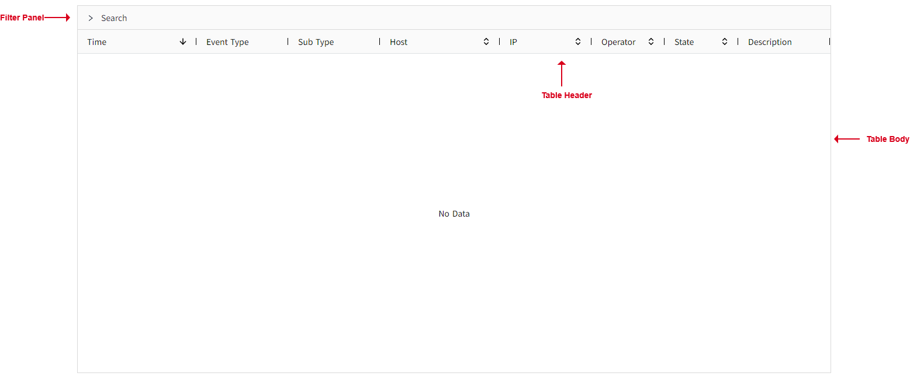
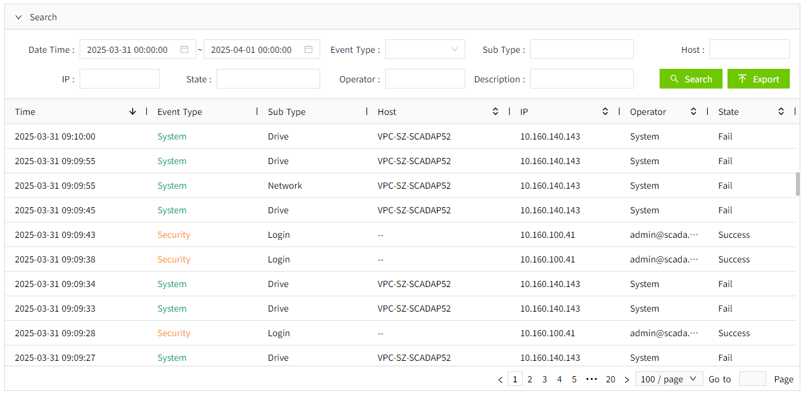

# Historical Event

The historical event control is used to display events that have occurred. By default, it does not display any data. You need to set the query conditions after running the page before performing the query operation.

**Interface Elements**

You can click and drag a column's margins to adjust its width on the preview and run pages. You can also sort columns in ascending or descending order by clicking the up or down arrow next to each column header.

**Properties**

| **Name**         | **Description**  |
|------------------|----------|
| Name             | The name of this control. |
| X                | The distance between the left side of the control and the left side of the canvas. |
| Y                | The distance between the top of the control and the top of the canvas. |
| W                | The width of the control.  |
| H                | The height of the control. |
| Border Color     | Set the color of the outer border of the control and the table line of the table. |
| Border Thickness | Set the thickness of the outer border of the control and the table line of the table. |
| Table Header     | Set the background color, font type, font size, bold, italic, and font color of the table header.  |
| Table Body       | Set the background color, font type, font size, bold, italic, and font color of the table body.  |
| Color            | Sets the color displayed on the control for each event type.   |
| Button Style     | Sets the style of the buttons used on the control. Click the setting button of the button style to set it.    Search Button.The background color, border color, font type, font size, bold, italic, and font color of the search button.   Export Button.The background color, border color, font type, font size, bold, italic, and font color of the export button. | 
| Filter Panel     | Set the style of the filter panel. Including tab query and in-page query. After performing the page tag query, the number of items displayed on each page may still be too many. You can also query again for the data in the currently displayed page , that is, in-page query.   - **Background**: he background color of the filter panel.   - **Title Font**: Set the font type, font size, bold, italic, and font color of the panel name.    - **Filter**: The background color and border color of the search conditions in the filter panel, the font type, font size, boldness, italics, and font color of the search title and entered search content. | 
| Column           | Set the column names that need to be displayed on the control.   |
| Items per page   | Set the number of items displayed on each page.  |

**Event**

Allows you to perform specific events based on certain conditions. See the full description of each event on the **2D Visualization-> Event** page.

**Example 1**

View events that occurred in the last 24 hours.

1. On the running page, expand "Search" tab and set the start and end time.
2. Click the "Search" button.

