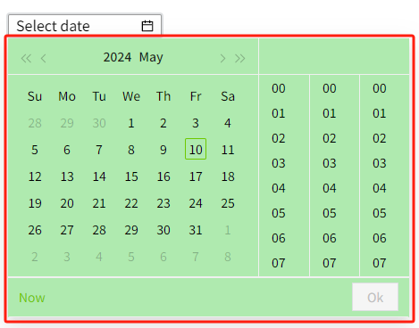

# Datetime Input

The Datetime Input control is used to set the date and format the date.


**Properties**

| **Name**      | **Description**  |
|--------------|------------------|
| Name              | The name of this control. |
| X                 | Distance of the left side of the control from the left side of the canvas.|
| Y                 | The distance from the top of the control to the top of the canvas. |
| W                 | Width of the control. |
| H                 | The height of the control. |
| Date              | Sets the date displayed on the control. |
| Picker Type       | Sets the format of the content displayed by the control, which contains Datetime and Date.  When **Datetime** is selected, the year, month, day, hour, minute and second can be selected on the control;  <br>  <br>When **Date** is selected, only the year, month and day can be selected.  <br>   |
| Format            | Format the date, you can drop down to select the preset format, or you can input your own.   <br>  Click to bring up the Format pop-up window, and double-click in the pop-up window to select the format.  |
| Background        | The background color of the control.    <br>|
| Picker Background | The background color of the control's popup calendar window.  <br> |
| Border Color      | The border color of the control.  |
| Border Thickness  | The border thickness of the control. |
| Font              | Sets the font of the control. This includes font , font size, font color, bold, and italic. |

**Event**

Allows you to perform a specific event based on certain conditions. See the **2D Visualization-> Event** page for a complete description of the various events.

**Example**

Display the current system time with the Datetime Input control.


1. Insert a Datetime Input control on the page.
2. Set the following properties for the control.

| **Property**        | **Value**                                     |
|---------------------|-----------------------------------------------|
| Background          | 03172c                                        |
| Calendar Background | eff0f2                                        |
| Border Color        | 12b5ac                                        |
| Border Thickness    | 2                                             |
| Fonts               | Digital Numbers, 18, bold, font color: 12b5ac |
| Picker Type         | Datetime                                      |
| Formatting          | a h:mm:ss                                     |

3.Set event for the control, event type is "LifeCycle" -> "Loaded".
    
4.Turn on the "Enable" button and enter the following script into the Script Editor: 
    ```typescript
    const data = await System.Tag.read('@System:Server.CurrentDateTime')
    const calendar = await System.UI.findControl('Datetime Input 1');
    calendar.value = data.value;
    calendar.applyChanges();
    ```
5.On the running page, view what the Datetime Input control displays.
    

