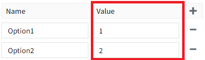
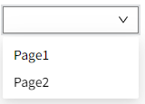

# Dropdown

When the user selects an option, you can perform a specific action, such as updating data, opening a page, and so on. You can set the list contents manually in the properties of the control.


**Properties**

| **Name**         | **Description**                |
|------------------|--------------|
| Name             | The name of this control.  |
| X                | Distance of the left side of the control from the left side of the canvas.|
| Y                | The distance from the top of the control to the top of the canvas.  |
| W                | Width of the control. |
| H                | The height of the control. |
| Dropdown Name    | The name of the drop-down option.  <br>|
| Dropdown Value   | The value of the drop-down option.  <br>|
| Selected Text    | The text of the currently selected dropdown option. |
| Selected Value   | The value of the currently selected dropdown option. |
| Selected Color   | The background color of a dropdown option that is displayed in the dropdown list when the option is selected. |
| Hover Color      | The background color of the dropdown list when the mouse is hovered over a dropdown option. |
| Maximum rows     | The number of rows to display in the dropdown list before the scrollbar is displayed.   |
| Row Height       | Determines the height in px of each option in the dropdown list.  |
| Fill Color       | The fill color of the dropdown box. <br>   |
| Border Color     | The border color of the dropdown box.    <br> |
| Border thickness | The border thickness of the dropdown box.   |
| Shadow           | Sets the shadow effect of the control. You can set the outer shadow and inner shadow.  <br> **Outer**   <br>**- Enable**: Whether to enable the shadow effect  <br>**- Color**: Used to set the shadow color <br> **- X**: Controls how far the shadow is shifted horizontally.  <br>`X = 10` → shadow moves 10px to the right  <br>`X = -5` → shadow moves 5px to the left <br>**- Y**: Controls how far the shadow is shifted vertically.  <br>`Y = 8` → shadow moves 8px downward  <br>`Y = -3` → shadow moves 3px upward <br> **- Blur**: Controls how soft or sharp the edges of the shadow appear. Higher values make the shadow more blurry and spread out. <br> **Inner**  <br>**- Enable**: Whether to enable the shadow effect  <br>**- Color**: Used to set the shadow color <br>**- X**: Controls how far the shadow is shifted horizontally.  <br>`X = 10` → shadow moves 10px to the right  <br>`X = -5` → shadow moves 5px to the left <br>**- Y**: Controls how far the shadow is shifted vertically.  <br>`Y = 8` → shadow moves 8px downward  <br>`Y = -3` → shadow moves 3px upward <br>**- Blur**: Controls how soft or sharp the edges of the shadow appear. Higher values make the shadow more blurry and spread out. <br>  **- Spread**: Controls how much the shadow **expands or contracts** from the shape. |
| Font             | The font of the dropdown box. Includes font type, font size, font color, bold, slant, and underline settings.|

**Event**

Allows you to perform a specific event based on certain conditions. See the **2D Visualization-> Event** page for a complete description of the various events.

**Example**

Opens the specified page when an option is selected in the drop-down list.



```js
// Opens Page1 when the value of the drop-down option is 1, and opens Page2 when the value of the drop-down option is 2.
if (Context.currentEvent.newValue == '1') {
    System.Page.open('Page1');
}
else if(Context.currentEvent.newValue == '2') {
    System.Page.open('Page2');
}
```