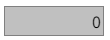
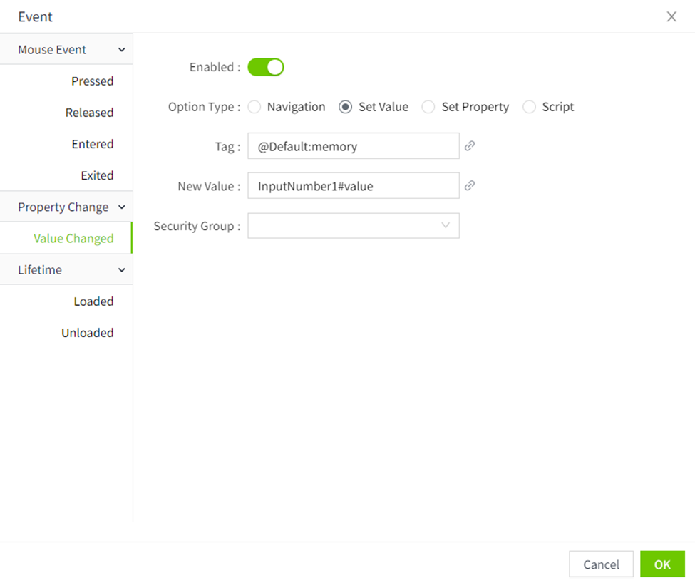

# Number Input

 The Number  Input  is used to display numbers and also to send down numeric values.

**Properties**

| **Name**              | **Description**       |
|-----------------------|-------------|
| Name                  | The name of this control. | X                     | Distance of the left side of the control from the left side of the canvas. |
| Y                     | The distance from the top of the control to the top of the canvas. |
| W                     | Width of the control.  |
| H                     | The height of the control. |
| Value                 | The value displayed in the Input Number . |
| Decimals              | Used to set the number of decimal places for the value displayed and entered in the Input Number , and the lack of which is automatically complemented by 0. |
| Boundary Value        | Sets whether or not bounds are enabled. When enabled, the control can only enter values between the maximum and minimum values.    - **Min**: Sets the minimum value allowed to be entered on the control    - **Max**: Sets the maximum value allowed to be entered on the control  |
| Out-of-bounds Prompts | Sets whether to enable out-of-bounds prompts. When enabled, you can set the content of the out-of-bounds hint.       Example:      **Note** :The out-of-bounds hint must be enabled for the boundary value to take effect. |
| Fill                  | The background color of the Input Number.   |
| Border Color          | The border color of the Input Number .  |
| Border Thickness      | The border thickness of the Input Number .   |
| Shadow                | Sets the shadow effect of the control. You can set the outer shadow and inner shadow.     **Outer**    - **Enable**: Whether to enable the shadow effect   - **Color**: Used to set the shadow color   - **X**: Controls how far the shadow is shifted horizontally.   `X = 10` → shadow moves 10px to the right   `X = -5` → shadow moves 5px to the left  - **Y**: Controls how far the shadow is shifted vertically.   `Y = 8` → shadow moves 8px downward   `Y = -3` → shadow moves 3px upward   - **Blur**: Controls how soft or sharp the edges of the shadow appear. Higher values make the shadow more blurry and spread out.   **Inner**   - **Enable**: Whether to enable the shadow effect   - **Color**: Used to set the shadow color  - **X**: Controls how far the shadow is shifted horizontally.   `X = 10` → shadow moves 10px to the right   `X = -5` → shadow moves 5px to the left  **- Y**: Controls how far the shadow is shifted vertically.   `Y = 8` → shadow moves 8px downward   `Y = -3` → shadow moves 3px upward  - **Blur**: Controls how soft or sharp the edges of the shadow appear. Higher values make the shadow more blurry and spread out.   - **Spread**: Controls how much the shadow **expands or contracts** from the shape. |
| Font                  | Sets  the font of the control. Includes font , font size, font color, bold, italic, and horizontal alignment.   |

**Event**

 Allows you to perform a specific event  based on certain conditions. See the **2D Visualization-> Event** page for a complete description of the various events.
**Example**

Modify the factory workshop temperature via a input number control.

1.  Add a input number  control to the page.
2.  Set the properties of the control.

| **Property**          | **Value** |
|-----------------------|-----|
| Fill                  | eff0f2 |
| Border color          | rgba(128,128,128,0)   |
| Border thickness      | 1|
| Value                 | Binding tag (Factory1: Temperature) |
| Decimals              | 1 |
| Boundary value        | Enabled.   - **Min**: -40 （lowest temperature allowed in the work shop）  - **Max**: 85 （highest temperature allowed in the work shop） | 
| Out-of-bounds prompts | Enabled  , set the content of the out-of-bounds prompt: The temperature of plant 1 is out of range, please enter a value between -40 and 85. |
| Font                  | Microsoft Black, 18, bold, font color fd9903, right align  |

3.  Set the "Value Changed" -> "Set Value " in the event  property of the input number control to send a value to a tag to change the factory floor temperature. 

