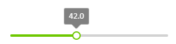
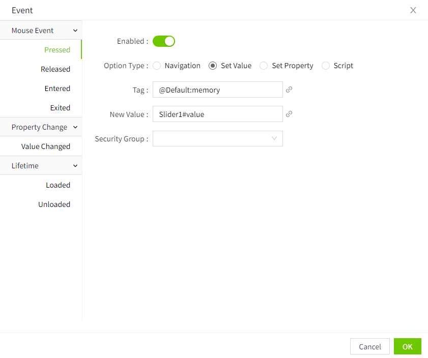

# Slider

The slider control is used to display the current value and optional range, i.e. to set parameters and select values within a certain value range by sliding the bar.

**Properties**

| **Name** | **Description** |
|----------|-----------------|
| Name | The name of this control. |
| X | The distance of the left side of the control from the left side of the canvas. |
| Y  | The distance from the top of the control to the top of the canvas. |
| W | The width of the control.  |
| H| The height of the control. |
| | The angle of the control. |
| Display| Sets the display style of the slider.    - **Reverse**: Sets the direction of the slider, when selected, inverts the slider.    - **Background**: Sets the background color of the entire background bar.     - **Slider Color**: Sets the color of the slider section.      - **Min**: Sets the minimum value of the slider.  - **Max**: Sets the maximum value of the slider.  - **Value**: Sets the current value of the slider.  **Note**: Once a value is bound, the slider is not draggable on the running page. |
| Tooltip   | Sets the display style of the slider alert message.    - **Show Tip**: Control the display or hiding of tooltip information. - **Background**: Sets the background color of the alert message.  - **Border Color**: Sets the border color of the alert message.  - **Decimals**: Sets the number of decimal places for the alert value. - **Font**: Sets the font, font size, bold, italic, and font color of the prompt message. |

**Event**

Allows you to perform a specific event based on certain conditions. See the **2D Visualization-> Event** page for a complete description of the various events.

**Example 1**

Use a slider to display the liquid level value.

1. A slider is inserted on the screen.
2. The "value" property of the slider is bound to a tag: liquid level.

**Example 2**

Use the slider to change the value of a tag. Dragging the slider manually changes the value of the slider, and when the slider is released, the current value of the slider is set to the tag.

1. A slider and a value display control are inserted on the screen.
2. The value display control is bound to the tag: Level
3. The value change event is set in the action property of the slider, and the value change is a tag assignment. Assign the value of the slider to the tag "Level".

4. On the running page, change the slider value of the slider, and the value on the value display control is shown as the value when the slider is released.

