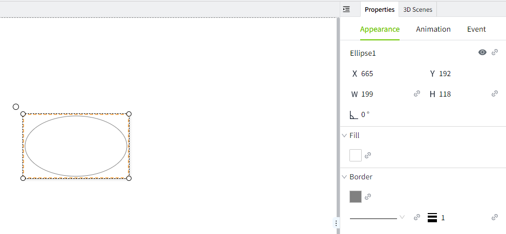
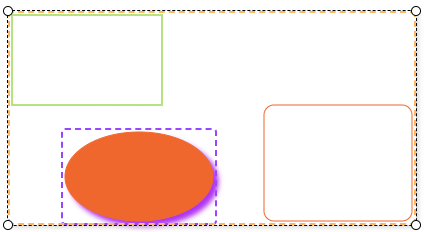

# Modify the Control Properties

#### Modify a Single Control's Properties

After selecting the control on the editor page, use the "Properties" window on the right to modify the control's appearance.



## Batch Edit Control Properties

Users can select multiple controls, and the Property Panel will display the common **Appearance**, **Animation**, and **Event** properties shared by those controls. These shared properties can be batch edited.

#### Batch Edit Appearance Properties

When multiple controls are selected, modifying or binding a property in the Appearance section will apply the change to all selected controls.

**Example: Batch Modify Text Appearance Style**

1. Select a **Label** and a **Value Display** control on the page.
2. The Property Panel will show the common properties shared by these two controls.
3. In the Appearance section, change the font to *Microsoft YaHei* and set the font color to purple.
4. The text appearance of both controls will be updated simultaneously.


#### Batch Edit Animation and Event Properties

When multiple controls are selected, editing **animation** or **event** properties only applies to the specific animation or event being modified — not the entire animation or event configuration. The system compares the new configuration with the existing one on each control.

**Example: Apply Blink Animation to Both a Rect and an Ellipse.**

1. Draw a rect and an ellipse on the page.
2. Apply a Fill animation to the rect only; leave the ellipse with no animation.
3. Select both the rect and the ellipse.In the Animation panel, add a Blink animation.
4. After configuration, inspect the animation settings for each shape.

Results：

- The rect will have both the original Fill animation and the new Blink animation.
- The ellipse will show only the new Blink animation.

## Modify the properties of the controls under the group

There are two ways to select elements under a group: 

1. In the Assets window, click on the element under the group


2. Double-click on an element of the group directly on the page



When an element under the group is selected, the element's properties are displayed in the Properties panel on the right, and you can make changes to the properties directly.


## Modify the appearance of controls through a script.

The system supports dynamically modifying the properties of controls through scripts to meet the flexible interaction and personalized requirements during runtime.

- Each control provides a set of modifiable properties, such as position, size, color, data binding, etc.
- The range of properties that can be modified may vary depending on the type of control.

**Example:** Click the button to modify the appearance of the LED display.

1. Add Label, LED display, and button controls to the page. 
2. Set the text of the Label control to "Device Status:".
3. Set the text of the LED display to "RUNNING", the background color to #0f1b01, and the font color to #6ec800. 
4. Set the text of the button to "Alarm", the background color to #ff0000, and the font color to #ffffff.
5. Click the button, and in the event window, enable the mouse pressed event. Select "Script" as the option type.


6. Enter the following content in the script editor and save it.

```typescript
const led = await System.UI.findControl('LED Display 1'); // Get the LED Display control on the page by its name.
led.backgroundColor = '#ff0000'; // Modify the background color of LED Display control
led.fontColor = '#fff'; // Modify the font color of LED Display control
led.text = 'Error';  // Modify the text of LED Display control
led.applyChanges();
```
 
7. Click the preview button on the page, then click the  button on the preview page to see the style change of the LED display control.


**Note:** After modifying control properties using a script, you need to call the **applyChanges()** method to apply the current modifications. 
