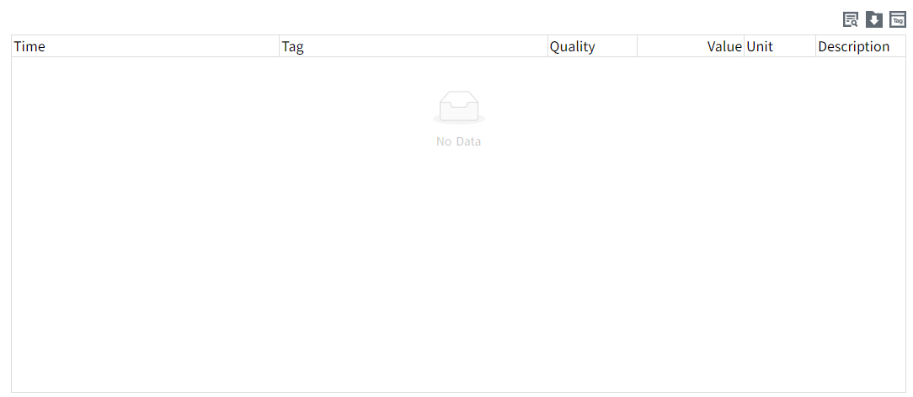

# Historical Data Table

This control is used to query and display historical data of tags.

**Properties**

| **Name**     | **Description** |
|--------------|-----------|
| Name         | The name of this control.  |
| X            | The distance between the left side of the control and the left side of the canvas.   |
| Y            | The distance between the top of the control and the top of the canvas.    |
| W            | The width of the control.  |
| H            | The height of the control.  |
| Time Range   | Query based on the specified time period.    - **Last**:Set the time range for data display.    - **Custom**: Set the start time and end time to customize the time range for data display. |  
| Query Mode   | Query according to the selected query mode, which includes: Raw, Fixed Points, and Periodic.   - **Raw**: Retrieves all raw historical data within the selected time range.   - **Fixed Points**: Requires setting the number of points. The selected time range is divided into corresponding time intervals based on the set number of points, and one data point is selected from each interval according to the specified aggregation mode. -  **Periodic**: Requires setting a period. The selected time range is divided into corresponding time intervals based on the set period, and one data point is selected from each interval according to the specified aggregation mode. |
| Data         | Click the data binding button to open the dataset binding variable. Only tag with history storage enabled can be bound.   |
| Sort         | Set control sorting rules.   - **Time Desc**: Sort in descending order by the time of tag value.  - **Time Asc**: Sort in ascending order by the time of tag value.  | 
| Show         | Sets which buttons are displayed on the control.     |
| Button Style | Sets the color of the button used on the control.    |
| Border       | Set border color and border thickness. |
| Fill         | Set the background color of the content display area.   - **Header**: Set background color of the header.     - **Body**: Set background color of the body.       - **Odd Rows**: Set background color of the add rows.   - **Even Rows**: Set background color of the even rows. |
| Table Header |  Set the font type, font size, bold, italic, font color, and horizontal alignment of the header. | 
| Table Body   |  Set the font type, font size, bold, italic, font color, and horizontal alignment of the body. |

**Event**

Allows you to perform specific events based on certain conditions. See the full description of each event on the **2D Visualization-> Event** page.

**Example**

View the average temperature per hour over the last 24 hours.

1. Insert a "Historical Data Table" control on the page.
2. Set the time range and aggregation mode.

| Time Range       | Last 24 hours |
|------------------|---------------|
| Query Mode       | Periodic      |
| Aggregation Mode | Avg           |
| Period           | 1 hour        |

3. Click the "Preview" button on the page to see the preview effect.

