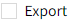
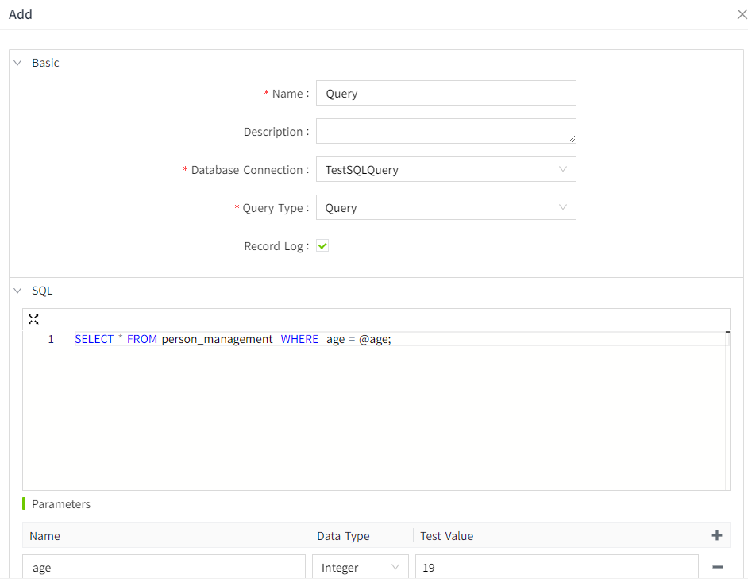
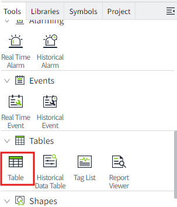
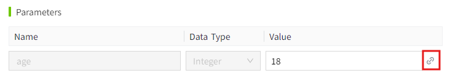
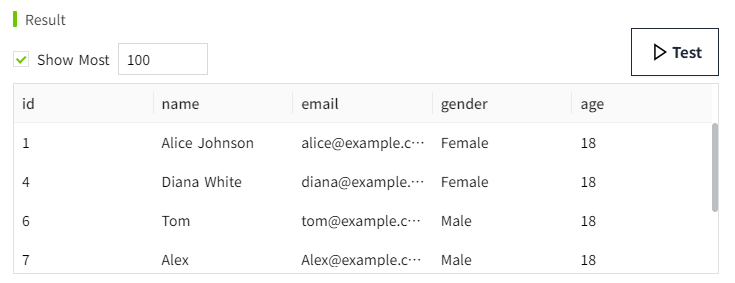
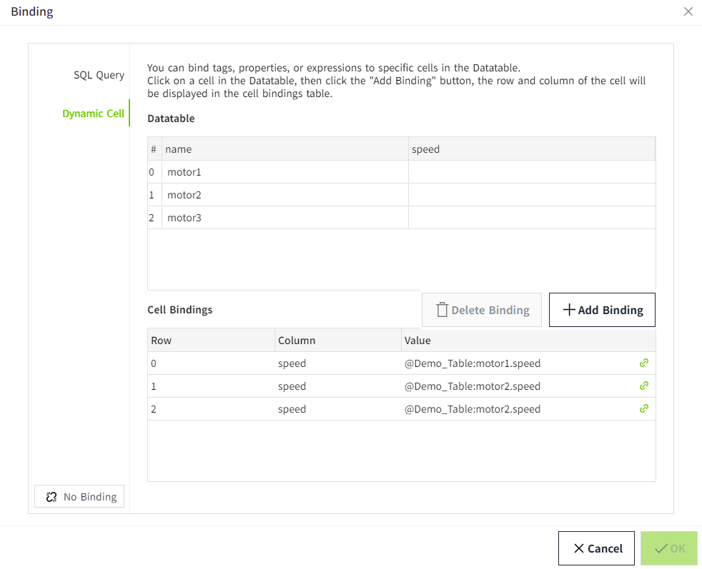
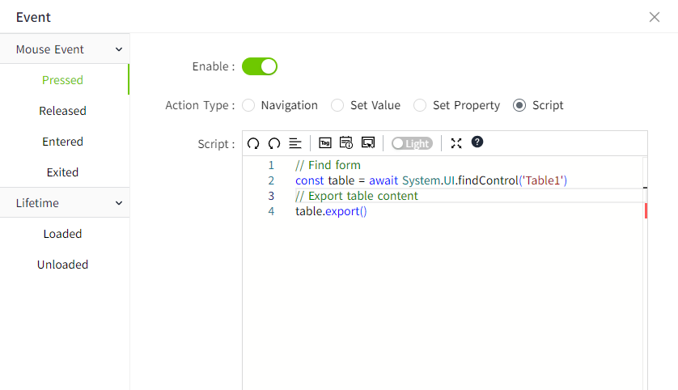
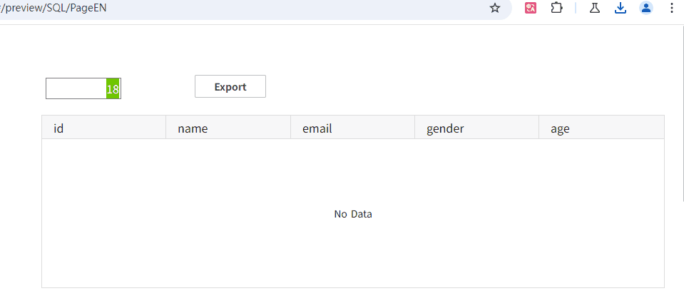

# Table

Display the data in a table.


**Properties**

| **Name**          | **Description**   |
|-------------------|--------------------|
| Name              | The name of this control.  |
| X                 | The distance between the left side of the control and the left side of the canvas.  |
| Y                 | The distance between the top of the control and the top of the canvas. |
| W                 | The width of the control.|
| H                 | The height of the control.   |
| Table             | Set the table contents.  <br> Click this button to set the default data for the table.  <br> Bind data to a table. You can bind SQL queries and dynamic variables.  When bound to an SQL Query, the data returned by the SQL Query is tabular data.  When a dynamic variable is bound, a cell data replacement is performed on the table content that the user manually added.  |     
| Column Properties | Each column can be configured, such as the column width, the data format of the column, etc.   <br>- **Display JSON**: Displays the data structure of the dataset in json format.    <br>- **Generate Columns**: Displays the manually added columns from the table properties here.  If the table is SQL Query bound, the columns that are queried by SQL Query will be displayed here. <br>- **Name**: Column name.  <br>- **Width Weight**: Proportion of the width of each column in the table control.    <br>- **Hide**: Hides the column on the table control. However, the data is still available for viewing and selection (hidden columns are not exported).    <br>- **Sortable**: Enable column sorting. When enabled, the user can click to sort in ascending or descending order at runtime.    <br>- **Filter**: Enable column filtering. When enabled, you can click the filter button to filter the data in the column at run time.        <br>- **Horizontal Align**: Sets the horizontal alignment of column contents.    <br>- **Data Format**: The format of the content expected to be displayed. You can enter it manually, or you can click the Settings button and double-click to select the format you want.     |  
| Show              | Sets whether the title and grid should be displayed. <br> |
| Right Click Menu  | Set whether the right-click menu is supported on the running page, and set the style of the right-click menu.  <br>Set the display and hide of the export operation in the right click menu.  If the "Export" option is checked, right-click the table area on the screen run page, and an "Export" button will be displayed. After clicking this button, the table content will be exported as a CSV file format. <br>Font:Set font type, font size, bold, tilt, and font color for the right-click menu.      | 
| Border            | Sets the border color and thickness. |
| Fill              | Set the background color.  <br>- **Header**: Sets the header background color.   <br>- **Body**: Sets the table body background color.          <br>- **Odd Rows**: Set the background color for odd rows.        <br>- **Even Rows**: Sets the background color for even rows.       <br>- **Selection Background**: Sets the background color of the selected row. <br>- **Selection Font**: Sets the font color of the selected line. |
| Tbale Header      | Styles the header.  <br>- **Row Height**: Sets the row height of the table <br>- **Font**: Sets font type, font size, bold, tilt, font color, and horizontal alignment for the table header. |
| Table Body        | Set the table body style.  <br>- **Background**: Sets the background color of the table body. If you want to alternate different colors on the table body, you can choose the background to alternate between odd and even rows. You can set the background color for odd and even rows, respectively. <br>- **Row Height**: Set the height of each row.  <br>- **Font**: Set the table body font type, font size, bold, slant, and font color. | 

**Event**

Allows you to perform specific events based on certain conditions. See the full description of each event on the **2D Visualization-> Event** page.

**Example 1**

Click the button to query the weather information of the latest period of time, and display the query results through the table.

1. Drag the table and button controls onto the page.
2. Select the button control and click the icon pointed by the arrow to open the configuration page of the action.


3. To configure the mouse press event for the button, write the following script: When the button is pressed, get the weather data，And through the  **System.Datatable.toDatatable** function, the results of the query are converted into the format that the table can display.


```typescript
const source = [
    {
        "date": "2025-03-04",
        "current_temperature": 2.2,
        "min_temperature": 0.5,
        "max_temperature": 3.9,
        "weather": "Cloudy day",
        "wind_speed": "12 km/h",
        "humidity": "85%"
    },
    {
        "date": "2025-03-05",
        "current_temperature": 4.8,
        "min_temperature": 0.7,
        "max_temperature": 8.8,
        "weather": "Cloudy",
        "wind_speed": "15 km/h",
        "humidity": "78%"
    },
    {
        "date": "2025-03-06",
        "current_temperature": 6.8,
        "min_temperature": 0.0,
        "max_temperature": 13.6,
        "weather": "Sunny",
        "wind_speed": "10 km/h",
        "humidity": "72%"
    },
    {
        "date": "2025-03-07",
        "current_temperature": 5.8,
        "min_temperature": 0.0,
        "max_temperature": 11.7,
        "weather": "Light rain",
        "wind_speed": "18 km/h",
        "humidity": "88%"
    },
    {
        "date": "2025-03-08",
        "current_temperature": 8.8,
        "min_temperature": 1.7,
        "max_temperature": 15.8,
        "weather": "Cloudy day",
        "wind_speed": "14 km/h",
        "humidity": "80%"
    },
    {
        "date": "2025-03-09",
        "current_temperature": 9.6,
        "min_temperature": 4.2,
        "max_temperature": 15.0,
        "weather": "Cloudy",
        "wind_speed": "13 km/h",
        "humidity": "76%"
    },
    {
        "date": "2025-03-10",
        "current_temperature": 11.4,
        "min_temperature": 5.4,
        "max_temperature": 17.4,
        "weather": "Cloudy",
        "wind_speed": "9 km/h",
        "humidity": "68%"
    },
    {
        "date": "2025-03-11",
        "current_temperature": 11.5,
        "min_temperature": 6.2,
        "max_temperature": 16.7,
        "weather": "Cloudy",
        "wind_speed": "16 km/h",
        "humidity": "85%"
    },
    {
        "date": "2025-03-12",
        "current_temperature": 14.7,
        "min_temperature": 8.6,
        "max_temperature": 20.7,
        "weather": "Cloudy",
        "wind_speed": "10 km/h",
        "humidity": "70%"
    }
]
// Convert weather data to a table-compatible format
const rows = System.Datatable.toDatatable(source);
// Find table
const tableControl = await System.UI.findControl('Table1');
// Set the table content
tableControl.table = rows;
// Reload the table data
tableControl.reload();
```
 
4. Click the preview button on the page. After clicking the button on the preview page, query the weather data and display the data in the table.


**Example 2**

Based on the age entered, the database is queried and the results are displayed.

1. Create an SQL Query.



2. Find the '**Table**' control in the **Tools** window of the 2D design page and drag it to the page.



3. Select the table control, in the property bar, click the binding button of the "Table" property, and bind an SQL Query for it.


4. After selecting **SQL Query**, choose the newly created query **"Query"** from the **Name** dropdown list.


5. Click the bind button for the parameter "age".



The property binding window pops up and binds it to the value property of **NumberInput1**. When NumberInput1 enters different values, the query is performed according to different ages.


6. Transform allow you to add, modify, or remove columns from the query again.

When the Test button is clicked, the result is as follows:



If we want to hide the **id** column, we can write the following script in the transformation.

```typescript
function transform(data: Table){
    data.forEach(res=>{
        delete res.id
    })
    return data;
};
```
 
7. Click the Test button again.In the results list, the **id** column is no longer displayed.


8. Finally, we want to make sure that polling mode is set to off. This means that the query will not run continuously, but only when the parameters change, such as when a new value is entered inside NumberInput1.


9. Click the "OK" button to finish binding, and click the preview of the page for testing. Enter the age to query in the " NumberInput1" of the preview screen to retrieve the matching data and display the query results in the table.


**Example 3**

The real-time speed of the different motors is displayed in the table.

By binding dynamic cell , the motor speed value is replaced dynamically.

1. In the tool window of the design page, find the 'Table' control and drag it to the page.
2. After selecting the table control, click the data set button of "Table" in the properties bar to add data.


3. Add 2 columns: name, speed. Create 3 rows of data named motor 1, motor 2 and motor 3 with the speed blank.


4. Click the binding button of "Table" in the property bar to perform dynamic cell binding on the rotational speed.


5. When the binding window is opened, a variable is bound for each speed. Click the "OK" button to complete the binding.



6. Click the preview button of the page to view. The result is as follows:


**Example 4**

Use the export function from the table to export the data in the table.

1. In the tool window of the design page, find the 'Table' control and drag it to the page.
2. Select the form control and find the export option in the property bar and check it out.


3. Bind an SQL Query to the table using '**Example 2** '.
4. Click the preview button to view.


**Example 5**

Use the script to export the data in the table.

1. Based on '**Example 4**', find the 'Button' control in the Page Designer window and drag it onto the page.
2. Select the button control and click the icon pointed by the arrow to open the configuration page of the action.


3. To configure the mouse pressed event for the button, write the following script: When the button is pressed, the table content is exported.



```typescript
// Find form
const table = await System.UI.findControl('Table1')
// Export table content
table.export()
```
 
4. Click the preview button to view.

