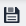
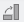
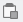
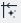
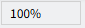
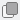
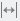
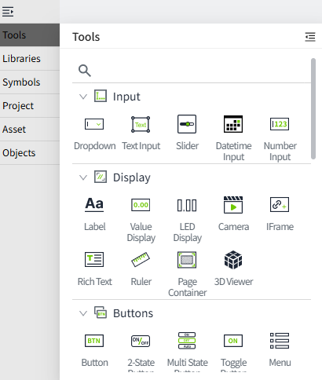
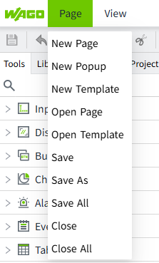
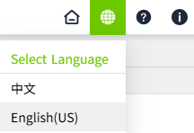

# Introduction to the Editor

All pages need to be drawn within an editor. VC Hub has a built-in WYSIWYG(What you see is what you get) editor. The WYSIWYG editor offers the benefits of real-time preview, intuitive operation, reduced errors, and improved consistency, making it easier for users to create and edit content with faster, more intuitive feedback.

The default window that displays when you first open a project has the following quick-start options. Create a new window by selecting the desired window type to be created. Opening it again displays the window that was open the last time you closed the browser, so you can continue editing from where you left off. 

## **Toolbar**

There is a toolbar at the top of the editor. When the mouse is placed over any button in the toolbar, a message box will appear indicating the function of the button.

**Icon** | **Description** | **Icon**|**Description** |
|--------|-------------|---------|---|
|  | Save current editing content  |  | Adjust the width and height of multiple selected objects simultaneously to be the same as those of the reference object.  Reference object selection rules:   1. **Ctrl + click selection**: The last selected object is used as the reference.  2. **Mouse marquee selection**: The topmost object in the layer order is used as the reference |
| | Undo the previous operation |  | Combine multiple selected objects into one group |
|  | Redo the undone action | | Split the combined objects |
|  | Delete the selected elements or controls |  | Rotate the selected objects 90 degrees clockwise|
| | Copy the selected elements|  | Rotate the selected objects 90 degrees counterclockwise |
| | Paste the copied elements onto the page|  | Flip the selected objects horizontally |
|  | Cut the selected elements |  | Flip the selected objects vertically |
|  | Align multiple selected objects to the left edge of the reference object  Reference object selection rules:   1. **Ctrl + click selection**: The last selected object is used as the reference.  2. **Mouse marquee selection**: The topmost object in the layer order is used as the reference| | Hide/Show the grid of the page |
| | Align multiple selected objects to the right edge of the reference object  Reference object selection rules:   1. **Ctrl + click selection**: The last selected object is used as the reference.  2. **Mouse marquee selection**: The topmost object in the layer order is used as the reference| | Set the interval size of the grid |
|  | Align multiple selected objects to the top edge of the reference object  Reference object selection rules:   1. **Ctrl + click selection**: The last selected object is used as the reference.  2. **Mouse marquee selection**: The topmost object in the layer order is used as the reference|  | Hide/Show the horizontal ruler of the page|
|  | Align multiple selected objects to the bottom edge of the reference object  Reference object selection rules:   1. **Ctrl + click selection**: The last selected object is used as the reference.  2. **Mouse marquee selection**: The topmost object in the layer order is used as the reference                    |  | Hide/Show the vertical ruler of the page|
|  | Align multiple selected objects horizontally to the reference object's center line  Reference object selection rules:   1. **Ctrl + click selection**: The last selected object is used as the reference.  2. **Mouse marquee selection**: The topmost object in the layer order is used as the reference            | | Hide/Show the alignment guide lines.  When dragging the component, if it approaches the edges or center line of other components, a reference line will automatically be displayed to assist users in quickly achieving precise alignment.|
|  | Align multiple selected objects vertically to the reference object's center line  Reference object selection rules:   1. **Ctrl + click selection**: The last selected object is used as the reference.  2. **Mouse marquee selection**: The topmost object in the layer order is used as the reference              |  | Set the color of the alignment guide lines  |
| ![img]| Automatically arrange selected objects vertically with equal spacing|  | Load/Unload historical data in the designer |
|  | Automatically arrange selected objects horizontally with equal spacing|  | Load/Unload real-time data in the designer |
|  | Align selected objects to the horizontal center of the page|  | Zoom out page|
|  | Align selected objects to the vertical center of the page|  | Show actual zoom level of the page (can manually adjust the scale)|
|  | Move the selected object up one layer | | Zoom in page  |
|  | Move the selected object down one layer | | Adjust the display ratio of the page to 100%  |
| | Move the selected object to the top layer | | Open the project management window  |
|| Move the selected object to the bottom layer  | |
|  | Adjust the width of multiple selected objects to be the same as that of the reference object  Reference object selection rules:   1. **Ctrl + click selection**: The last selected object is used as the reference.  2. **Mouse marquee selection**: The topmost object in the layer order is used as the reference  | ||
|  | Adjust the height of multiple selected objects to be the same as that of the reference object  Reference object selection rules:   1. **Ctrl + click selection**: The last selected object is used as the reference.  2. **Mouse marquee selection**: The topmost object in the layer order is used as the reference | | |

## **Window Menu**

The editor comes with a number of windows. You can check which window you want to open and adjust the display position and size of the window according to your usage habits. 

You can click the  button to display different window styles:

The form of window display is illustrated:

Form 1: 

Form 2:

| **Window** | **Description**                                                                                                                                                                                              |
|------------|--------------------------------------------------------------------------------------------------------------------------------------------------------------------------------------------------------------|
| Tools      | Used to display all controls for easy use and viewing.                                                                                                                                                       |
| Libraries  | Used to display and manage image materials.                                                                                                                                                                  |
| Symbols    | Used to display and manage symbols.                                                                                                                                                                          |
| Project    | Used to display project information, including the project's pages, templates, and reports.                                                                                                                  |
| Objects    | Displays all controls on the currently opened page in a list, and displays the status of each control (locked, hidden, animated, action set), and allows the user to quickly perform an action on a control. |
| Asset      | Displays asset and tag information.                                                                                                                                                                          |
| Properties | Displays the properties of the page or the selected control.                                                                                                                                                 |
| 3D Scenes  | Displays the 3D scene and allows you to create a 3D scene.                                                                                                                                                   |
| Reset      | Click to restore all windows to their default settings.                                                                                                                                                      |

## **Page Menu**

You can use this menu to create, save, and close the page.

| **Function**  |**Description** |
|---------------|-------------|
| New Page      | Allows you to create a new page.                                          |
| New Popup     | Allows you to create a new popup page.                                    |
| New Template  | Allows you to create a new template.                                      |
| Open Page     | Allows you to open a previously created page, including pages and popups. |
| Open Template | Allows you to open a previously created template.                         |
| Save          | Saves the currently displayed page.                                       |
| Save As       | Saves the currently displayed page as a new page.                         |
| Save All      | Saves all open pages.                                                     |
| Close         | Closes the currently displayed page.                                      |
| Close All     | Closes all open pages.                                                    |

## **Canvas**

Draws the page in the area.

## **Project Configuration**

Used to set the startup page of the project, the loading style of the running page and whether the running page needs to be automatically logged in. You can also upload your own loading image. 

## **Preview Project**

Often it is useful to test a drawn page to make sure certain bindings or scripts work as expected. Instead of clicking between controls and viewing their properties, such as clicking a button to execute its script, or typing a value into a text field to update a tag value, you will be able to interact directly with the control.

Click on the "Preview" button to enter preview mode，and display preview content in a new browser tab.

## Open Console Menu

Clicking on it opens the console page in a new browser window.

## Language Switch Menu

The language switch menu is used to switch between different language interfaces. It allows users to choose the language that suits their needs and makes it easier for them to understand and operate the software interface.

##  **Help Menu**

View the help documentation in a new browser window.

## **About Menu**

Provides information about VC Hub, e.g. versions, copyrights, etc.

