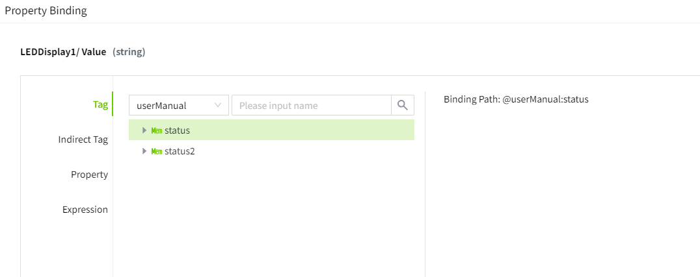
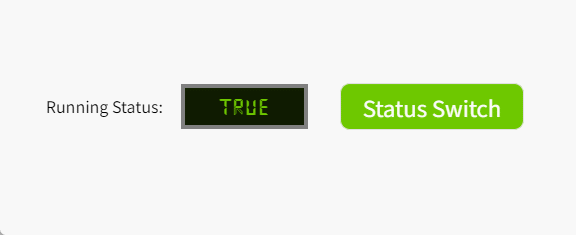
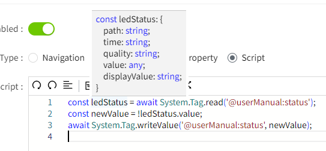
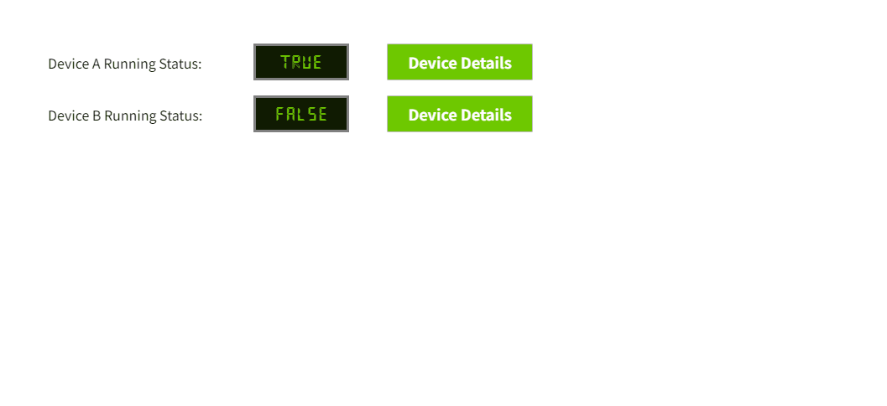

# Script

Allows you to write custom scripts for more flexible configuration.

The script can change the properties of controls at runtime by accessing the controls on the page.

If you need to perform two or more actions simultaneously (such as navigation, set value, etc.), you can combine these actions in the script editor.

## Modify the appearance of controls through a script.

**Example**

Click the button to modify the appearance of the LED display.

1. Add Label, LED display, and button controls to the page. Set the text of the Label control to "Device Status:". the text of the LED display to "RUNNING", the background color to #0f1b01, and the font color to #6ec800. Set the text of the button to "Alarm", the background color to #ff0000, and the font color to #ffffff.
2. Click the Alarm button, and in the event window, enable the mouse down event. Select "Script" as the option type.

    

3. Enter the following content in the script editor and save it.

    ```typescript
    const led = await System.UI.findControl('LED Display 1'); // Get the LED display control on the page by its name.
    led.backgroundColor = '#ff0000'; // Modify background color
    led.fontColor = '#fff'; // Modify font color
    led.text = 'Error';  // Modify text
    led.applyChanges();
    ```
 
4. Click the preview button, then click the alarm button on the preview page to see the style change of the LED display.

    

**Note:** After modifying control properties using a script, you need to call the **applyChanges()** method to apply the current modifications. 

## Set a new value to a variable through a script.

**Example**

Click the button to modify the value bound to the LED display.

1. Add Label, LED display, and button controls to the screen. Set the text of the Label control to "Running Status:". the text of the LED display to "true". Set the text of the button to "Status Switch", the background color to #6ec800, and the font color to #ffffff.
2. In the properties window of the LED display, select the text and bind it to the boolean variable at the path userManual:status.

    

3. Click the Status Switch button, and in the event window, enable the mouse down event. Select "Script" as the option type.

    

4. Enter the following content in the script editor and save it.

    ```typescript
    const ledStatus = await System.Tag.read('@userManual:status');  // read tag
    const newValue = !ledStatus.value;
    await System.Tag.writeValue('@userManual:status', newValue); // set new tag
    ```
 
5. Click the preview button, then click the status switch button on the preview page to see the style change of the LED display.

    

**Note:** System.Tag.read() can read more information about the variable.




## Open a popup through a script

**Example**

Click the button to display different content in the popup.

1. Add two Label, two LED display, and two button controls to the screen. Set the text of the Label controls to 'Device A Running Status:', and 'Device B Running Status:',respectively.Set the text of both LED displays to "true". Set the text of both buttons to "Device Details", the background color to #6ec800, and the font color to #ffffff.
2. Create a new popup page named 'Device Details' to display values passed by scripts.
3. Bind the text properties of the two digital tubes to the boolean tags userManual:status and userManual:status2, respectively.

     - LED Display 1 :

    

     - LED Display 2 :

    

4. Click the Device Details button, and in the event window, enable the mouse down event. Select "Script" as the option type.

    

5. Enter the following content into the script editor of each button separately and save:

    ```typescript
    // Button 1 script:
    const ledValue = await System.Tag.read('@userManual:status'); // get device A status
    System.UI.openPopup('Details', { // popup name
        titleBar:{
            title: "DeviceDetails"  // popup title
        },
        position:{
            type: "follow" // popup position
        },
        pageProperties:{
        custom: { // custom parameters
            name: 'DeviceA',
            status: ledValue.value
        }
        }
    });

    // Button 2 script
    const ledValue = await System.Tag.read('@userManual:status2'); // get device B status
    System.UI.openPopup('Details', {
        titleBar:{
            title: "DeviceDetails"  // popup title
        },
        position:{
            type: "follow" // popup position
        },
        pageProperties:{
        custom: { // custom parameters
            name: 'DeviceB',
            status: ledValue.value
        }
        }
    });
    ```
 
6. Click the preview button, then on the preview page, click both device detail buttons to view the popup content.

    

