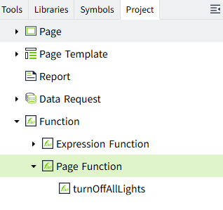

# Page Function

## What is a page function?

Page functions are predefined functions that can be called in multiple places within a project. When you execute an page function, you can pass parameters to it to get the execution result, which helps avoid writing the same logic repeatedly.

Page functions are located under Project > Function in the editor.



## Create Page Function

To create a page function, right-click on the "Page Function" node under "Function" and select "Add".


**Note**：In use, Page function is referred to by name, so all references to the page function need to be updated when renaming. 

**Property**

| **Name**    | **Description**      |
|-------------|------------|
| Description | Description of page function.   |
| Script      | **Note:**  <br>- A page function must contain one and only one `export function`. The name of this export function serves as the name of the page function. <br>- Names of page functions must be unique across all functions. <br>- If needed, non-export functions can be defined within the page function, but they cannot be called by external scripts. <br>- The name displayed in the list corresponds to the name of the export function. <br>- Page functions and expression functions are independent of each other and cannot call one another. |

## Where can page functions be used?

In any event configuration interface that supports Script, you can access page functions through the `PageFunction` namespace.


## Example: Batch control pump group start/stop

1. Create a page function named `controlPumpGroup` with the following script

```typescript
// @param {string} command - Start/Stop command (Start or Stop)
// @param {array} pumpTags - Array of pump control tags
// @returns {boolean} Whether the operation was successful
export async function controlPumpGroup(command: 'Start' | 'Stop', pumpTags: Array<string>) {
    let successCount = 0;

    for (const tag of pumpTags) {
        try {
            await System.Tag.writeValue(tag, command == 'Start');
            successCount++;
        } catch (error) {
            console.error(`Failed to control pump ${tag}:`, error);
        }
    }
    return successCount === pumpTags.length;
}
```
 
2. Call this page function in a button's mouse down event script.

```typescript
const pumpTags = [
    '@Default:Pump1_Control',
    '@Default:Pump2_Control', 
    '@Default:Pump3_Control'
];

const result = await PageFunction.controlPumpGroup("Start", pumpTags);

if (result) {
    console.log("All pumps started successfully");
} else {
    console.log("Some pumps failed to start");
}
```