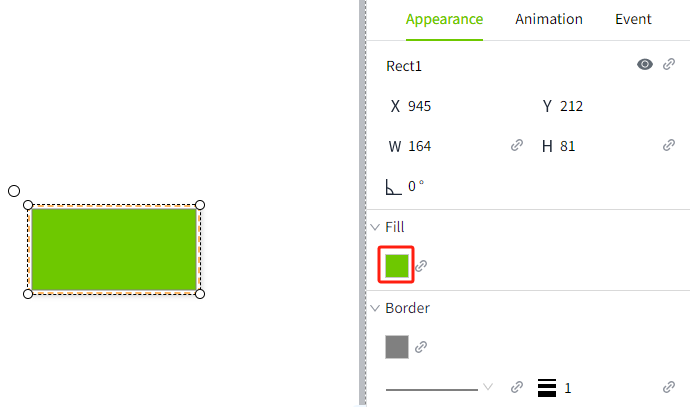
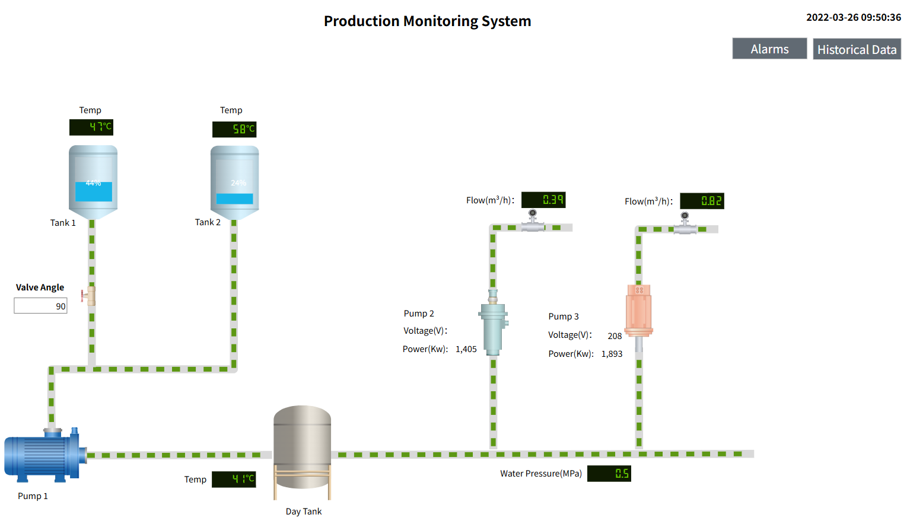

# 2D Visualization

Through the 2D visualization interface, users can intuitively understand and control each part of the industrial automation system, and improve the operation and management efficiency. It is widely used in factory automation, energy management, building automation and other fields to help users realize the functions of equipment monitoring, data analysis and remote operation.

The following are some of the main functions of 2D visualization:

## **Controls**

The 2D visualization editor has a variety of built-in controls, such as drawing elements, buttons, charts, and so on. Each control has several properties to control its appearance, behavior and data. For example, a rectangle has a background property and a label has text and font properties. 

## **Page**

There are two basic window configurations to define the behavior of the window:

Page : A page that fills the entire window.

Popup : A popup window is a window that appears (pops up) when the user performs an action such as clicking the mouse. Pop-ups typically remain at the top of the current window until it closes, allowing the user to quickly select options or settings before returning to the previous window.

## **Template**

Using template can greatly reduce design and development time. Instead of designing each screen from scratch, you can build on an existing template  to add and refine them. This saves a lot of time and cost.

Template simplify the maintenance process when updates or modifications need to be made to a page. Simply making changes to a template can be automatically applied to all pages created based on that template, rather than having to modify each page individually.

You can design templates according to your needs. You can adjust the layout, change colors and fonts, etc. to meet specific design requirements and user needs. 

## **Images**

In addition to the built-in controls, you can support the use of SVG, PNG , JPEG, GIF, BMP, and JPG format images on the page.

## **SVG**

Scalable Vector Graphics (SVG) have several advantages over other image types. Because they are vector images, they can be scaled without loss of sharpness or resolution. To use a picture in VC Hub, simply drag the picture directly onto the page where you want it to appear.

## **Binding**

Binding is a mechanism that allows properties on controls to change based on changes in values elsewhere in VC Hub. For example, the value of tag can be bound to a Gauge or a LED Diaplay. The power of binding comes from the variety of binding types.

Binding types:

- Tag
- Property
- Expression
- Dynamic Tag
- Dynamic Cell
- SQL Query
- Bidirectional Bindings

