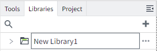
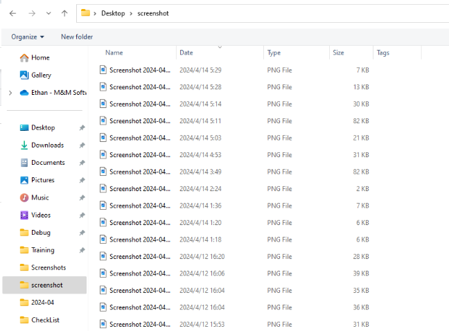
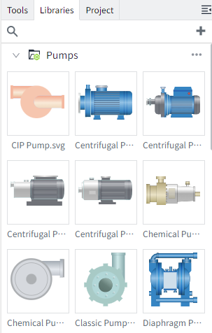
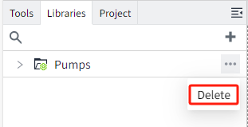
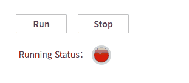
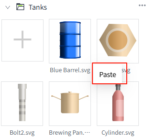

# Libraries

Manage pictures in the "Library" window. Supports uploading images in SVG, PNG, JPEG, GIF and JPG formats. Images can be used in pages, templates or symbols.

## Add Pictures

Click the New button on the right side of the library to add it.

## Add Library

You can add pictures according to your preferences and actual needs. After clicking "Add"->"Add Library" in the library window, a new library will be automatically created, and the library name will be in editing mode.

You can modify the library name. After modification, click the Add button in the library.

The Open dialog window will appear. Just find your image on your local system, you can select multiple, and click the "Open" button of the dialog box to upload the selected image.

## Import Library

When you already have a large number of pictures locally, you can import these materials into the library by importing an external library. Just compress these classified files into zip files, and then click "Add" -> "Import  Library" in the library window to pop up the import window.

Click the "Upload zip file" button and the "Open" dialog window will appear. Simply find your zip file on your local system, you can select multiple files, and click the "Open" button of the dialog box to upload the selected files.

After uploading, the name of the uploaded zip file will be used as the library name, and the corresponding pictures will be displayed under the corresponding library .

**Note:**Only pictures directly displayed at the next level of the zip will be imported. For example, all the contents in the “others“ directory as shown below will not be imported.

## Reference System Library

VC Hub has built-in rich picture materials. After clicking "Add"->"Reference System Library" in the library window, users can view and choose which built-in materials to add to the library.

After adding to the library:

**Note:** The referenced system pictures do not support editing and deletion. If you no longer want to use it, you can click the delete button of the library to delete the reference. Deleting a system library does not actually delete the library, but deletes the reference relationship, which can be referenced again later.

## Use Pictures

1. Upload pictures to the library.
2. Drag pictures from the library directly onto the page.

**Path**

When an image is added to a page, the path is displayed in the properties. **Path format:** LibraryName.ImageName

If the image is from the system library, a `$` symbol will appear at the beginning of the path. **Path format:** *$.LibraryName.ImageName*

Image paths support binding.

**Example: Display different images based on device operating status**

**Steps:**

1. Draw two buttons on the page,name them **"Run"** and **"Stop"**.
2. Set mouse pressed event for the buttons. 

For the **Run** button: When pressed, modify the tag `@Region:Motor1.RunningStatus` to `1`, indicating that the device is turned on.

For the **Stop** button: When pressed, modify the tag `@Region:Motor1.RunningStatus` to `0`, indicating that the device is stopped.

3. Add a label to the page, set its “Text” to **"Running Status:"**.
4. Insert an Image from the System Library to the page. Click the **binding button** for the image path and write the following expression:

5. Click the **Preview** button to open the preview page.When clicking the **Run** button, it will appear **green**.When clicking the **Stop** button, it will appear **red**.

**Check Reference**

You can quickly check the citation relationships of an image to determine where the image is used. The method is to right-click the mouse on the picture and click "Check References". A reference list will pop up showing detailed reference information.

**Scale Pictures**

After selecting a picture, you can drag the mouse to zoom in and out of the picture.

For SVG format images, holding down the **Shift** key and then pulling the four top corners of the image to scale the image will perform an isometric zoom.

**Move Pictures**

You can modify the image's path. To move the image to another library, click and drag the image to the target library, thereby changing its library.

**Notes：**  
1. Moving images into the system library is not supported. 
2. Images in the system library can be dragged into user-created libraries. Dragging an image is equivalent to copying it to the target library, and the original image in the system library remains unaffected.

## Copy/Paste Pictures

Right-click on an image in the gallery and select the **Copy** option to duplicate the image. Both system library images and user-uploaded images support copying.

After copying, click the "..." button in the top-right corner of the library, or right-click on a blank area in the library to paste.

**Note:** The copied image can only be pasted into user-created libraries. Pasting into the system library is not supported.

## Export Pictures

#### Export Library

Click the export button behind the library to export the materials in the library.

In the export window, you can select the pictures you want to export.

#### Export Project

When exporting a project, the system library will not be exported, but other libraries will. When importing the exported project into another project, if the exported project uses images from the system library, you need to reference the system library again after the project is imported, otherwise the used system library images will appear as broken images on the page.

#### Export Workspace

When exporting a workspace, all libraries will be exported together. When importing the exported workspace into other node, open the project page under the workspace, and the pictures used on the page can be displayed normally.

