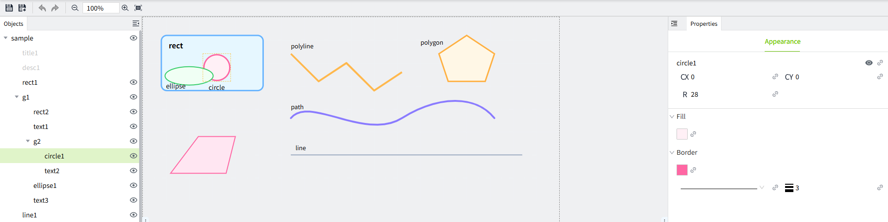
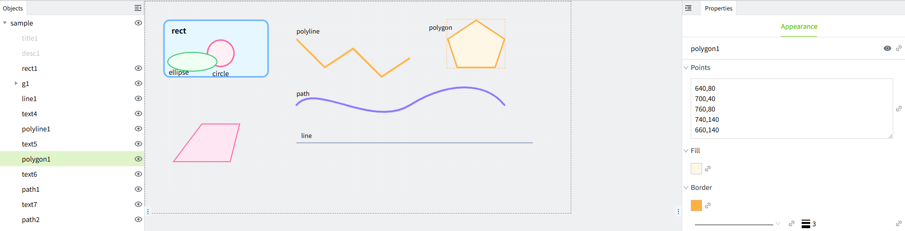
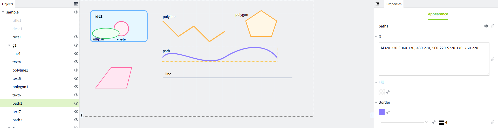
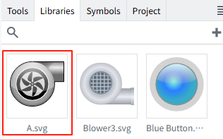
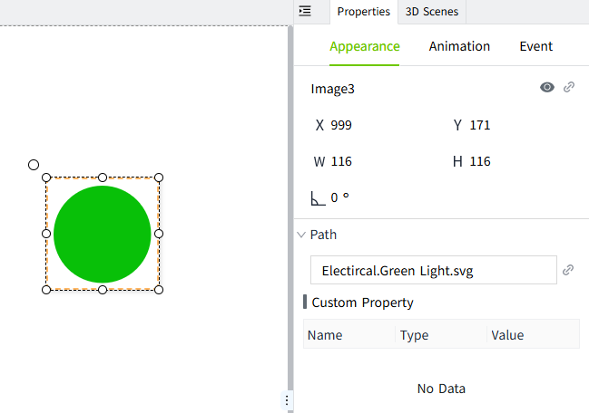
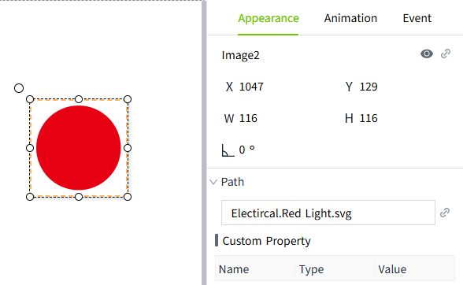

# SVG Editor

The SVG editor is used to edit the SVG images in the library, including background color, border color, visibility, position, size, text, etc.

## How to open the SVG editor

There are four ways to open the SVG editor as follows:

- In the library, double-click the SVG format image
- Right-click on the SVG format image in the library, and click "Edit" in the menu
- Double-click the SVG format image on the page
- Right-click on the SVG format image on the page, and click "Edit" in the menu

The interface of the SVG editor is as follows:

## Supported element types for editing

- rect
- circle
- ellipse
- line
- polyline
- polygon
- path
- text
- group

Element types that are not supported for editing will be displayed in gray color in the object window.

## Element properties

#### rect

**Properties**

| **Name**     | **Description**                                                                              |
|--------------|----------------------------------------------------------------------------------------------|
| Name         | The name of this control.                                                                    |
| X            | The distance from the left side of the control to the left side of the page, the unit is px. |
| Y            | The distance from the top side of the control to the top side of the page, the unit is px.   |
| W            | The width of the control, the unit is px.                                                    |
| H            | The height of the control, the unit is px.                                                   |
| RX           | The radius of the rounded corners in the horizontal direction of the rectangle.              |
| RY           | The radius of the rounded corners in the vertical direction of the rectangle.                |
| Fill Color   | The fill color of the rectangle.                                                             |
| Border Color | The border color of the rectangle.                                                           |
| Border Width | The border width of the rectangle.                                                           |

#### circle

**Properties**

| **Name**     | **Description**                                                               |
|--------------|-------------------------------------------------------------------------------|
| Name         | The name of this control.                                                     |
| CX           | The position of the center point in the horizontal direction, the unit is px. |
| CY           | The position of the center point in the vertical direction, the unit is px.   |
| R            | The radius of the circle, the unit is px.                                     |
| Fill Color   | The fill color of the control.                                                |
| Border Color | The border color of the control.                                              |
| Border Width | The border width of the control.                                              |

#### ellipse

**Properties**

| **Name**     | **Description**                                                       |
|--------------|-----------------------------------------------------------------------|
| Name         | The name of this control.                                             |
| CX           | The horizontal position of the center of the ellipse, the unit is px. |
| CY           | The vertical position of the center of the ellipse, the unit is px.   |
| RX           | The horizontal radius of the ellipse, the unit is px.                 |
| RY           | The vertical radius of the ellipse, the unit is px.                   |
| Fill Color   | The fill color of the control.                                        |
| Border Color | The border color of the control.                                      |
| Border Width | The border width of the control.                                      |

#### line

**Properties**

| **Name**     | **Description**                                                                        |
|--------------|----------------------------------------------------------------------------------------|
| Name         | The name of this control.                                                              |
| X1           | The horizontal  coordinate of the starting point of the straight line, the unit is px. |
| Y1           | The vertical coordinate of the starting point of the straight line, the unit is px.    |
| X2           | The horizontal coordinate of the end point of the straight line, the unit is px.       |
| Y2           | The vertical coordinate of the end point of the straight line, the unit is px.         |
| Border Color | The border color of the control.                                                       |
| Border Width | The border width of the control.                                                       |

#### polyline

**Properties**

| **Name**     | **Description**                                                                                                                                                                      |
|--------------|--------------------------------------------------------------------------------------------------------------------------------------------------------------------------------------|
| Name         | The name of this control.                                                                                                                                                            |
| Points       | A series of coordinate points, in the form of   x1, y1   x2, y2   x3, y3  …   It will start from the first point and then connect the subsequent points one by one to form a broken line. |
| Border Color | The border color of the control.                                                                                                                                                     |
| Border Width | The border width of the control.                                                                                                                                                     |

#### polygon

**Properties**

| **Name**     | **Description**  |
|--------------|------------------|
| Name         | The name of this control. |
| Points       | A series of coordinate points, in the form of   x1, y1   x2, y2   x3, y3  …   It starts from the first point and connects the subsequent points one by one.   Unlike polyline, polygon will automatically connect the last point back to the first point, forming a closed area. |
| Fill Color   | The fill color of the control.  |
| Border Color | The border color of the control. |
| Border Width | The border width of the control. |

#### path

**Properties**

| **Name**     | **Description**   |
|--------------|------------------|
| Name         | The name of this control.  |
| D            | The d attribute is a string containing a series of commands and coordinates. These commands and coordinates define the shape of the path.  Common commands are:   - **M**: Moves to a specified point. M10,10: Move to the (10, 10) point.  - **L**: Draws a line to a specified point. L100,100: draws a line from (10, 10) to (100, 100)  - **C**: Draws a cubic Bezier curve. C40,10, 65,10, 95,50: Draws a cubic Bezier curve with control points (40, 10) and (65, 10) and an endpoint (95, 50).  - **S**: Draws a smooth Bezier curve. S150,150, 200,100: Draws a smooth cubic Bessel curve with control points automatically derived and ending at (200, 100).  - **Q**: Draws a quadratic Bezier curve. Q50,10, 90,50: Draws a quadratic Bezier curve with a control point of (50, 10) and an end point of (90, 50).  - **T**: Draws a smooth quadratic Bezier curve. T150,150: draws a smooth quadratic Bessel curve with control points calculated automatically and ending at (150, 150).  - **Z**: Closes the path (returns to the starting point). Z: Close the path and return to the starting point |
| Fill Color   | The fill color of the control.  |
| Border Color | The border color of the control.  |
| Border Width | The border width of the control.  |

#### text

**Properties**

| **Name** | **Description** |
|----------|------|
| Name     | The name of this control.                                                            |
| X        | The distance from the left of the control to the left of the canvas, the unit is px. |
| Y        | The distance from the top of the control to the top of the canvas, the unit is px.   |
| Text     | Set the text content to be displayed.                                                |
| Font     | Set font style, font size, bold, italic, underline, font color.                      |

#### group

**Properties**

| **Name** | **Description**           |
|----------|---------------------------|
| Name     | The name of this control. |

## Examples

**Example 1**: Modify the color of some elements in the SVG.

1. Double-click on an SVG image in the library, for example, A.svg.

2. In the object window of the SVG editor, select a path element.

3. Change the fill color to green and save as A1

4. View the saved images in the library and see the modified effects.

**Example 2：**By using property binding, the color of elements in the SVG image can be dynamically changed.

1. Add an SVG image from the library to the page.

2. Double-click on this image to open the SVG editor.
3. Inside the SVG editor, select an element and click the binding button for its fill color.

4. Bind a numeric tag and set the following color range.

5. After saving, close the SVG editor. Click the preview button on the page to view the preview effect of the image. You will find that as the tag values change, the SVG image presents different color effects.

**Example 3**: Through the custom properties of the SVG image, the operating status of different devices can be reflected.

1. From the library, add an SVG image to the page. This image serves as an indicator light to reflect the operating status of the device.

2. Double-click on this image to open the SVG editor.
3. Inside the SVG editor, click on the root node of the image and add a custom property named "motorNo" to it, which will be used as the device number.

4. Click on the elements, such as path1 in the above image, and bind a dynamic property to the fill color for it. This is used to display the operating status of Motor1, Motor2, and Motor3, and set the corresponding fill color for the status values.

5. Save and close the SVG editor. Add a dropdown box on the page and set its text content and values as follows.

6. Bind the custom property of SVG to the selectedValue property of the dropdown.

7. Click the preview button, on the running page, when switching the dropdown options, the SVG image will display different colors according to the running status of the corresponding device.

