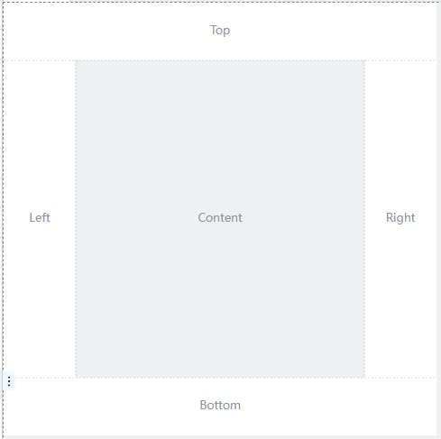
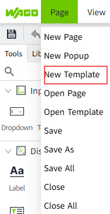
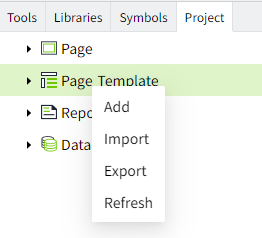
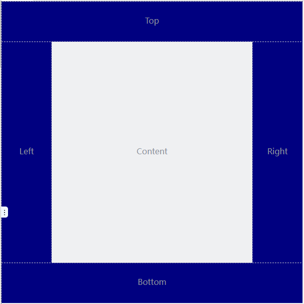
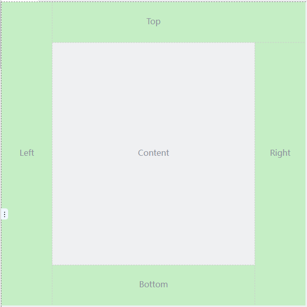

# Page Template

A page template is a predefined layout and design. The template contains a defined set of controls, arrangement, colors and fonts.

By using templates, you can quickly create new pages and apply existing designs and layouts. When updates or modifications to the system are required, simply update the template without having to modify each screen individually.

Page templates are divided into five areas: the content area, the top sidebar, the bottom sidebar, the left sidebar, and the right sidebar. The content area is not editable and the other areas are editable.

## **Create a Template**

Entry 1: In the "Page" menu, click "New Template".

Entry 2: Click "New Template" in the guide page of the editor (when you open the editor for the first time or when no page is opened in the editor). 

Entry 3: Right-click on the "Page Templates" node in the "Project" window and click "Add" in the popup menu. 

#### **Template Properties** 

| **Name**         | **Description** |
|------------------|---------------------|
| W                | The width of the template . |
| H                | The height of the template. |
| Background Color | The background color of the template. |
| Layout           | You can set the size of each area. Click the button below to set how the area is tiled horizontally and vertically.        Spread the page to the left.        Spread the page to the right.       Spread the page to the upwards.    Spread the page to the down.    |

**How to view page template properties**

1. Click on a blank area of the page template
2. Click on the tab name of the page template
    
3. Click the gray area outside the canvas (the area highlighted in the red box below)
    

**Example of Layout**

- The top and bottom sidebars span horizontally across the entire page.

    

- The left sidebar fills vertically, the top sidebar fills to the right, and the right sidebar fills downwards.

    

## **Using Page Templates**

Select the page template you want to use in the properties of the page. 

After referencing a page template, you cannot edit the the template, but you can only draw on the content area of the template.. 

