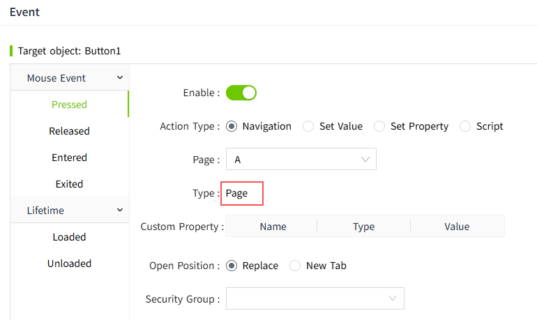
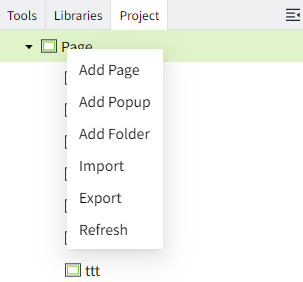
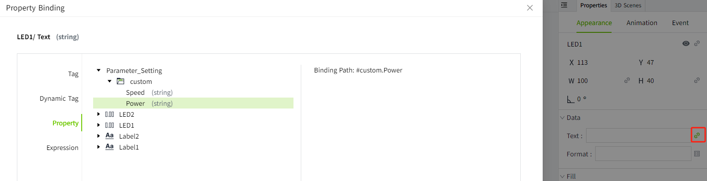
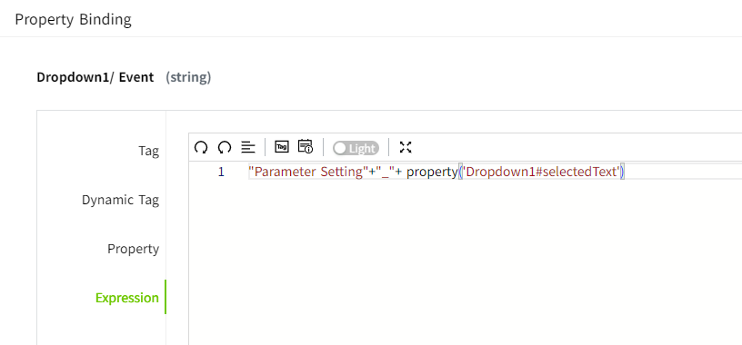

# Navigation

By setting up page navigation, you can navigate between different pages in VC Hub.

Navigation settings can be configured in the event properties of the control.

## **Navigation Procedure**

1. Select an event type, e.g. Mouse Pressed. 
2. Turn on the "Enable" button.
3. Select the page. The page type is displayed automatically after selection.

      
     

4. Select the open position.
5. Click the **"OK"** button.

## Title

This property is displayed when the page type is a popup window. Modifications and bindings are supported. See **example 2** below.

## Custom Property

When a page is selected, the custom properties for that page are automatically displayed, with support for modification and binding. See **example 2** below.

## **Open Position**

#### **Page**

Replace: The original page is closed and replaced by a new page.

New Tab: The original page is unaffected and the new page is displayed in a new tab of the browser.

#### **Popup Page**

Center: The position of the popup page is displayed in the center of the window.

Follow: The popup page is displayed at the current mouse click position.

Custom: You can set the position of the popup page yourself.

## **Script**

The following script functions can be used for page navigation:

- [System.UI.back](../../appendix/system-function/system-ui/system-ui-back.md) 
- [System.UI.close](../../appendix/system-function/system-ui/system-ui-close.md) 
- [System.UI.forward](../../appendix/system-function/system-ui/system-ui-forward.md) 
- [System.UI.goHome](../../appendix/system-function/system-ui/system-ui-gohome.md) 
- [System.UI.open](../../appendix/system-function/system-ui/system-ui-open.md) 
- [System.UI.openNewTab](../../appendix/system-function/system-ui/system-ui-opennewtab.md) 
- [System.UI.openPopup](../../appendix/system-function/system-ui/system-ui-openpopup.md) 

## **Navigation Example**

**Example 1:** Use the button control to navigate between two pages.

1. In the "Project" window, right-click the "Page" node and click "Add Page" in the popup menu to create a new page: Page 1. Repeat this step to create Page 2. The background color of Page 1 is set to orange and the background color of Page 2 is set to blue.

    

2. Drag and drop a label and button onto Page 1. The label content is set to Page 1 and the button content is set to Open Page 2. 

    

3. In the event of the button on Page 1, set Navigate to Page 2 when mouse is pressed. 

    

4. Drag in a label and button on Page 2. The label content is set to: Page 2 and the button content is set to: Open Page 1. 

    

5. In the event of the button on Page 2, set Navigate to Page 1 when mouse is pressed. 

    

6. Go back to Page 1 and click on the Preview button to see how it works.

    When you click the "Open Page 2" button on Page 1, Page 2 is displayed; when you click the "Open Page 1" button on Page 2, Page 1 is displayed.

    

**Example 2:** Select the different device name in the drop-down box to bring up the "Parameter Settings" pop-up window for the device.

1. Create a page: Page 1 , and add a dropdown control to the page. The dropdown options are set to:

    

2. Create a popup window with the name: Parameter_Setting. Place two Label controls and two LED Display controls on the popup window. 

    The contents of the labels are set to: Power, Speed. 

    The name of the LED Display behind the "Power" is: LED1; the name of the LED Display behind the "Speed" is: LED2.

    

3. Create 2 custom properties on the popup: Power, Speed.

    

    The "Text" property  of the LED1 is bound to the "Power" of the page custom property.

    

    The "Text" property  of the LED2 is bound to the "Speed" of the page custom property.

    

    Save the popup window.

4. Click the dropdown control on Page 1 and set the "Selected Changed" in the event window, as shown below.

    **Action Type**：Navigation.

    **Page:** Select "Parameter_Setting".
    

    **Title:** Binding expression "return Parameter Setting" +"_"+ property('Dropdown1#selectedText')

    

    **Custom Property:** The value of "Speed" is bound to a dynamic tag. When "Motor 1" is selected in the drop-down box, the tag path of the Speed value is: Demo:Motor1.Speed; when "Motor 2" is selected in the drop-down box, the tag path of the Speed value is: Demo:Motor2.Speed.

    

    The value of "Power" is bound to a dynamic tag. When "Motor 1" is selected in the drop-down box, the tag path of the Power value is: Demo:Motor1.Power; when “Motor 2” is selected in the drop-down box, the tag path of the Power value is: Demo:Motor2.Power.

    

5. Save the page, click the "Preview" button, and when you switch the options of the dropdown box, the pop-up window displays different contents according to the current options of the dropdown box.

    

