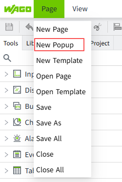

# Page Parameter Passing

Page parameter passing allows you to pass parameters from one page to another.

Scenario example: There are two motors: motor 1 and motor 2. when you click button 1 on a page, information about motor 1 is displayed in a popup window; when you click button 2, information about motor 2 is displayed in a popup page. The number of the motor can be passed to the popup page via a parameter.

## **Drawing a popup page**

1. Create a new popup page: Motor_Details. 

    

2. Drag in a motor and a  label into the popup window. 

    

3. Set a custom property on the popup window: number. 

    

4. Click on the label, then click the binding button next to its text property, and write the following expression. The content displayed in the label will change with the change of 'custom.No'.

    

## **Drawing a Page**

1. Create a new page: Motor.
2. Draw two buttons on the page, Motor 1 and Motor 2. 

    

3. Set the press script in the "Action" of Motor 1. When the button is clicked, open the "Motor_Details" popup page, it centered display, and set the value of the custom property "Number" on the "Motor_Details" popup page to 1. 

```typescript
System.UI.openPopup("Motor_Details", {
    position: {
        type: 'center',
    },
    pageProperties: {
        'custom.No': '1'
    }
});
```
 
4.Click on the "Motor 2" button and set the same script in the "Action" to change the value of the incoming parameter from 1 to 2. 

```typescript
System.UI.openPopup("Motor_Details", {
    position: {
        type: 'center',
    },
    pageProperties: {
        'custom.No': '2'
    }
});
```
 
5.Click the Preview button . On the preview page, click the button "Motor 1" to open a popup page with the text "Motor 1"; click the button "Motor 2" to open a popup page with the text "Motor 2". 

    


