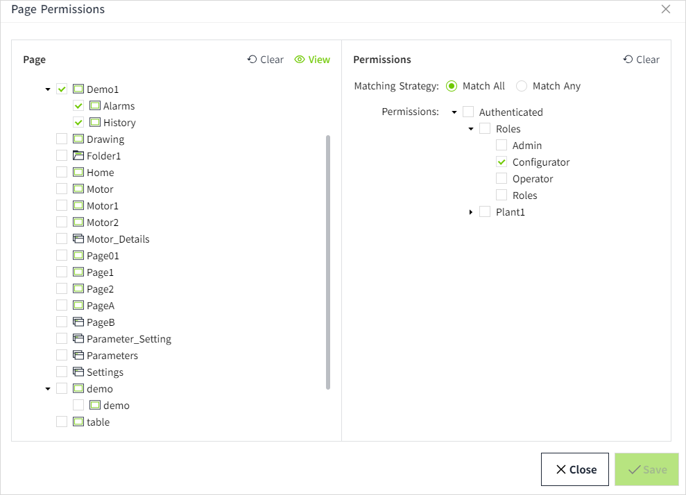
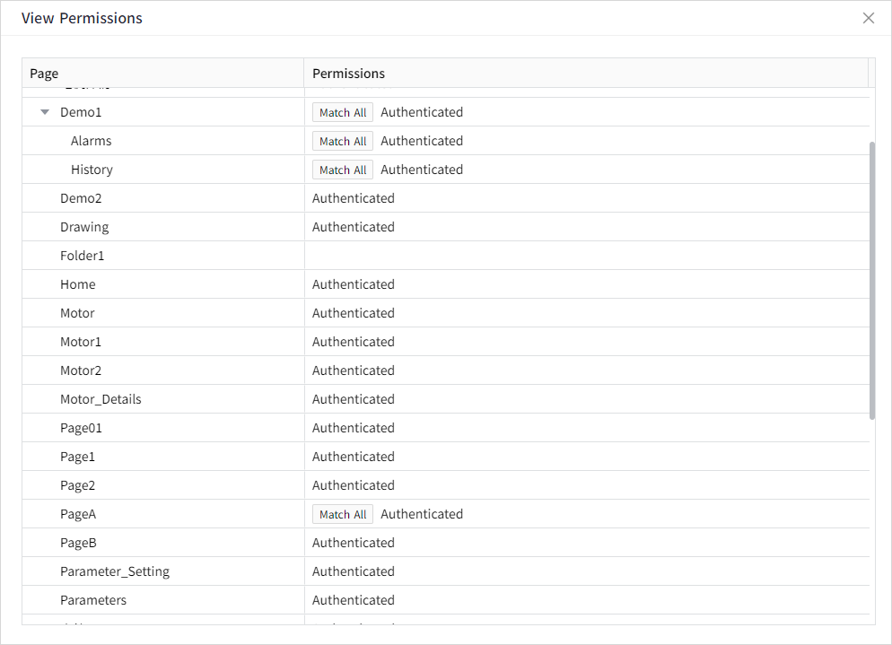
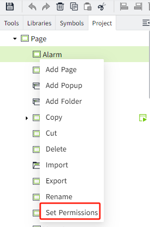
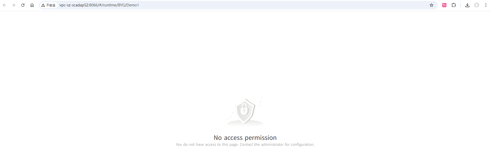

# Page Permission

You can set up security for your pages in VC Hub. After security is set, only users who meet the security requirements can view the running page.

Once the page is created, there will be an initial permission: Authenticated.

## How to set page permissions:

- Set permissions in bulk
- Set permissions for individual page

## Set permissions in bulk

1. In the editor's "Project" window, right-click the "Pages" node, and in the pop-up menu, click the "Set Permissions" button.

   

2. In the pop-up **Page Permissions** window, select a page from the left side of the window. By default, no pages are selected. Multiple pages can be selected. Clicking the **"Clear"** button in the page area will remove all selected pages.

   

3. After selecting a page, configure permissions for the selected pages in the **Permissions** area on the right side of the pop-up window. 

   Clicking the **"Clear"** button in the permissions area will remove all selected permissions.

- **Matching Strategy**：Single selection only。Default option: "Match All"，can be modified.
   -  **"Match All"**: The user must have **all** assigned permissions to view the page.
   - **"Match Any"**: The user only needs **one** of the assigned permissions to view the page.
- **Permissions**：Set permissions for these pages in the **Permissions Tree**. By default, no permissions are selected. **Multiple selections are supported**, but a parent node and its child nodes cannot be selected simultaneously.

4. Once the configuration is complete, click the **"Save"** button to apply the changes.

   For example, in the image below, the **Authenticated/Roles/Aconfigurator **permission is assigned to the **Demo1, Alarms, and History** pages.

   

5. After clicking the **Save** button, the pop-up window will remain open, and the page and permissions will be reset to a cleared state, allowing you to continue selecting other pages to set their permissions.
6. To view the permissions already assigned to a page, click the **"View"** button in the page area to check the configured permissions for each page.

   

**Notes：**  

1. Directory nodes do not require permission settings. 
2. When setting permissions in batch mode, selecting pages will **not** display their existing permissions in the permissions area on the right. To view the assigned permissions, please use the **"View"** button in the page area. 

## Set permissions for individual page

1. In the editor's **"Project"** window, right-click a single page in the page tree, and in the pop-up menu, click the **"Set Permissions"** button.

   

2. In the pop-up **Access Level** window, set permissions for the page. The window will **default to displaying the currently assigned permissions and matching strategy** for the page, which can be modified as needed.

   

3. Once the configuration is complete, click the **"OK"** button to finalize the permission settings for the page.

**Example 1:**

If the user's permissions match the page permissions, they will be able to view the running page.

1. Create a user with the role: Operator.
2. Create a page （PageA) and set its permissions: `Authenticated/Roles/Operator`.
3. This user viewed the running page of Page A and was able to view it successfully.

**Example 2:**

The page's access level path is included in the user's access level path, so the user has the right to view the running page.

1. Create a user and set the access level through Identity Provider → User Grants to: `Authenticated/PlantA/TeamLeader`
2. Create a page (PageA) and set its permission to: `Authenticated/PlantA`.
3. This user viewed the running page of Page A and was able to view it successfully.

**Example 3:**

The user's access level path is included in the page's access level path, the user does not have the right to view the running page.

1. Create a user and set the access level through Identity Provider → User Grants to: `Authenticated/PlantA`
2. Create a page (PageA) and set its permission to: `Authenticated/PlantA/TeamLeader`.
3. This user viewed the running page of Page A and does not have permission to view the running page.

   

