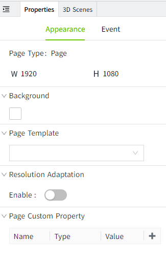
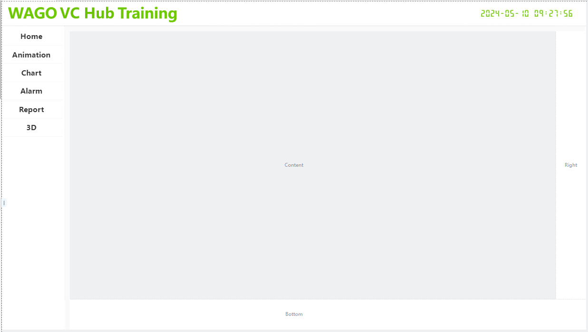
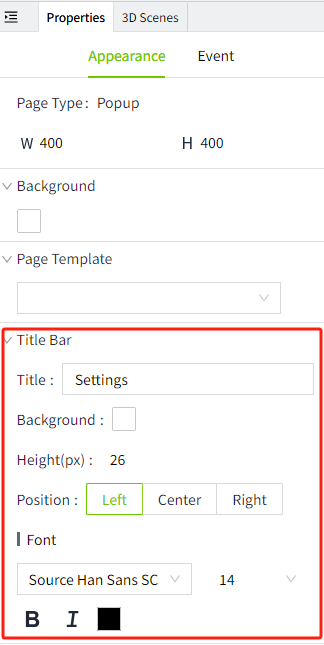
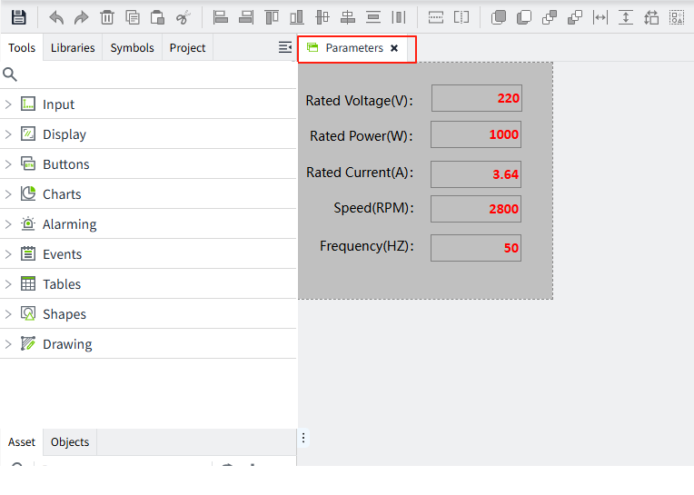

# Page Type

There are 2 page types: page and popup.

There are the following 3 entrances to create pages.

**Entry 1**: The default window of the editor. 

**Entry 2**: The "Page" menu of the editor.

**Entry 3**: Right-click any node of "Page" in the "Project" window.

## **Page**

FFill the entire window with the page.

#### **Page Properties**

**How to view page properties**

1. Click on a blank area of the page
2. Click on the page’s tab name

    

3. After zooming the page, click the gray area outside the canvas (the area highlighted in the red box below).

    

**Page Template**

You can reference a template directly, so that the style of the template can be directly rendered on the current page. After referencing, editing of the template content is not allowed on the current page.

**Resolution Adaptation**

Different devices (e.g. computers, tablets, cell phones, etc.) have different screen sizes and resolutions. If you don't set the appropriate resolution adaptation, the page may be misplaced, overflowed with controls, or incompletely displayed on some devices.

Once resolution adaptation is set up, the system will automatically recognize the resolution of the current device and automatically adapt and adjust it when the page is opened on a device with a different resolution.

VC Hub includes 2 resolution adaptation methods, see Resolution Adaptation.

| **Adaptation Method**                                                                                                                                                                                                                 | **Description**                                      |
|---------------------------------------------------------------------------------------------------------------------------------------------------------------------------------------------------------------------------------------|-----------------------------------------------------------------------|
|  | The aspect ratio remains unchanged.                                   |
| | Stretch or zoom the page so that it spreads across the entire window. |

**Custom Properties**

In addition to the basic property settings, you can create custom properties for the page. You can use custom properties like any other property, such as data binding, scripts, and styles.

Custom properties are important for passing parameters from one page to another. See chapter **Page-> Page Parameter Passing** for details.

To configure custom properties, do the following:

1. Click on an empty space on the page.
2. Click Appearance >Page  Custom Property.
3. Click the plus icon to add a row.
4. Enter the custom property name, data type, and initial value.
5. The custom property is automatically saved after you add it. 

## **Popup Page**

A window that appears above the page. On the running page, the popup window can be dragged to change its position. However, you can only drag the popup page within the current window, not outside the window.

#### **Popup Page Properties**

A popup page has more properties than a page, such as title bar settings. You can set the title bar style of the popup page in the Appearance property of the popup page according to your specific needs.

**How to view popup page properties**

1. Click on a blank area of the page
2. Click on the page’s tab name

    

3. Click the gray area outside the canvas

    

#### **Popup Position**

You can specify a specific location to open the popup page. 

Example of a popup window style:  

