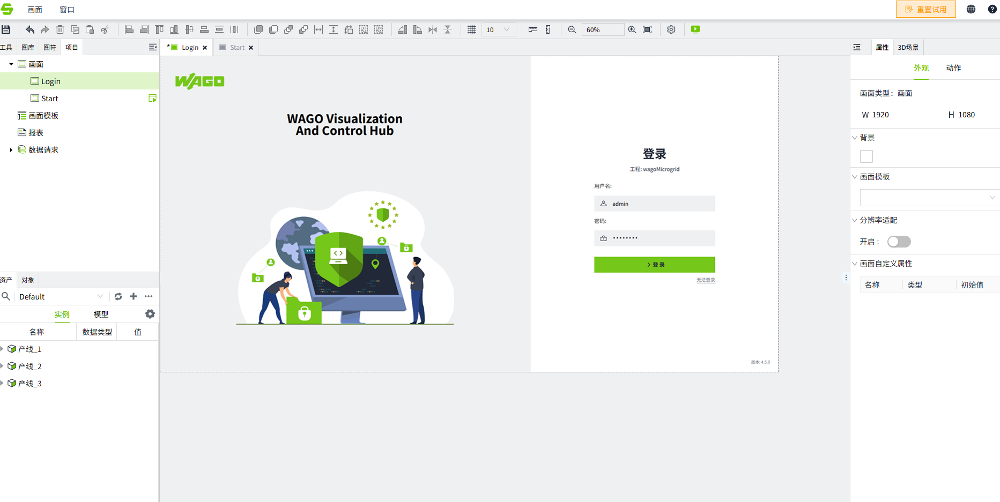
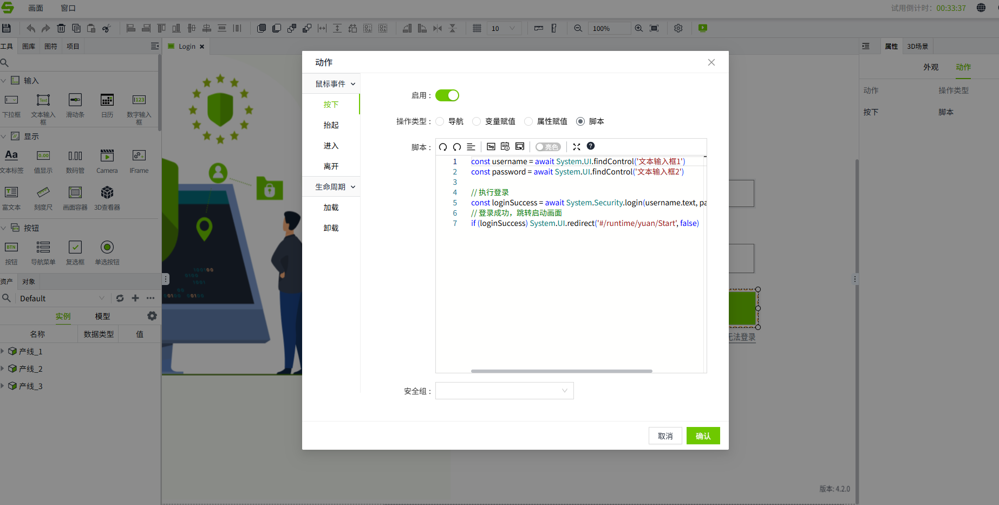
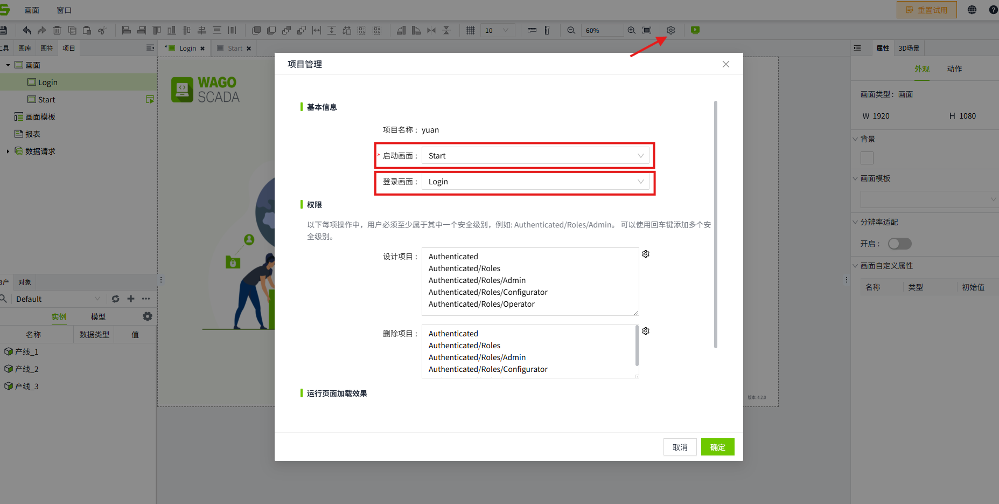

# Customize the Login Page

If you prefer not to use the default login screen for VC Hub, you can configure a custom login screen for your project. This custom login screen will be displayed when users access the operation screen and login authentication is required.

You can configure a custom login screen for each item individually.

## Customize a Login Page

1. In the editor, create a page that will serve as the login page at runtime. For example, the page can include elements such as a username field, a password input box, and a login button, as shown in the figure below.
    
2. Set an execution script for the login button. When the login button is clicked, retrieve the values from the username and password input for authentication validation. 
    

    ```typescript
    const username = await System.UI.findControl('TextInput1')
    const password = await System.UI.findControl('TextInput2')
    // Execute Login
    const loginSuccess = await System.Security.login(username.text, password.text)
    // Login successfully, jump to startup page
    if (loginSuccess) System.UI.redirect('#/runtime/yuan/Start', false)
    ```
**Note:** The script provided here is just an example. You can edit and customize the script according to your specific requirements. 

## To configure a login page for your project, follow these steps:

1. In the editor, click the settings button in the top right corner of the project to open the "Project Configuration" popup.
2. Set the startup page and login page for the project. If no login page is selected, the default VC Hub login page will be used when accessing the runtime page.
3. After configuring, click the **OK** button to save the configuration.

    

## Accessing the Project Runtime Page

**Scenario 1：The current Identity Provider is set to Local type, and a custom login page is configured for the project with auto login disabled.**

When the user accesses the project's running page, the custom login page will be displayed. After completing the login on this page, the user will be able to view the running page.

**Scenario 2：The current Identity Provider is set to Local type, and a custom login page is configured for the project with auto login enabled.**

When the user accesses the project's running page, the custom login page  will not be displayed. Instead, the running page will be shown directly.

**Scenario 3：The current Identity Provider is set to OpenID Connect type, and a custom login page is configured for the project.**

When the user accesses the project's running page, the custom login page will not be displayed. Instead, the login page of the third-party system corresponding to the Identity Provider will be shown.

**Scenario 4：The current Identity Provider is set to OpenID Connect type, and no custom login page is configured for the project.**

When the user accesses the project's running page, the login page of the third-party system corresponding to the Identity Provider will be displayed instead of the custom login page.

## Exiting the Runtime Page

**Scenario1：The current Identity Provider is set to Local type, and a custom login page is configured for the project.**

When the user logs out, they will be redirected to the custom login page set for the project.

**Scenario 2：The current Identity Provider is set to Local type, and no custom login page is configured for the project.**

When the user logs out, they will be redirected to the default VC Hub login page.

**Scenario 3：The current Identity Provider is set to OpenID Connect type, and no custom login page is configured for the project.**

When the user logs out, they will be redirected to the login page of the third-party system corresponding to the Identity Provider.

**Scenario 4：The current Identity Provider is set to OpenID Connect type, and a custom login page is configured for the project.**

When the user logs out, they will be redirected to the login page of the third-party system corresponding to the Identity Provider.

