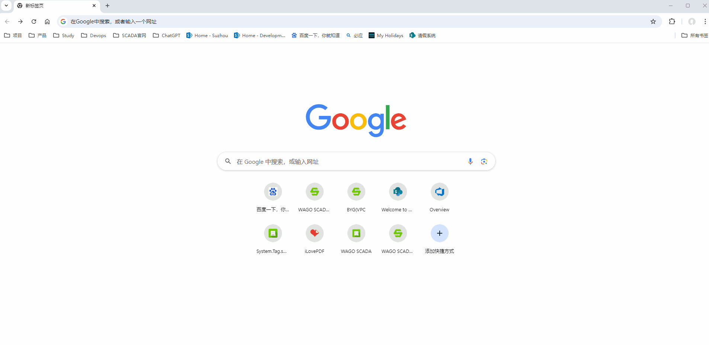

# 项目属性

您可以在 2D编辑器中为当前项目设置属性配置。例如，启动画面、运行画面的加载效等。

单击菜单栏的设置按钮进行属性设置。

| **名称**         | **描述**                                                                                                                                                                                                                                                                                                                                                                                                                                                                                                                                                                                                                                                       |
|------------------|----------------------------------------------------------------------------------------------------------------------------------------------------------------------------------------------------------------------------------------------------------------------------------------------------------------------------------------------------------------------------------------------------------------------------------------------------------------------------------------------------------------------------------------------------------------------------------------------------------------------------------------------------------------|
| 项目名称         | 显示当前所属项目的名称。                                                                                                                                                                                                                                                                                                                                                                                                                                                                                                                                                                                                                                        |
| 启动画面         | 设置项目的启动画面, 默认选择创建的第一个画面。设置后在项目列表中点击项目的运行按钮时，自动显示该画面。                                                                                                                                                                                                                                                                                                                                                                                                                                                                                                                                                            |
| 登录画面         | 当Identity Provider为Local类型时，可以自定义一个画面，用作运行时的登录页面。                                                                                                                                                                                                                                                                                                                                                                                                                                                                                                                                                                                      |
| 设计项目         | 为该项目配置设计权限(即在编辑器进行编辑和保存的权限)。  - 默认为空，为空时表示使用Security->Permission中的设计项目权限。 - 若在此重新设置了权限，则以此处权限为准。 - 设计权限的access level路径包含在用户的accesss level路径内，则用户有权设计项目。                                                                                                                                                                                                                                                                                                                                                                                                                 |
| 删除项目         | 为该项目配置删除权限。  - 默认为空，为空时表示使用Security->Permission中的删除项目权限。 - 若在此重新设置了权限，则以此处权限为准。 - 删除权限的access level路径包含在用户的accesss level路径内，则用户有权删除项目。                                                                                                                                                                                                                                                                                                                                                                                                                                                 |
| 运行页面加载效果 | 用于设置运行画面，在画面内容未完全加载出来之前的loading效果。如果不启用，则使用系统默认的加载效果；如果启用，允许用户自定义运行画面的加载背景色和loading样式。                                                                                                                                                                                                                                                                                             |
| 加载背景色       | 开启“页面加载效果”后才显示该配置项。设置运行画面加载时的背景色。                                                                                                                                                                                                                                                                                                                                                                                                                                                                                                                                                                                                 |
| 加载样式         | 开启“页面加载效果”后才显示该配置项。设置运行画面加载时的loading动画。  内置的样式支持修改颜色。选中样式后，点击“设置颜色”按钮进行颜色修改。  也支持用户自行上传图片。用户自己上传的图片不支持颜色修改。                                                                                                                                                                                                                                                                                                                                                                                                                                                               |
| 自动登录         | 当Identity Provider为Local类型时，开启自动登录功能后，在访问该项目的运行画面时，无需登录即可查看运行画面。                                                                                                                                                                                                                                                                                                                                               |
| 用户名           | 用于设置自动登录的用户名。                                                                                                                                                                                                                                                                                                                                                                                                                                                                                                                                                                                                                                      |
| 密码             | 用于设置自动登录的用户名对应的密码。                                                                                                                                                                                                                                                                                                                                                                                                                                                                                                                                                                                                                            |
| Salt             | 将运行画面分享给无账号的用户进行查看时，为了提升系统安全性，需要手动在运行画面的url后面增加`?salt=xxxxxxxxx`  例如：  当前画面的运行地址为：`http://vpc-sz-scadap52:8066/#/runtime/Project1/Home,`将该页面分享给其他无账号的用户查看时，需将`http://vpc-sz-scadap52:8066/#/runtime/Project1/Home?salt=xxxxxxxxx`提供给被分享人。  如果需要终止某个用户查看已分享的运行画面，只需在上图弹窗中执行以下任一操作：  - 点击 **“重新生成”** 按钮更新 **Salt** 值，或 - 关闭 **自动登录** 功能。  这样，当用户再次访问原分享链接时，将无法继续查看页面。  **提示**：由于浏览器缓存的存在，在缓存仍有效的情况下，用户可能在短时间内仍能继续访问。缓存失效后，使用原链接将无法再查看内容。 |

| **说明**：1. 当网络环境比较好的情况下，运行页面的加载效果会一闪而过。 2. 如果启用了自动登录并已正确配置用户名和密码，再次打开配置页面时，密码框将自动隐藏。如果更改用户名，密码框将会显示，允许更新自动登录的用户名和密码。一旦正确配置了用户名和密码，即使之后修改了密码，自动登录仍然有效。如果不再需要自动登录功能，可随时关闭自动登录。 3. Autologin是项目级别的，登录之后只有当前项目权限。无法在同一个客户端浏览器同时使2个项目的autologin操作生效。比如，已经在当前浏览器中autologin了项目A，现在想要切换到autologin的项目B，必须先退出项目A的登录，才能autologin到项目B。 4. 使用autologin的方式访问运行画面，之后切换到控制台页面，无论该autologin账号配置了何种权限，一旦通过autologin方式登录后，都只具备查看权限。如果想恢复权限，需退出，重新使用账号登录。 |
|----------------------------------------------------------------------------------------------------------------------------------------------------------------------------------------------------------------------------------------------------------------------------------------------------------------------------------------------------------------------------------------------------------------------------------------------------------------------------------------------------------------------------------------------------------------------------------------------------------------------------------------------------------------------------------------------------------------------------------------------|

#### 运行页面加载样式

从画面1导航到画面2时，为运行画面设置加载效果。

1. 创建两个画面，画面1和画面2。
2. 在画面1上放置一个按钮，点击该按钮时导航到画面2。

| **属性**     | **值**                                                                                                                                                                                                     |
|--------------|------------------------------------------------------------------------------------------------------------------------------------------------------------------------------------------------------------|
| 页面加载效果 | 启用。                                                                                                                                                                                                      |
| 加载背景色   | 02023b                                                                                                                                                                                                     |
| Loading样式  |  |

运行画面，在画面1上点击”打开画面2“按钮，页面处于加载状态，加载完成，显示画面2。

#### 项目的运行画面自动登录

在项目上开启了自动登录功能后，访问该项目的运行画面，无需登录即可直接查看。

1. 打开项目管理弹窗。
2. 开启自动登录。
3. 输入用户名和密码，点击确认按钮。
4. 在项目列表页面，点击该项目的”运行“按钮，在运行页面复制链接地址。
5. 在其他的浏览器或者机器上打开步骤4的链接，无需登录即可自动访问。

