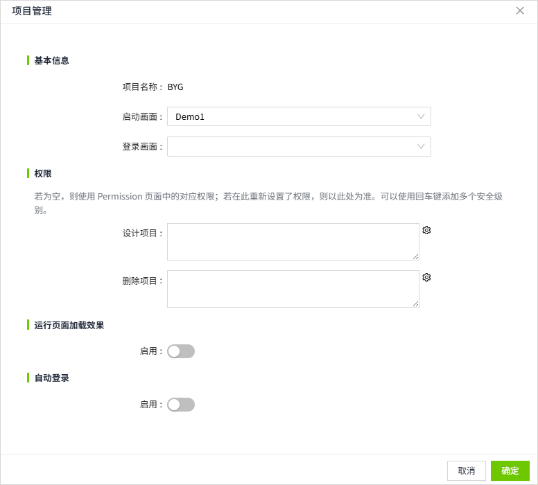
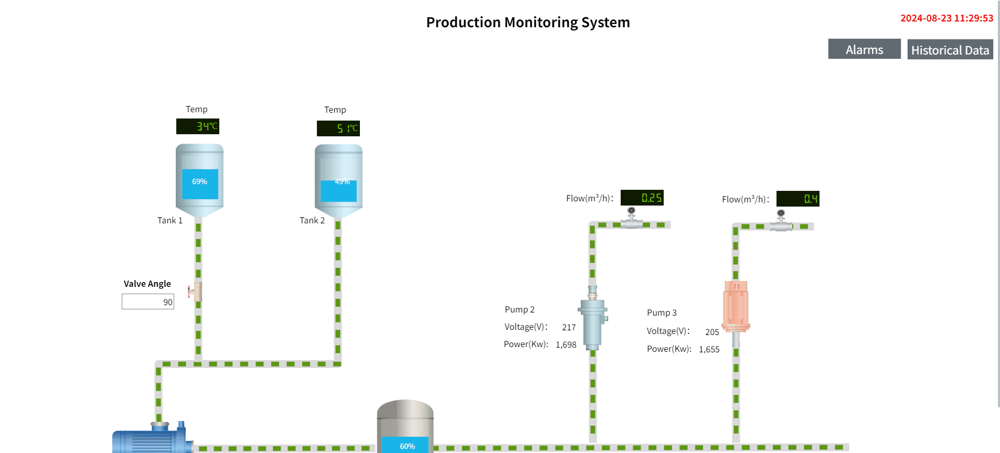

# Project Properties

You can set  configurations for the current project in the 2D Editor. For example, startup page, loading effect of running page, etc.

Click the Settings button on the menu bar to set properties.

| **Name**                   | **Description**  |
|----------------------------|---------------------------------------|
| Project Name               | Displays the name of the current project.  |
| Startup Page               | Set the startup page of the project, the first page created is selected by default.  After setting, this page is automatically displayed when you click the run button of the project in the project list.   |
| Login Page                 | When the Identity Provider is set to **Local** type, you can customize a page to serve as the login page during runtime.   |
| Design Project             | Configure design permissions for this project (i.e., permissions for editing and saving in the editor).   - By default, this field is empty. When empty, the system uses the design project permissions defined in Security > Permission.  - Permissions configured here will replace those set in Security > Permission.  -  If the design permissions' access level path is within the user's access level path, the user will have the right to design the project.   |
| Delete Project             | Configure delete permissions for this project.   - By default, this field is empty. When empty, the system uses the delete project permissions defined in Security > Permission.  - Permissions configured here will replace those set in Security > Permission.  -  If the delete permissions' access level path is within the user's access level path, the user will have the right to delete the project.    |
| Running Page Loading Style | Used to set the running page and the loading effect before the page content is fully loaded. If not enabled, the system default loading effect will be used; if enabled, the user is allowed to customize the loading background color and loading style of the running page.        |
| Loading Background Color   | This configuration item is only displayed after turning on "Running Page Loading Style". Set the background color of the running page when loading.    |
| Loading Style              | This configuration item is only displayed after turning on "Running Page Loading Style". Set the loading animation when the running page is loaded.  Built-in styles support changing colors. After selecting the style, click the "Set Color" button to modify the color.  It also supports users to upload pictures by themselves. Images uploaded by users themselves do not support color modification.    |
| Auto Login                 | When the Auto Login is enabled, you can view the running page without logging in.     |
| User Name                  | User name for automatic login.    |
| Password                   | Password for the automatic login.   |
| Salt                       | To share a runtime page with users who do not have an account, and to enhance system security, you must manually append `?salt=xxxxxxxxx` to the end of the runtime page URL.   For example:   If the current runtime screen URL is: `http://vpc-sz-scadap52:8066/#/runtime/Project1/Home`   To share this page with other users without an account, you need to provide them with the following URL:   `http://vpc-sz-scadap52:8066/#/runtime/Project1/Home?salt=xxxxxxxxx`   To **terminate access** for a user who has already received the shared link, perform either of the following actions in the dialog shown above:   - Click **“Regenerate”** to update the **Salt** value, or  - Disable the **Auto Login** feature.   After doing so, the user will no longer be able to view the page using the previously shared link.   **Note:** Due to browser caching, the user may still be able to access the page for a short time while the cache is valid. Once the cache expires, the original link will no longer work. |

**Notes:** 

1. If the network connection is good, the loading effect of the runtime page will flash by almost instantly. 
2. If auto-login is enabled and the username and password are correctly configured, the password field will be automatically hidden when reopening the settings page. If the username is changed, the password field will appear, allowing you to update the auto-login username and password. Once the username and password are correctly configured, auto-login will remain effective even if the password is later changed. If you no longer need the auto-login feature, you can disable it at any time. 
3. Autologin is configured at the project level, and after logging in, only the current project's permissions are granted. It is not possible to use autologin for two different projects simultaneously in the same client browser. For example, if Project A has already been autologged in on the current browser, switching to autologin for Project B requires first logging out from Project A before autologin for Project B can take effect. 
4. When accessing the runtime page using autologin, and then switching to the console page, the session will only have view-only permissions — regardless of the permissions configured for the autologin account. To restore proper permissions, the user must log out and log in again using a regular account.

## Run page loading styles

Sets the loading effect for the running page when navigating from Page1 to Page 2.

1. Create two pages, Page1 and Page2.
2. Place a button on Page1 that when clicked navigation to Page2.

| **Property**               | **Value**    |
|----------------------------|-----------------------------------------------------|
| Running Page Loading Style | Enable.  |
| Loading Background Color   | 02023b      |
| Loading Style              | |

Run the page and click the "Open Page 2" button on page 1. The page is loading. When the loading is completed, Page 2 is displayed.

    

## Auto-login for Project Runtime Page

When the auto-login feature is enabled on a project, users can directly access the project's runtime page without the need to log in.

1. Open the Project Management Window
2. Enable Auto-Login
3. Input the username and password that will be used for auto-login, then click the "OK" button.
4. On the project list page, click the "Run" button of the project. In the runtime page, copy the link address.
5. Open the link copied in step 4 in another browser or on a different machine. The project will automatically open without requiring a login.

    

