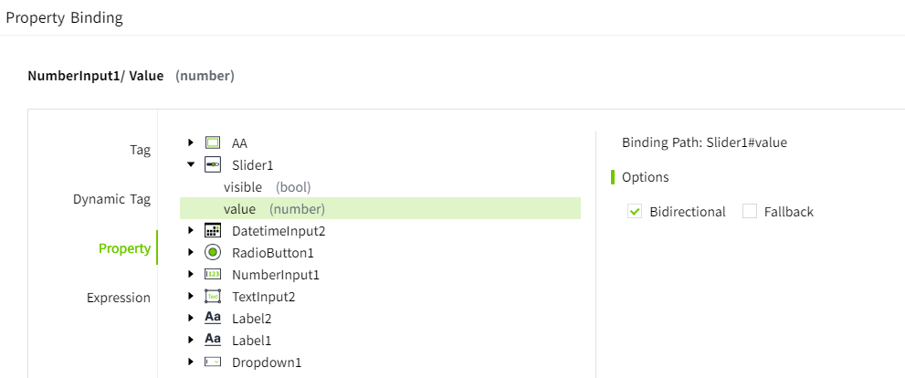
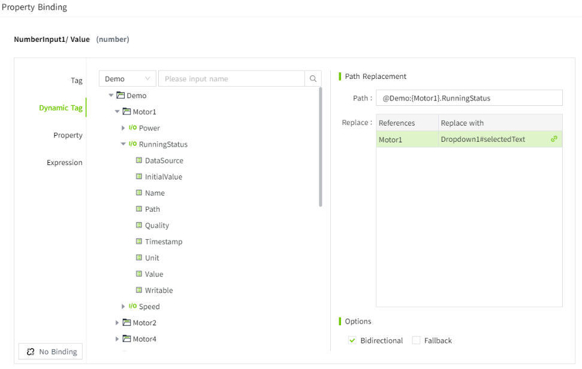

# Bidirectional Bindings

Bidirectional binding refers to the automatic synchronization between a control's property and a tag, dynamic tag, or another property. 

This means when the data source changes, the control's style or value updates automatically，when the user modifies the control's style or value, the data source is also updated automatically.

## Controls and Properties that Support Bidirectional Binding

| **Control**    | **Property**                 |
|----------------|------------------------------|
| Text Input     | Text                         |
| Number Input   | Value                        |
| Slider         | Value                        |
| Checkbox       | Selected                     |
| Radio Button   | Selected Text/Selected Value |
| Dropdown       | Selected Text/Selected Value |
| Datetime Input | Date                         |

## Bidirectional Tag Bindings

In the property binding window, after selecting a tag, you can enable the **"Bidirectional "** option. After enabling bidirectional binding, a fallback option can be set. If the property change fails, it will revert to the last valid value.

**Example**

Number input control and tag are bound in both directions.

1. Draw a number input control on the page.
2. Click the bind button on the "Value" property of the control.

    

3. After selecting the tag in the "Property Binding" window, check the “Bidirectional ” box and click the "OK" button to complete the binding.

    

4. On the running page, when the value of the tag changes, the value displayed in the number input control changes synchronously; clicking the **Enter** key after entering the value in the number input control will write the entered value back to the bound tag.

## Bidirectional Property Bindings

In the property binding window, after selecting a property, you can enable the **"Bidirectional"** option. After enabling bidirectional binding, a fallback option can be set. If the property change fails, it will revert to the last valid value.

**Example**

The number input and slider are bound in both directions.

1. Draw a number input and a slider control on the page.
2. Click the bind button of the "Value" property of the number input.

    

3. In the "Property Binding" window, select the **value** property of the slider, check the “Bidirectional” box, and click the "OK" button to complete the binding.

    

4. On the running page, when the value of the slide changes, the value displayed in the number input changes synchronously; when you enter a value in the number input and click the **Enter** key, the value of the slide changes accordingly.

    

## Bidirectional Dynamic Tag Bindings

In the property binding window, after selecting a dynamic tag, you can enable the **"Bidirectional"** option. After enabling bidirectional binding, a fallback option can be set. If the property change fails, it will revert to the last valid value.

**Example**

The text input is bound to an dynamic tag to display the running status of different motors. When a different motor is selected in the drop-down box, the running status of the motor is displayed in the text input, and the running status of the motor can be modified.

1. Draw a text input, a dropdown, and 2 text label controls on the page.

    

2. The dropdown options are set to: Motor 1, Motor 2, Motor 3.
3. Click the bind button of the "Text" property of the text input control.

    

4. After selecting ”Dynamic Tag“ in the property binding window, make the following settings, check “Bidirectional ”, and click the ”OK“ button to complete the binding.

    

5. On the running page, when the options in the dropdown  change, the value of the text input  changes. When Motor 1 is selected, the text input displays the running status of Motor 1, and when Motor 2 is selected, the text input displays the running status of Motor 2.
6. Entering **true** or **false** in the text input and clicking the Enter key will modify the operating status of the currently selected motor.