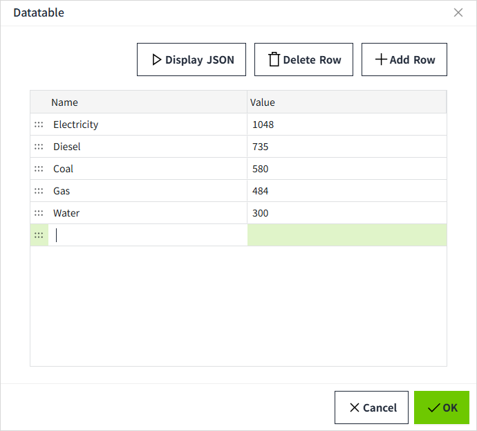
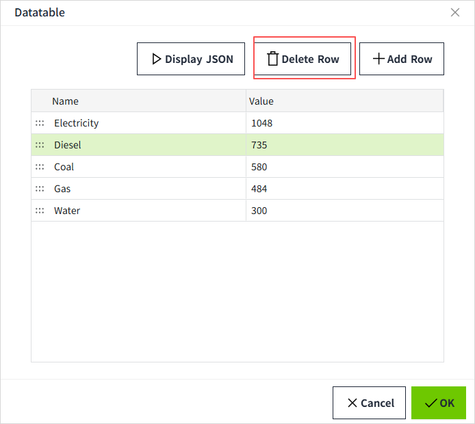
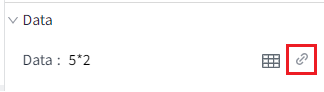
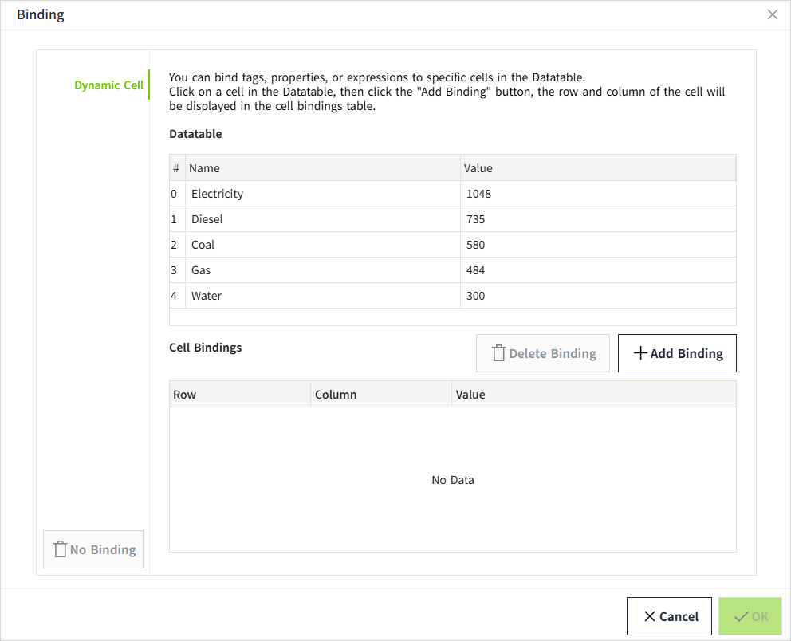
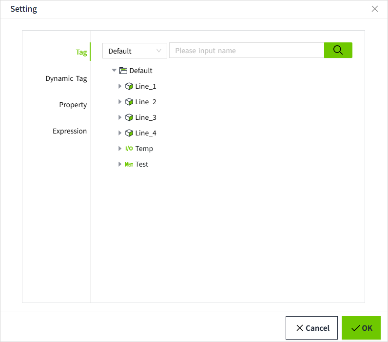

# Dynamic Cell

Dynamic cell binding allows you to link cells within a dataset to Tags or properties, enabling you to easily make one or more cells within the dataset dynamic.

Currently, supported controls include: Bar Chart, Pie Chart, and Custom Curve.

## Setting Datatable

For example, in the case of a pie chart, click the dataset button next to the data.

A dataset window will pop up as shown below.

#### Add Data

- If no row is selected, clicking the "Add Row" button will add a new row at the end of the list.
- If you click on a specific row, making it the selected row, clicking the "Add Row" button will insert a new row below the selected row.

You can double-click the text box to edit the content.

#### View Datatable

In the datatablet pop-up, clicking the "Display JSON" button will display the data structure of the dataset. When you want to manipulate the data property of the control through scripts, you can refer to this JSON format and make modifications based on it.

### Delete Data

When you click on the row that needs to be deleted, that row will be in the selected state. Clicking the "Delete Row" button will delete that row. If no row is selected, the "Delete Row" button will be grayed out and disabled.

#### Dynamic Cell Binding

Click the binding button for the data.

A binding window will pop up as shown below.

There are two ways to add cell bindings:

**Method 1**: Click to select a specific cell in the DataTable, then click “Add Binding.” At this point, the cell binding list will increase by one entry. The **Row** column indicates the row index of the cell in the DataTable, the **Column** column indicates the column index of the cell in the DataTable, and the **Value** column indicates the binding content.

Click the binding button in the **Value** column to open the settings window. Here, you can bind the cell to a variable, property, or write an expression.

**Method 2**: When no cell in the DataTable is selected, you can also directly click the "Add Binding" button. This will add a blank row to the cell binding list, where you can manually enter the row and column information and the corresponding data from the DataTable.

For example, in the cell bindings shown below, the set row is 0, the column is **Name**, corresponding to **Electricity** in the DataTable.

Once the setup is complete, on the runtime page, the values that were bound will replace the values in the Datatable.