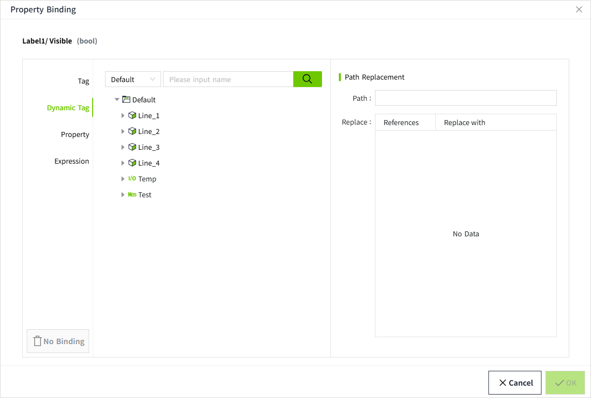
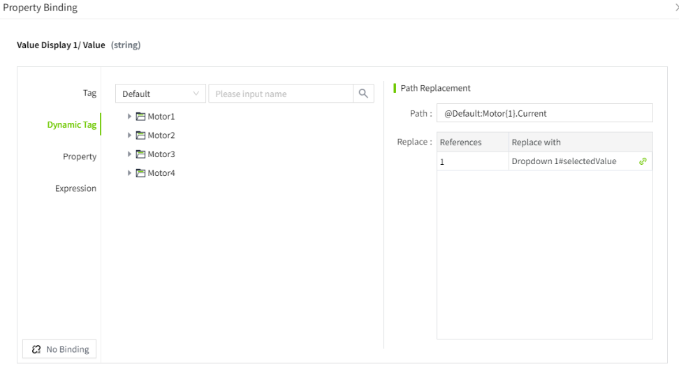
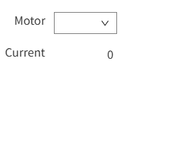

# Dynamic Tag

Dynamic tag binding is very similar to tag binding, with the key difference being that dynamic variable binding allows you to introduce any number of indirect parameters to dynamically construct the tag path. These parameters are marked with curly braces, such as {1}. Once the indirect parameters are replaced by the properties of the bound control, the binding will link to the tag path represented by those tags.

## Binding



| **Name**         | **Description**  |
|------------------|-----------------|
| Path             | Path of the tag with parameters |
| Replacement list | Each line in the list corresponds to a parameter reference within **{}**. You can bind each line to any property on the current Page. To bind a parameter reference to a property, simply select the corresponding line and click the property binding button in the "Replace with" column. Then, choose a property from the property selector dialog that appears. |

**Example**

There are four motors, each represented as a folder, and each motor contains a tag: Current. The tag paths for the current values of these four motors are as follows:

```plain
Default:Motor1.Current
Default:Motor2.Current
Default:Motor3.Current
Default:Motor4.Current
```
 
Instead of creating four separate controls to display the values of these four tags, we can create a single control that indirectly displays the values of different tags. For this, we only need one control to display the value (value display control) and another control (dropdown control) that allows the user to select which motor to view.

1. Draw a value display control and a dropdown control on the page.
2. Set the dropdown options for the dropdown control.
   
3. Select the value display control and click the binding button for the "Text" property.
   
4. In the pop-up property binding window, choose Dynamic Tag.
       1. On the left side of the asset tree, select the tag **Default: Motor1.Current**.
       2. On the right side in the path replacement section, delete **1** from the variable path and replace it with **{1}**.
       3. In the replacement list, select that row and click the binding button to bind it to the **selectedValue** property of the dropdown control.
       4. Click **OK** to save the binding.
   
5. In the editor, click the "Preview" button to enter the preview page.
6. When selecting **1** in the dropdown, the path is: **Default: Motor1.Current**, and the value display control shows the current value of Motor 1.<br>
   When selecting **2** in the dropdown, the path is: **Default: Motor2.Current**, and the value display control shows the current value of Motor 2.<br>
   When selecting **3** in the dropdown, the path is: **Default: Motor3.Current**, and the value display control shows the current value of Motor 3.<br>
   When selecting **4** in the dropdown, the path is: **Default: Motor4.Current**, and the value display control shows the current value of Motor 4.<br>
   

